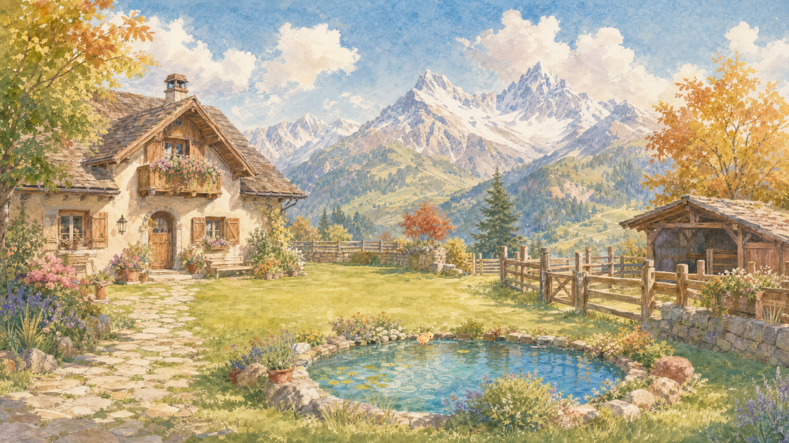

# 鸭低头接食关键姿态候选

GAME-PRODUCER，#122。仅资源研究归档，不替换idle/attention，不改成功投鱼行为、照片或公共状态机。原件1254×1254 RGBA，1066111字节，比idle1188640字节小；不代表PCK净增量，尚未导出接入包。

候选静态低头、嘴略张，可读为啄取，但尚不能证明接到鱼。来源、精确提示和哈希见PROVENANCE.md/measurements.json。保留生成原像素，不因低头后总高度降低而整只放大。

Godot4.7.2 OpenGL实际渲染：与idle使用同一比例0.0252565408085431（画布约31.67px）、世界点(688,562)。候选锚点(590,1177)，idle(670,1205)，只是平移校准；不得把engine-check.json的数学脚点断言当双脚像素重合。复现时将render_study.gd挂到隔离Node2D项目，视口1280×720，准备yard.png（现有晴天院景）、idle.png（cast_v2/duck.png）、feed.png（本母版），以-- --capture运行。脚本不等同正式FeltActor。

独立GAME-PRODUCER-REVIEW-DUCK-ART实际查看原件、idle和两张引擎图，核对master hash：APPROVE仅作为接触点/切换校准候选。身份、笔触、身体/脚间距基本保留；低头向右探出可辨；未见明显白框/新增晕圈。未批准正式接食。

剩余：逐脚对应、连续idle→feed→idle及镜像切换、嘴接触点与食物方向、正式成功事件/移动打断、照片资源路径兼容、手机及PCK验证。不得凭两静帧宣称无亚像素滑动，也不增加鱼、爱心或新投喂规则。
