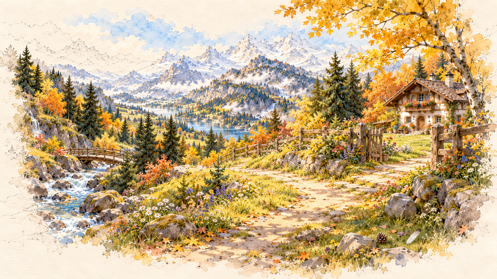
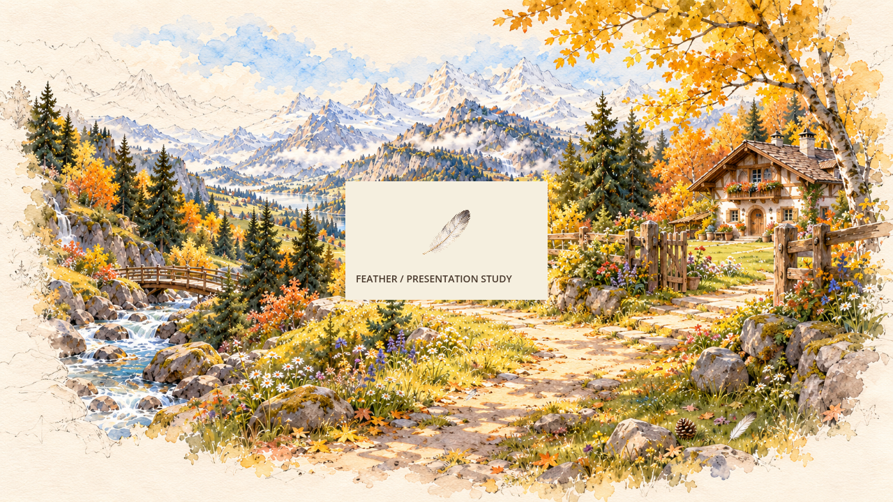

# 落羽母版与尺寸试验（未接入）

GAME-PRODUCER，#155。供近郊首片的发现/获得演出校准。原件没有像素修改；哈希、alpha范围见 measurements.json，生成来源见 PROVENANCE.md。

独立审图结论见 REVIEW.md：64px主体可识别，世界18.37px几乎融入亮路。因此这不是可直接替换占位的正式资源。底图右下较大的既有落羽不是本次精灵。

复现：在隔离Godot4.7.2项目中将羽毛母版复制为feather.png，将已归档02_near_path.png复制为near_path.png，以挂载render_study.gd的Node2D为主场景，视口1280×720，OpenGL compatibility，先import再图形运行。脚本保存world.png和presentation.png后退出；.gdignore避免本目录进入游戏导入。脚本使用原画点(880,752)、alpha>=200主体高913、包围盒底中(684,1086)仅作尺寸试验，不能当正式接触/拾取锚点。

完整首片仍需人物与物件同场、近远尺度、遮挡、发现提示、真实take触发的音画同步、手机及静音/低动效验证。框和英文只用于尺寸研究，不是正式UI。底图原落羽清理、边缘多底色复核、运行资源准备尚未完成；不新增物品种类或捡齐目标，不改总容量3。
