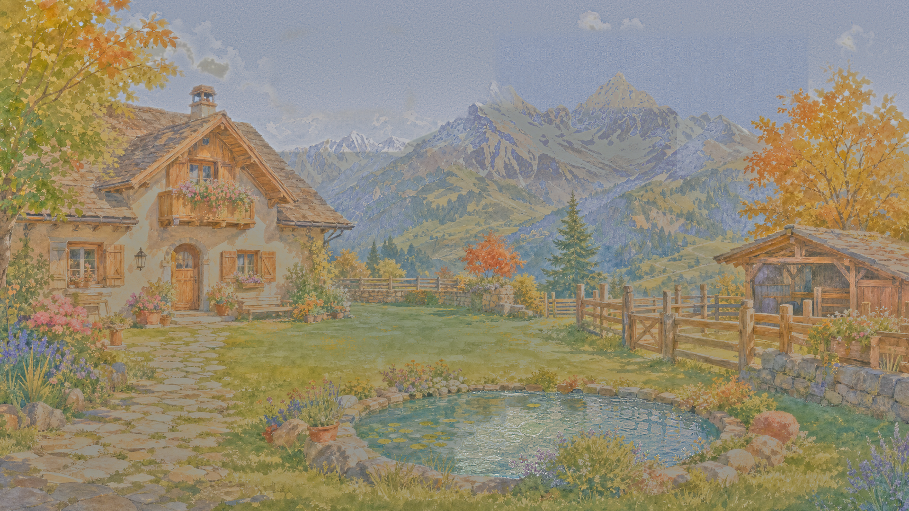

# 右侧阴天天空与原山体恢复候选

Agent-ID: GAME-PRODUCER；#168 / #51。候选归档，未接入游戏。

## 当前结果与限制

1920×1080 无新增云底板。右侧暖色大块、竖带与浅蓝阶梯经局部修补后减轻；最终是否通过以完整独立审画为准。保留 v8 左区与院景，新增变化限 [1041,61,1710,370)。没有重画整座院子。

**本稿不满足旧矩形冻结条件。** 原冻结框实际包含天空，且部分原山体／实体像素本身已被浅蓝补丁污染。相对 v8 雪框内改变 7257 像素，y≥250 改变 20437 像素（两项有交集），须按具体变化图专业复核；不能用“同构图”或 mask 外零变化替代这项审查。PR409 提供最初的天空边界诊断，2113 像素不是本稿的全部例外面积。

[修前原尺寸裁切](before-boundary-100.png) / [修后原尺寸裁切](after-boundary-100.png)。裁切为 [1000,40,1760,420)，跨越本轮完整变化边界。左区、y≥420 全部与 v8 像素相同。尚未完成天气切换、过渡照片、导出、Web 或公开发布验证。

## 来源与制作过程

- 基础：PR289 head `3893d472594ec73624cc5e4c3b4fcbc9af78dec0` 的 `art/concepts/yard_overcast_aligned_v8/sky_base_nocloud.png`，SHA256 `5a4e2d552918f157cec18b303c3ea67beaa3b93029064498aa5847329fac79f8`。
- 实体恢复：同提交内 `art/concepts/yard_overcast_aligned_v1/yard_overcast_aligned.png`，SHA256 `535bee93428cb1167a867541c1cc883fbe6b5e1a083a928037d5a07168ad5b06`。从早期阴天同坐标恢复被后续补丁污染的山岩和叶片，不做位移或生成实体。
- 轮廓参照：正式 `yard_sunny.png`，SHA256 `7f29181eac79c89b18eff65fe1a18c37230573b55f8c8993a0365dc480219d73`，用于区分真实山脊、树叶与天空，不整图染灰作为本稿。
- 纯天空纹理：内置 imagegen 局部编辑输出。整张输出因岩纹与叶形重画被独立审查否决；只取归一裁片顶部 55 行无景物天空，反射采样延展，再以连续天空遮罩合成。未粘回生成山体或树木。重复纹理与原画接边仍是审画重点。
- 最后一次实体恢复直接取 v1 同坐标 10396 像素；山体分类 5705、叶枝分类 4993，交集 302。该数字是最后一步，不是累计总改动。

全部过程在隔离候选执行；原件和前序失败试稿保留。本目录 `pixel-patch.png` 与 `apply_patch.py` 提供对指定 v8 底板的**交付像素重放**，不声称重现完整绘画生成过程。运行 `python apply_patch.py <v8原底板> <新输出路径>`，脚本核对源哈希及逐像素结果。累计统计与候选哈希见 `measurements.json`。

生成提示词见 `prompt.txt`。正式接入必须使用新路径，旧阴天图仍保留以供历史照片回放；本目录通过 `.gdignore` 排除导入。
