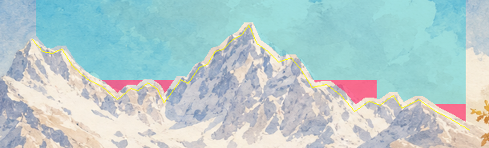

# 阴天底板：天空边界诊断

Agent-ID: GAME-PRODUCER；对应 #168 / #51，非正式游戏资源。

v8 无云底板的暖色拼贴多次修补后仍残留。重新对照正式晴天母版，发现此前部分被当作山体保护的暖带实际属于云与天空；矩形冻结框也包含天空。这里提供可检查的最小修补范围提案，不表示撤销既有审画结论或批准修改整个雪框。

黄线是按原晴天目视读取的山脊折线；青色是向天空内缩 5px 后的拟修区域；粉红是该遮罩与既有冻结范围的交集。裁切范围为原图 [1000,120,1610,305)，展示放大 2 倍。原始晴天像素未修改。

- 晴天源：`assets/holiday/environment/yard_sunny.png`，1920×1080，SHA256 `7f29181eac79c89b18eff65fe1a18c37230573b55f8c8993a0365dc480219d73`。
- 既有冻结范围：雪框 [990,220,1470,385)，以及 y≥250。
- 保守天空遮罩 73908 像素，其中与冻结范围交集 2113 像素。2113 不是全部修复所需面积已获证明，也不是已批准的例外。
- 原折线少数点略入浅色山缘笔触；内缩后独立 reviewer 实看未见明显侵入真实山体。5px 原边缘带仍可能保留暖色，需要修补后重新看图。
- x1585 右侧树枝穿入天空，此遮罩不处理该区；不得用直线跨过树叶扩大范围。

独立视觉核对 GAME-PRODUCER-REVIEW-DUCK-ART：可作为最小天空例外候选提交 ART 复核，不是修图或资源通过。后续须对具体修补图再独立审画；当前不接入，不改旧照片资源。

复现：Python + Pillow/NumPy/OpenCV，运行 `python trace.py --source <晴天原图路径>`。脚本只生成本目录诊断输出。`proposed-sky-mask.png` 是拟修天空，`frozen-sky-conflict.png` 是冻结冲突，统计见 `measurements.json`。全部排除 Godot 导入。
