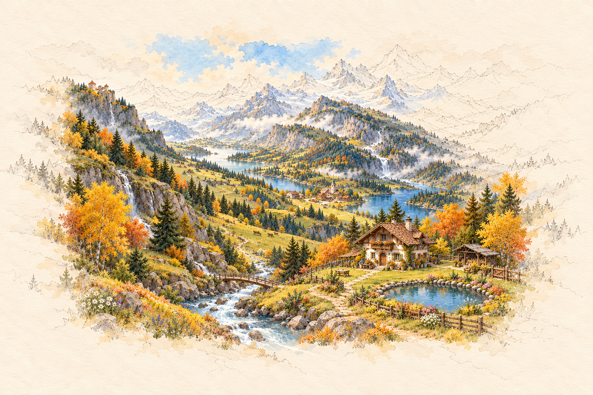
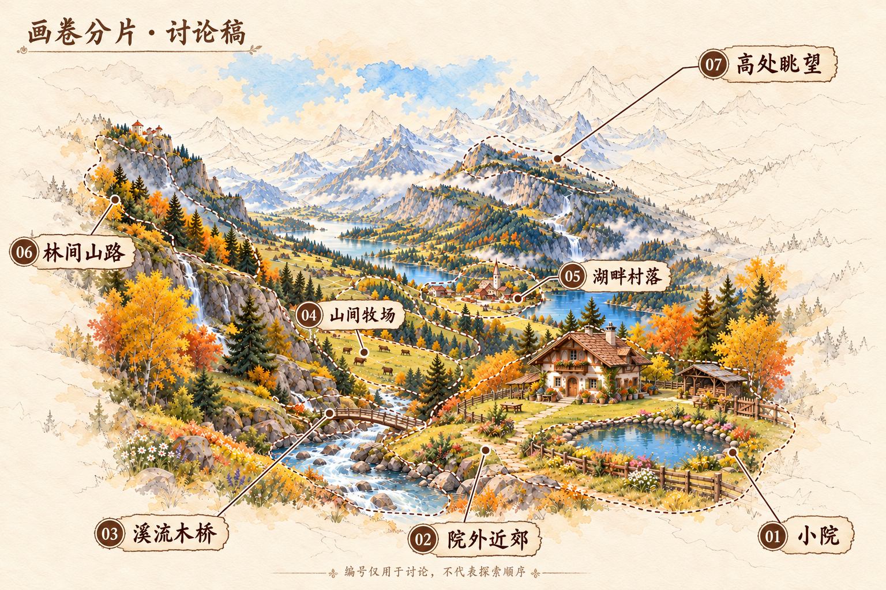

# 世界画卷原图恢复包

Agent-ID: GAME-PRODUCER。2026-10-05 从用户指定的[原制作会话](https://chatgpt.com/share/6ac35ad0-1960-8327-9146-201f8afa02a1)恢复，关联 #153 / #155。本包解决原图只存在于聊天、开发者没有可追溯文件的问题，不代表运行时美术或七页玩法已经验收。

## 当前入口

| 文件 | 用途及状态 |
| --- | --- |
| [world_master_whitespace.png](world_master_whitespace.png) | 用户认可的扩大留白版总图；固定世界空间母版 |
| [world_seven_pages.png](world_seven_pages.png) | 用户认可的七页概念标注；编号不是探索顺序，虚线不是碰撞/地图边界 |
| [02_near_path.png](02_near_path.png) | 院外近郊场景候选 |
| [03_stream_bridge.png](03_stream_bridge.png) | 溪流木桥场景候选 |
| [04_pasture.png](04_pasture.png) | 山间牧场场景候选 |
| [05_lakeside_village.png](05_lakeside_village.png) | 湖畔村落场景候选 |
| [06_forest_path.png](06_forest_path.png) | 林间山路场景候选 |
| [07_outlook_left_home_right_village.png](07_outlook_left_home_right_village.png) | 按用户要求修正的高处回望候选：画面左院、右村；未找到用户对这张修正版的后续终验 |

01 小院继续使用游戏原画，本包不替换小院。用户评价其他几页空间关系基本正确，不等于完整技术/运行时验收。

## 原件与历史

13 张 PNG 均逐字节复制网页提供的原图，未缩放、裁切、重绘或重新压缩。逐图尺寸、字节数、SHA256、原网页图片标题及状态见 [manifest.json](manifest.json)。总图为 1536×1024；场景为 1672×941。可以用任意 PNG 解码器打开、按清单核 hash。

用户随后直接提供三个总图分享链接。本地分别重新下载，SHA256 与本包对应原件完全一致：

| 独立来源 | 对应文件 | SHA256 |
| --- | --- | --- |
| [小院布局修订版](https://chatgpt.com/s/m_6ac35f8a671081918a862db4b8ea72c8) | archive/world_b_yard_revision.png | `d4f70f38e73595b942397251de6323b6b6623e3fab43d29fffa5235aeefc190a` |
| [扩大留白总图](https://chatgpt.com/s/m_6ac35f979878819193f4ea5908fea358) | world_master_whitespace.png | `6ce53fd01a9d09d8cc9ada1d668e8c8d351b1d3d310efdd60ede4055cb00f08c` |
| [七页标注图](https://chatgpt.com/s/m_6ac35fa209488191a482b62f86330e78) | world_seven_pages.png | `f23fb223b30d2414f4066f25223cdf8c53856003a337e8761511156e42ef5dee` |

`archive/` 保存 A/B 初稿、小院布局修订版及两张旧远眺。`archive/07_outlook_wrong_orientation.png` 已被用户指出左右错误，不可用于接入；初始远眺也已被后稿替代。历史稿仅用于溯源，不能优先于空间母版与用户明确纠错。

来源为此前制作人使用 ChatGPT 图像生成所得，本次只恢复并归档。原始生成提示词、工具版本与云端本地提交对象未取得，不编造这些资料，也不声称恢复了云端整个工作目录。云端曾报告的提交 `b59d1757f43bb55a8674ee1db7518504138bc96c` 在本次 GitHub API 查询中未找到；本包是新的恢复提交，不能冒充该旧提交。签名下载 URL 不写入仓库。

## 接入限制

- 世界空间遵守总图。山脉、湖泊、溪流、木桥、牧场、村落、小院的位置和相互关系固定，留白不授权添加地形。07 必须从高处回望左院右村；改图不能反改地理。
- 此批是单幅透视画，不能横向拉伸到 3–5 屏，不能直接给透视道路套固定高度的侧视行走线。用户已选择保留原画透视、沿路走动并自然换页；具体路径与接入验证仍待完成，见[执行方向](../../../docs/architecture/exploration-painted-path-direction.md)。
- 图片已画入某些物件/牲畜，它们不自动成为可采集物、运行时角色或新增玩法。02 画内的松果/落羽不能与后续可拿取精灵叠成两个，取走后不应残留同一可交互物件的底图副本；需正式分层/清底资源处理后接入。
- 本目录有 `.gdignore`，且现有 Web 导出排除 `art/*`。不改正式资源绑定，不影响旧照片，不把候选计入已发布资源。
- 下一步按已决原画透视行走方向校准可走区域和手机取景，再制作接入版本、标锚点、做专业独审与实际运行验证。#322 原型参数及携带上限不是用户产品承诺。
