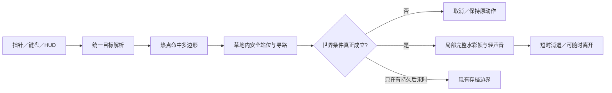

# 静态水彩背景如何支撑大量真实互动

- 2026-10-02；关联 [REQ-20261002-009](../decisions/REQ-20261002-009.md)、[issue #36](https://github.com/narutojzm1-dot/youjia/issues/36)。本文件起初是待验证的架构决定；花箱叠加型首热点已经上线，岸石第二处候选已通过原生画面/触屏定向回归，见[花箱记录](../playtests/2026-10-02-REQ-009-windowbox.md)和[岸石记录](../playtests/2026-10-02-REQ-009-shore-stones.md)。**尚未证明几十处热点的规模化编辑和原物件替换型背景补绘。**
- 设计原则：**背景负责构图，热点负责判断，独立绘画层负责变化，世界状态负责后果。** 画面里的物体不必全部从整张画中拆出，但每一个真正可变的物体必须有自己的画作与锚点。不能给整张 PNG 加几个任意矩形，就声称它有几十个“真实可互动对象”。

## 现状与真正的技术障碍

`YardWorld` 在 `setup()` 创建一张 `Sprite2D _backdrop`，把 1920×1080 的 `yard_sunny.png` 映射到 1280×720 世界，置于 z=-1；动物、草堆、植物床、钓鱼道具和反馈则是另外的运行时节点。原先 `YardInteraction.pointer()` 逐段写死“动物 → 草 → 植物床 → 池塘 → 普通散步”；花箱首切片在这些原有命中之后、普通散步之前加入声明式环境热点。输入由 `Main._unhandled_input()` 转成世界点，`YardWorld._request_action()` 用 action.point 寻路，到达后才调用成功行为。已运行的 `WorldEffectsOverlay` 能做短时鸟类、抚摸和浇水回应，但始终压过最前角色，不适合承担门后/树下等需要被人物遮挡的所有环境画作。`PhotoMoment._collect()` 捕获实际 Sprite2D/AnimatedSprite2D 等节点，**不会自动拍到只在 Node2D._draw() 中绘制的临时笔触**。

所以扩张时有三个不同问题：**点到了画里的哪里**（命中）、**人能否在安全位置做这件事**（交互）、**画上的那个对象实际改变了什么**（视觉/规则）。三者不能共用一个“中心坐标”；光给背景画叠透明按钮，只解决了第一问。



## 四层渐进架构

| 层 | 保存什么／做什么 | 何时需要 |
| --- | --- | --- |
| **背景底板** | 保留现有完整院子作为空间、光线与透视基准；天气图/色调与后续局部层必须同一构图和世界映射。 | 全部热点；不为新增一只蝴蝶重做整张小院。 |
| **热点定义** | 每个 ID 分开写：玩家可点击的世界坐标多边形、*院内*安全站位候选、画作/声音锚点、文案键、触发条件、与旧动作的显式优先级、取消规则。开发态可显示多边形与安全站位，发布包不显示。 | 可互动地点增加到多处时集中维护，不在 `pointer/primary/world` 各复制一套数值。 |
| **独立绘画层** | 轻交互在原画上叠透明水彩帧（蝴蝶、涟漪、飘叶）；若原背景画上的物体本身必须移走/打开/改变，另提供**补全空背景的底板小块或无物件版本**，以及同锚点的“静止/变化”两套完整透明局部画。根据遮挡关系分地面下层、脚底排序对象层、前景遮挡层；不把全部效果强行放到最高 z。 | 只是“看见一个偶遇”可先用叠层；真正开关门、改变花箱或掀动栅栏时必须从图像中去掉原物体，否则会出现两扇门、鬼影和贴片边框。 |
| **权威世界与反馈** | 现有 `YardWorld` 判定是否实际完成，短时表现由环境反馈控制器按热点 ID 播放，持久后果才进 `SaveStore`；彩蛋是会话内偶遇、不写进今日任务或老相册。 | 阻止点击失败也冒庆祝、旧钓鱼被新热点抢掉、动画与存档脱节。 |

### 具体的热点契约

建议给环境热点建立少量可审阅的声明式配置（Godot Resource 或集中 `YardHotspotCatalog.gd`；先随第一个真实热点选择，不因空架构新增通用引擎）。一项定义的概念接口如下，**示例数值须用 Godot 实测，不可直接当成当前坐标**：

```gdscript
{
  "id": "cottage_windowbox",
  "hit_polygon": PackedVector2Array([...]), # 指针命中：画面里可见的区域
  "approach_points": [Vector2(...)],    # 玩家可走草地上的安全脚点
  "visual_anchor": Vector2(...),         # 画作应出现的位置，可在不可走背景上
  "reach": 72.0,
  "label_key": "action.observe_windowbox",
  "target_key": "target.windowbox",
  "input_priority": 10,               # 明确低于动物/花床/钓鱼专属命中
  "art_mode": "overlay",             # 或 "replace_patch"
  "behavior_id": "observe_windowbox"
}
```

上面的示例是**目标接口，不是已存在的完整字段集**；首切片实际采用 [`scripts/game/yard_scene_hotspots.gd`](../../scripts/game/yard_scene_hotspots.gd) 的 `windowbox` 一条定义（ID、命中多边形、安全站位、视觉锚点、距离和双语键）。原有动物/植物/池塘先判，再尝试可用场景热点，不需要把 `input_priority` 复制到每条数据里；`art_mode` 和 `behavior_id` 也未为单热点提前抽象。条件和行为由项目内可检查的 handler 调用，不把任意表达式字符串放进资源文件，更不从 JSON 动态执行脚本。测试校验翻译键、点击区域不抢现有动物/草/植物床/钓鱼、至少一处站位在 `YardGround.lawn()` 中且可达、视觉锚点在 1280×720 世界中。触屏命中可做适度扩大，但不能扩大到旁边池水或动物；先用当前 `_screen_to_world` 转换，不再维护第二套屏幕像素系。

`YardInteraction.pointer/selected/primary` 统一解析 `target + safe_approach_point + reach + label`，**按旧高优先级目标→可用环境热点→普通散步**执行；正在钓鱼、携鱼、正在牵行等状态具有显式排他规则。`_selected_target/_pending_interaction` 保持同一热点 ID 直到到达或取消，真正行为由 `YardWorld` 再检查条件，不能仅凭指针命中就播放动画。`visual_anchor` 只用来摆画，不作为玩家走路终点。镜头如需轻聚焦，必须在移动、暂停、远距、切目标时发送 release，不得把玩家锁在彩蛋里。

## 两类视觉变化的明确分界

**叠加型（先做）：** 背景原貌不变，例如花箱上偶尔飞来蝴蝶、岸边水面多一组涟漪。独立 RGBA 水彩帧与背景世界坐标同尺度，存主画母版和运行贴图，天气亮度/昼夜色调一起匹配。正常动效与低动效是同一画作的少动/静止呈现；停下也能识别动作是否成功。这已足以支撑首批许多地点，但不能说蝴蝶原来就在底图里。

**替换型（真会变的物体）：** 例如将来若批准窗扇打开、栅栏门开合，必须从原背景画中移除对应静态对象，补绘其背后的墙/地面/阴影，再绘同一透视与锚点的完整静止帧和变化帧。对晴/阴两套背景分别校对边缘、阴影和遮挡，避免贴片矩形、位置漂移、光线断裂。优先按**局部区域**制作可复用的透明层/底板，而不是为每种事件导出一张完整 1920×1080 新背景；有意义的原画差异才能上线，不靠压缩、缩放、扭转角色图来冒充动作。

绘画层使用世界节点而非常驻前置 HUD：地面涟漪可以在动物脚下，蝴蝶能在花前和玩家身后，前景枝叶可盖住路过的人；每个画作记录自己的深度基准和锚点。`PhotoMoment` 若要记录此场景瞬间，必须捕获那个时刻的真实 Sprite/AnimatedSprite 当前帧和对应底板；暂未批准的彩蛋不自动新增相册规则，否则照片里可能又冒出被替换的静态旧物件。

## 可扩到很多热点而不炸掉维护成本

首批以一个画面坐标系、一套定义和一条解析路径为准。仅当确有几十个同时活跃热点且性能测得问题时，才引入空间网格；现有单场景几处静态热点顺序遍历已足够，避免先造复杂框架。不同地点共享**输入、寻路、取消、低动效、短时状态与测试契约**，不共享一张万能爱心：花箱、岸石、栅栏各自有自己的水彩画作与有趣之处。只更新邻近玩家或正在播放的少数画层，不让每个背景装饰物每帧运行一套 `_process`。图集/运行资源预算在实际 Web 导出后测量，源母版不能混入游戏包；保留现有画作/授权与旧档兼容。

## 首个可验证的技术垂直切片

以 [花箱观察与蝴蝶偶遇](../decisions/REQ-20261002-009.md#第一切片窗台花箱--蝴蝶的轻发现优先) 实证这套技术，而不先提交空的抽象框架：一个位置配置、一幅场景局部回应、一只手绘蝴蝶的低频会话偶遇、一段对象绑定成功行为。它应证明四件事：**能准确点中画里的花箱；人只站在可达门外；动画属于花箱而不覆盖原房屋构图；打断/低动效/旧存档/原有动作都正确**。绘画效果若不足，在原生和 Web 画面修正后再复制模式到岸石、围栏。热点足够多时再评估 Godot Inspector 资源编辑器/可视化多边形工具，不建立第二套与实际游戏不一致的碰撞数据。

原生 Godot 真画面需在固定世界 1280×720、桌面/窄屏和晴/阴下检验锚点、补绘接缝、深度遮挡；行为回归覆盖命中、错误目标、站位不可达、途中目标被取消、既有钓鱼/种花/喂食优先级、低动效、相册旧快照与 Web 资源包。发布后由实际浏览器点选热点并确认可以继续散步；**仅编写本设计文档不意味着技术已经实装。**

### 首个原型后的明确边界

花箱候选实现了“一条目录记录 → 原有统一目标解析 → 门前草地脚点 → 世界成功条件 → 双帧蝴蝶／花瓣原画”的竖切，[原生晴阴及 390×844 画面](../playtests/2026-10-02-REQ-009-windowbox.md)验证锚点和透视。`YardSceneFeedback` 是可被角色遮挡的短时 Node2D／Sprite2D 画层，不改变原底图，也没有新增存档字段；它不应被直接复用为“拉开原本画死的窗扇”。真实 Web 点选验收、第二处岸石热点的命中冲突，以及需要消除底图旧物的**底板局部补绘**均未由这个首切片证明。下一切片必须先在岸石与池面现有钓鱼命中间明确可点区域，再抽出重复行为，而不是在此时写大量空的通用装饰系统。

### 第二处：同一目录支持的岸石候选

[岸石原生与触屏画面](../playtests/2026-10-02-REQ-009-shore-stones.md)验证同一 `YardSceneHotspots.CATALOG` 可以放第二条几何上分离的定义：薄岸石 `(515,560)`、经真实 Web 纠偏的大石头 `(510,612)` 同属石头命中，院内草坪脚点 `(515,527)`，水面局部画作锚点 `(568,580)`。世界到达判定才触发两幅完整水纹；**不点石头**的普通步行靠近以会话内短时蜻蜓作为另一种触发。这个状态复用 `YardSceneFeedback`，在晴/阴和低动效下换完整画帧，无持久字段。测试保持水面钓鱼、携鱼投鸟、草、花和同目标输入不被新热点夺取。它只证明**两处叠加型**，不证明会动的背景原物件：若将来要真正开门或转动围栏，仍须先补绘背景空洞、遮挡、晴阴版本并验证替换接缝，不能直接复制一层蜻蜓做假开门。
