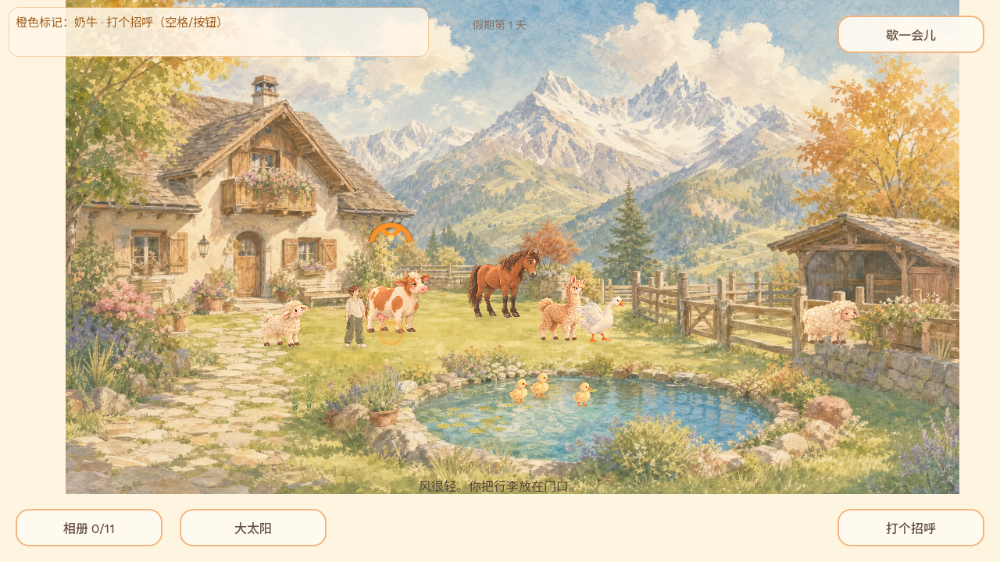
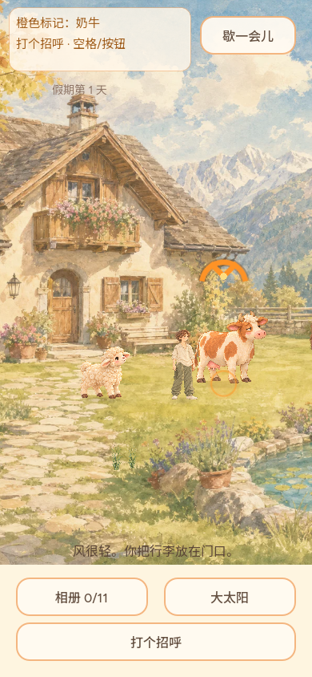
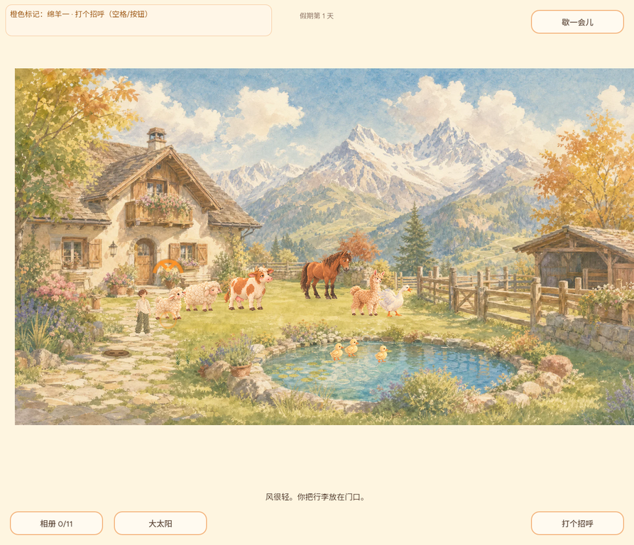
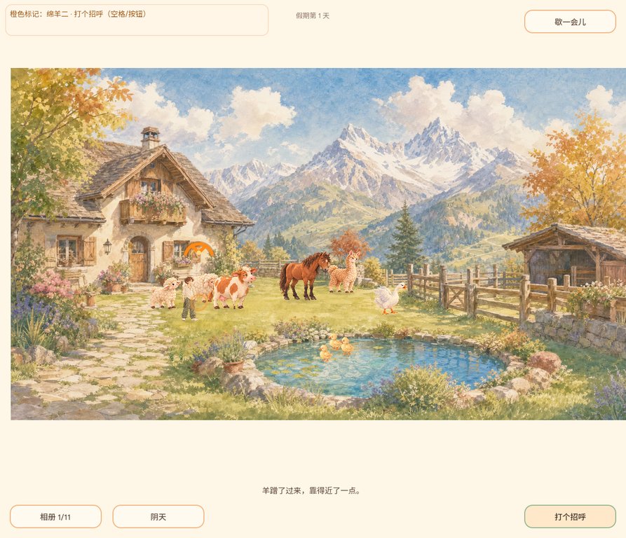

# REQ-20261002-002：目标说明候选版体验核查

- 日期：2026-10-02
- 分工：用户直接指定 `MANUS-CONTRIBUTOR`；功能与独立审核见 [PR #25](https://github.com/narutojzm1-dot/youjia/pull/25)。
- 基准：开发时的主分支 `c6c3929ca8fe948dcbd7652c08a86a92270e4ed6`。本记录包括**候选分支的原生画面和本地 Web 浏览器检查**；并非合并后 GitHub Pages 正式构建的验收，届时需记录发布构建号再复核。
- 范围：解释可抚摸动物头顶的橙色指示；名称与动作从同一主动作解析；点选、空格和行动按钮在接近期间沿用精确目标；普通散步、取消点击、鱼过期恢复默认选择。

## 用户可见变化

1. 靠近可打招呼的动物时，顶栏以「橙色标记：奶牛 · 打个招呼（空格/按钮）」等具体文字说明标记的含义；绵羊一/二和小鸭一/二/三分别有可辨识的名称。标记仍通过原有脚底环与头顶弧绑定**同一只动物**。
2. 点选草堆、水塘、花圃、草泥马、鸭或鹅时，顶栏显示相应对象和下一步动作；行动按钮文案取自同一个实时动作，空格与按钮共用执行路径。
3. 玩家点选动物后，即使它移动或仍在远处，橙色标记会跟着正确动物；新点击/手动行走会取消旧选择，动作完成后会解除焦点，避免重复触发。
4. 提示加了不拦截点击的浅纸底；在手机窄屏使用两行文字，避免「空格」被拆开。没有弹窗、待办或失败惩罚。

## 场景验证

| 场景 | 方法和观察 | 结果 |
| --- | --- | --- |
| 点选绵羊二并接近 | `interaction_photo_suite.gd` 在真实世界对象中点选具体轮廓，检查 Space、HUD、行动按钮共享 `pet:sheep_b`；远处橙色标记跟随 `sheep_b.position`，而不是近旁其它动物。 | 定向回归通过 |
| 点选水塘与取消 | 点选水塘后 HUD/空格的主动作是垂钓；错误点选取消旧行走和目标。 | 定向回归通过 |
| 奶牛与双语 HUD | `ui_interaction_suite.gd` 实际加载主场景，检查顶栏中文/英文对象名、动作文案、按钮和脚底指示的同一目标；随后恢复原路线继续 UI 操作。 | 定向回归通过 |
| 携鱼失效、连续空格 | 鱼过期不保留无效的鸟类目标；先点草泥马再按空格只执行一次，不会出现喂草后立刻重复牵行。 | 定向回归通过 |
| 桌面和手机渲染 | Godot 4.7.2、Xvfb/OpenGL 实际渲染，分别以 1280×720、390×844 截图。为稳定核查文字与指示位置，通过调试入口把玩家放在奶牛附近；**不是**浏览器人工游玩截图。 | 纸底、文字、橙色弧与动作按钮可见 |
| 候选 Web 新存档与行动按钮 | Godot 4.7.2 导出 `dist/index.html`，经本地 HTTP 服务在 Sandbox 云浏览器打开，画面显示「橙色标记：绵羊一 · 打个招呼」，相册 0/11、假期第 1 天；点击底部行动按钮后出现「羊蹭了过来，靠得近了一点。」通知，按钮按下态可见。中途的 1/11 相册是这次游玩获得的照片。浏览器截图的顶部红色虚线为工具高亮，不是游戏画面内容。 | 候选 Web 启动与按钮交互通过；实际浏览器中精确点选移动动物未充分验收 |
| 完整工程回归与导出 | `GODOT_SILENCE_ROOT_WARNING=1 npm run verify:daily`；Godot `--headless --export-release Web dist/index.html`。 | 全量回归通过：389 项通用检查、便携输入 16 项、目标/照片交互 42 项、所有既有场景；Web HTML/WASM/PCK 均导出成功 |

**桌面候选画面：**

**窄屏候选画面：**

**真实浏览器里的候选 Web 首屏：**

**真实浏览器里的 HUD 动作后画面：**

## 正式发布核查（非人工游玩验收）

- [PR #25](https://github.com/narutojzm1-dot/youjia/pull/25) 经独立子代理核准最终 SHA 后合入：`9fe0d3986cc4167de122df26f9ed41d645d053e3`。[Actions run 36987478579](https://github.com/narutojzm1-dot/youjia/actions/runs/36987478579) 的 Godot 4.7.2 验证、Web 导出和 Pages 发布全部成功。
- 2026-10-02 从 [线上游戏](https://narutojzm1-dot.github.io/youjia/) 读取 `game-release.json`：`sourceCommit=9fe0d3986cc4167de122df26f9ed41d645d053e3`，`entry=game-9fe0d39`。HTML 指向该版本的 PCK，WASM 返回 200；线上**实际下载** PCK 的 SHA-256 `ba2873e0ef11061fc8772915ca7d0745a67c072589817baa12cf3a75a0d53e0a` 与 `gh-pages` 分支相同。这证明代码对应资源已公开，不证明交互都经人工验收。

## 未覆盖与后续

- 候选浏览器实玩只覆盖新档载入、HUD 目标说明和按钮操作；鼠标点击正在移动的具体动物、手机真实触屏及键盘连续输入仍由场景和设备模拟回归覆盖，未声称已完成人工浏览器体验。原生 390×844 画面检查不等于 Web 手机触屏验收。
- 后续仍应从新存档在 `game-9fe0d39` Pages 构建实际走近动物、点选草堆/水塘/一只绵羊、按空格与行动按钮，检查长文案在实际屏幕上的可读性与一致性，另记步骤、截图和遗留问题；`REQ-002` 暂保持「待验收」。
- 用户另提出所有主动交互应有明确正反馈，尤其鸭/鹅吃鱼后的爱心或啄食动作；独立需求见 [REQ-20261002-008 / issue #30](https://github.com/narutojzm1-dot/youjia/issues/30)，不混入本 PR。
- 当前主分支的 `docs/decisions.md` 出现乱码历史，详见 [issue #31](https://github.com/narutojzm1-dot/youjia/issues/31)；修复前本 PR 不覆盖该文件。
