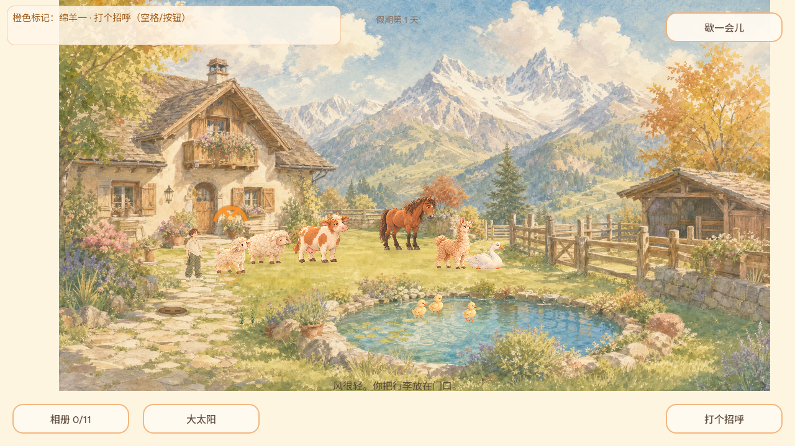

# REQ-20261002-004：大鹅收翅与伏卧姿态（首切片画面核查）

- 日期：2026-10-02；实现身份：`MANUS-CONTRIBUTOR`。[用户新指示与需求记录](../decisions/REQ-20261002-004.md)、[issue #33](https://github.com/narutojzm1-dot/youjia/issues/33)。
- 目标：保持《悠长的假期》**每一帧是精致绘画**的定位，解决大鹅长时间只有张翅姿态；不以拉伸旧图假装卧姿。
- 原生画面来自 Godot 4.7.2、Xvfb OpenGL llvmpipe，游戏真实 `main.tscn` 及 1280×720 视口。固定大鹅地面世界坐标 `(770,500)`，依次显式设置活动、安静和休息状态进行同地画作对比；**不是**用截图替代自然作息实测或正式 Web 游玩。沙箱无 ALSA 设备，音频降级 Dummy，不影响画面保存。

## 画作与场景

| 活动/警觉（旧张翅） | 安静站立（新收翅） | 伏卧休息（新画作） |
| --- | --- | --- |
|  |  |  |

同一世界锚点下测得画面命中框：活动 `70.82×66.24`、安静 `56.38×69.71`、伏卧 `71.00×50.95` 世界像素。新画作在羽毛、橙喙和水彩背景间保持相近笔触；收翅图比原张翅图窄，卧图比站图低，腹部贴地，没有贴片拉扁痕迹。大鹅原 `cast_v2/goose.png` 完整保留；新增两张 1254 方真实透明素材，实测 alpha 边界与独立脚底锚点，详见[原画/母版来源](../../art/concepts/animal_cast_v2/goose_poses/README.md)。

## 已完成的针对性核查

- `test/locomotion_suite.tscn`：新增断言先在旧行为下确实失败；摆拍修正后的最终针对性检查 **410 项通过**。安静/卧伏/活动画帧可切换，世界脚点不跳；低动效仍稳定显示卧姿；点击卧鹅仍准确投鱼给鹅；真实相册捕获卧姿贴图而非原张翅图，摆拍布局使鹅恢复接地的原站姿。
- `test/animal_home_suite.gd`：三种模拟帧率（30/60/120 Hz）及晴/阴各 180 秒，**1005 项通过**。三种画姿均在自然作息中出现；鹅的安静时间占比约 89%–92%，每个天气段均能散步、收翅和伏卧，无越界、位置跳变或隐形滑行。
- `npm run verify:daily`：完整 Godot 日常回归 **退出码 0**，无脚本/渲染器错误；其运行开始早于最后一个摆拍边界改动，因此该边界由随后重跑的 410 项目标回归覆盖。GitHub Actions 对最终提交仍须再跑一次完整套件。
- Web 候选导出：Godot 4.7.2 成功生成 `dist/index.html` / `index.wasm` / `index.pck`；PCK 的实际字节中可找到 `goose_calm` 与 `goose_rest` 资源引用，PCK SHA-256 `d5b0305f27ee85ef23fd66e816b07361c21d98261fa9aa706bd4454ae16470b6`。此为**候选**，不是正式 Pages 构建号或线上版本。

## 仍待验证与其它动物

以上不等于正式 Pages 构建里真人连续观察的大鹅坐卧过渡；请合入发布后再次游玩，观察切画频率、草地遮挡与不同镜头下的表现。完整 REQ-004 还包含鸭、马、牛、羊等动物的专属动作，以及靠近/受互动时的情绪和对象回应，不能把本首切片标记为整条需求完成。REQ-008 的抚摸与浇水正反馈另走独立 PR；REQ-001 的主角动作不在本分支。
