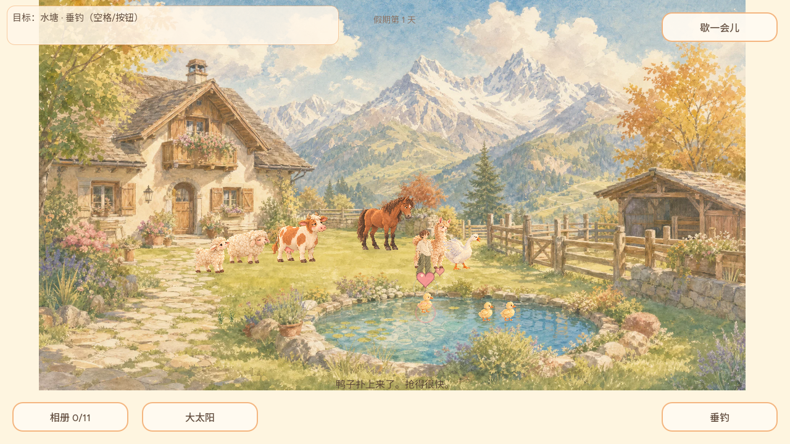
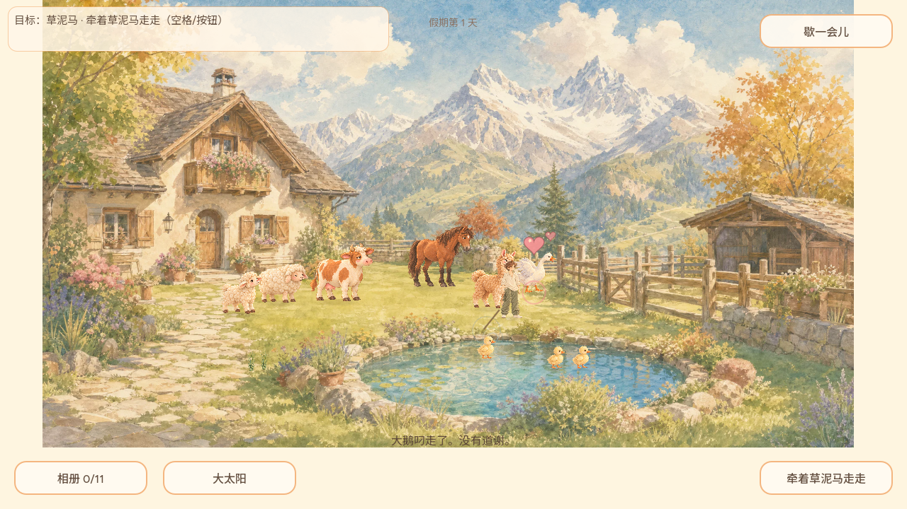

# REQ-20261002-008：投鱼后鸭鹅回应（首切片候选核查）

- 日期：2026-10-02；基准主分支：`9fe0d3986cc4167de122df26f9ed41d645d053e3`。
- 需求背景：用户指出给鸭子喂鱼后缺少正反馈，希望所有主动交互都能得到真正有趣的回应。完整方向在 [增补决策记录](../decisions/REQ-20261002-008.md) 和 [issue #30](https://github.com/narutojzm1-dot/youjia/issues/30)；**本次只交付鸭鹅投鱼后的对象回应，不宣称其它交互已完成**。
- 验收环境：Godot 4.7.2；以下图片由 Xvfb/OpenGL 的真实 Godot 渲染器导出（1280×720），不是 Dummy/headless 虚拟画面，也不是 GitHub Pages 实玩截图。为了稳定控制被喂鸟与鱼，使用游戏现有调试入口预置了玩家、鸟、携鱼状态，然后触发真实的点选投鱼路径；尚未覆盖自然钓鱼、走到鸟边和手动投喂的完整浏览器流程。

## 此切片的玩家可见变化

鱼成功交给具体鸭/鹅之后，只有**收到鱼的那一只**脚边出现很淡的粉色涟漪、头顶浮起两颗短时爱心（约 1.8 秒）。它们跟随鸟继续移动，到期自动消失，不拦截触控或点击。低动效偏好开启时不漂浮，但仍短时显示。仍保留原有轻通知；不存在积分、必做目标、新增损失或等待惩罚。当前鸭鹅只有 `idle` 贴图，**未制作或声称新的啄食帧动画**。

## 代码回归矩阵

| 场景 | 实际检查 | 当前结果 |
| --- | --- | --- |
| 点选携鱼附近的小鸭一 | `request_pointer_action` 选中 `toss_fish:duck_a`；鱼消费一次，覆盖层目标 `duck_a`、时长为正；小鸭位置变化后反馈读到新位置。 | 定向回归通过 |
| 爱心结束、没有鱼仍点击 | 2 秒后对象反馈自动结束；没有携鱼时不会误触发成功爱心。 | 定向回归通过 |
| 距离过远与鱼过期 | 尚未真正到鸟旁时不显示；携鱼过期取消目标，不给鸭鹅错误正反馈，普通散步仍可继续。 | 定向回归通过 |
| 另一只大鹅接收鱼 | 新一轮指向 `goose`，不复用上一只鸭的名字或位置；`ui.reduced_motion=true` 保持静态可读。 | 定向回归通过 |
| 相册与保存 | 投鱼不改变已收相册条目；爱心保存于覆盖层临时内存而非存档，不加入新持久字段。 | 定向回归通过 |
| 辅助验证 | `GODOT_SILENCE_ROOT_WARNING=1 npm run verify:daily`、Godot 4.7.2 `--headless --export-release Web dist/index.html`。 | 全量通过：通用 389 项、投鱼所在 interaction-photo 55 项、portable-accept 16 项及既有 UI/目标/视口套件；Web HTML/WASM/PCK 导出成功。候选 PCK SHA-256：`7f7c5af9eaee2dba9bee73457767484224b20b561e362ace636a1c10836c2db9`；这是未合并的本地候选，不是 Pages 正式构建 |

## 其它主动交互的反馈审计（下一切片的依据）

| 主动行为 | 已有的近身结果 | 尚需确认或补足 |
| --- | --- | --- |
| 捡草 | 草根缩小、草束约 0.42 秒飞向玩家手中；低动效直接到手。 | 已具物理联系；人工确认移动/触屏可读性，无需复制一个通用爱心。 |
| 喂/牵草泥马 | 喂草可切换 `happy` 表情；牵行有牵绳和跟随动作。 | 主角递草/牵行起停动作属 REQ-001，与其 Owner 协调后再补。 |
| 抚摸奶牛/绵羊/马 | 玩家记录 `just_petted`，可进入相册表达式规则并发通知。 | **下一优先**：目前未保证被摸的具体动物每次都即时回应；应让它轻微转头或亲近，但不强迫拍照。 |
| 抛竿/收杆 | 抛竿有钓鱼道具和通知；钓到后有多环庆祝与相册机会。 | 咬钩 6 秒窗口与无压力承诺另有已知冲突；反馈改进不能掩盖规则问题。 |
| 播种/浇水/收获 | 播种切换土壤/种子，开花有花朵，收获有花瓣爆发。 | **下一优先**：浇水当下基本只有通知与内部日期变化，建议增加花圃自身的轻微湿润或水滴回应。 |
| 给鸭/鹅鱼 | 原先主要是通知；本切片加入选中鸟的定位涟漪与爱心。 | 真实啄食动作需新动画或合适的现有肢体接口，不能仅复制静止鸟贴图宣称已完成。 |

## 尚未交付

其余主动交互（捡草、喂/牵羊驼、抚摸、钓鱼、播种/浇水/收获等）需要逐项检查谁做了什么、谁该回应，以及现有动作和通知是否足够。REQ-001 主角动作由 `CODEX-LEAD` 负责；后续动物/场景反应先与其确认文件与接口，避免重复改步态。真实 Web 新档的自然投鱼、触屏、帧率及多人连续快速投鱼效果仍需合并后在正式构建实玩验证；不把本地截图当成线上结论。
