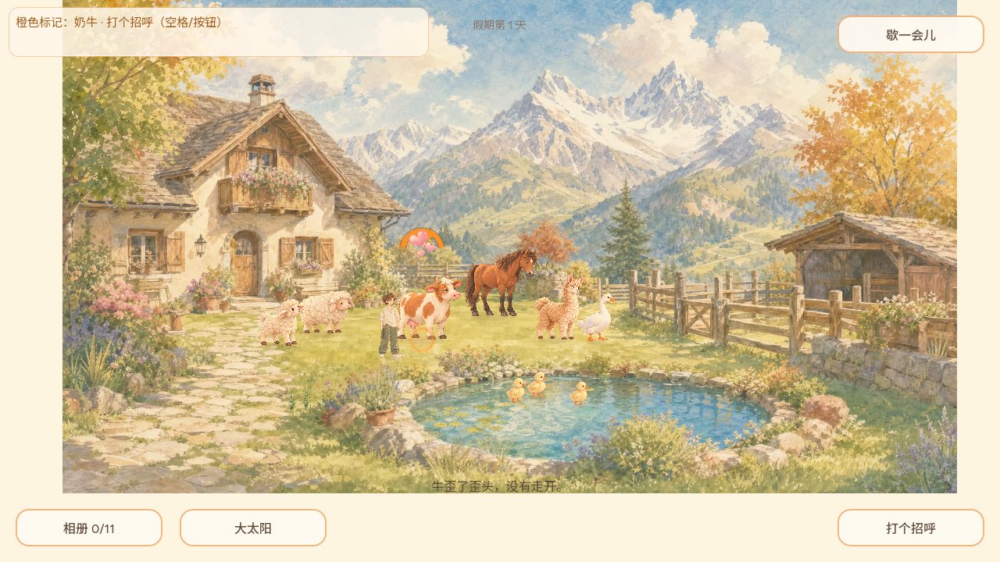
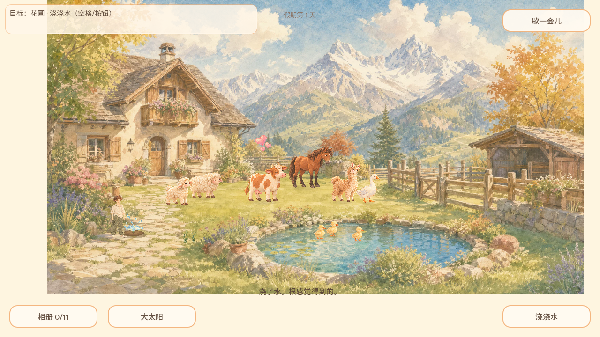
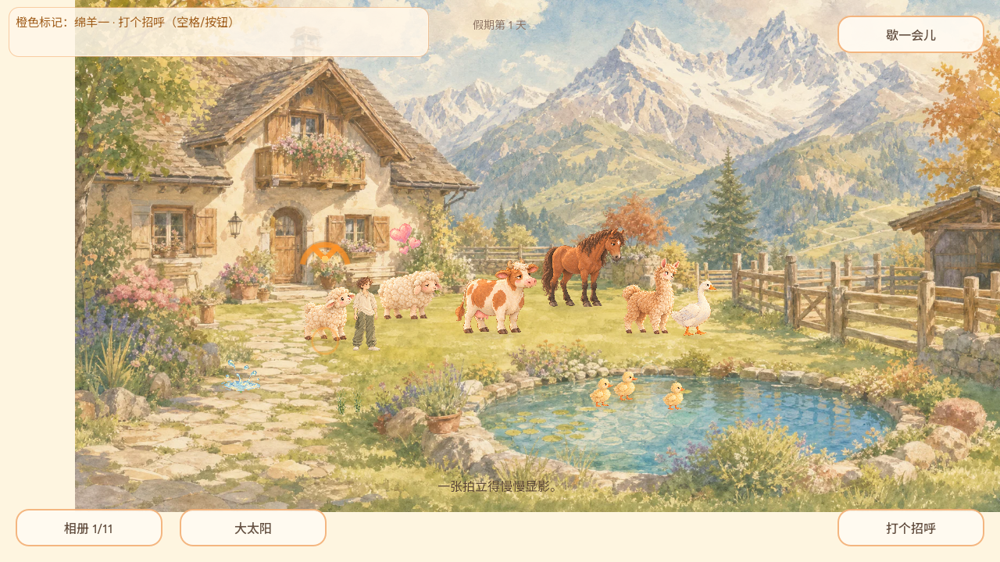

# REQ-20261002-008 第二切片：抚摸与浇水的手绘回应

- 日期：2026-10-02；基于已合并大鹅首切片的主线 `d8afc6aac8c01336dd946f8b98265f6926517ab4`。本功能独立于[鸭鹅投鱼 PR #32](https://github.com/narutojzm1-dot/youjia/pull/32)与[大鹅绘画姿态 PR #34](https://github.com/narutojzm1-dot/youjia/pull/34)，不改正在并行开发的 REQ-001 主角步态/动作。
- 用户美术约束：每帧保持精致绘画。因此两组短时回应均为透明的独立水彩画帧；优化后的 512 方运行资源及 1920 方原画母版、哈希、无损取景/降采样方案详见[画作来源](../../art/concepts/interaction_feedback/README.md)。原动物和花圃画面仍然真实在场；不通过拉扁其身体或程序性几何标记冒充新动作。

## 同一个真实院子的原生渲染画面

Godot 4.7.2 + Xvfb OpenGL llvmpipe、真实 `main.tscn`、1280×720 视口；一律先在真实世界层满足交互距离并触发成功分支，再等待数帧保存画面，不是在截图上后期贴图。沙箱音频使用 Dummy 驱动；画面不受影响。

| 牛受到实际抚摸 | 花圃成功浇水 | 低动效模式摸绵羊 |
| --- | --- | --- |
|  |  |  |

水彩心意固定关联真实被抚摸的动物并跟随它移动，花圃水珠只在当天第一次有效浇水时出现；均在约 1.6 秒后淡出，不占画面大面积、不阻止点击。低动效设置时保留短时静止画但去掉向上漂移。截图里的临时画作与其他 UI/水彩环境的大小、质感已做肉眼复核，进一步手机尺寸和正式 Web 实玩仍待发布后复核。

## 行为断言与未完成事项

| 场景 | 结果 |
| --- | --- |
| 远处对奶牛调用抚摸 | 不出现成功画；不改变当前游戏的接近语义。 |
| 真的摸到奶牛 | 仅奶牛头顶显现回应；动物随后移动时画跟随，计时后消失。 |
| 有效播种床/幼苗浇水 | 记录真实 `watered_day` 后才在该花圃出现画作，计时后不进入相册/存档。 |
| 同日再次浇水 | 仅保留既有“浇过水”提示，不触发假成功；新的一天对幼苗浇水则再出现短时画作。 |
| 低动效/现有鸭鹅投喂 | 低动效静态可见；已有鸭鹅回应保持原功能，无存档结构或目标 ID 变化。 |
| 自动化验证 | 新增的 `test/interaction_photo_suite.gd` 断言在旧代码上因缺少两个对象回应而先红；扩展牛羊马与远距花圃边界后 **69 项通过**。最终完整 `npm run verify:daily` 待结果。 |

Godot 4.7.2 已成功导出候选 HTML/WASM/PCK；候选 PCK SHA-256 `cbc7b3a110033f2d1cbbc61b211be9658f9a357d2bdd3173da5d01a72c513987`，包内确实含 `pet_heart_watercolor` 和 `water_splash_watercolor`。这不是正式 Pages 版本；独立审核、合并和公网资源核验前不得称其已发布。

REQ-008 **仍未全部完成**：羊驼喂草/牵行、捡草、种植、收获及更具体的啄食/亲昵动物动作依照独立清单继续开发。该切片只是成功事件的画面反馈，绝不宣称牛羊马已经有新表情/动作帧，也不把“每天浇水”设计成需回访的压力任务。
