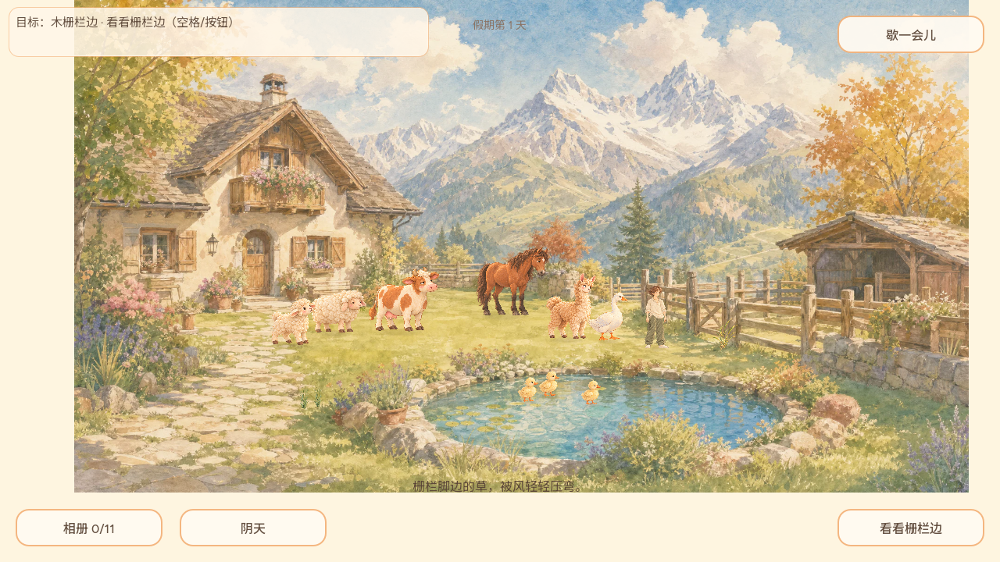
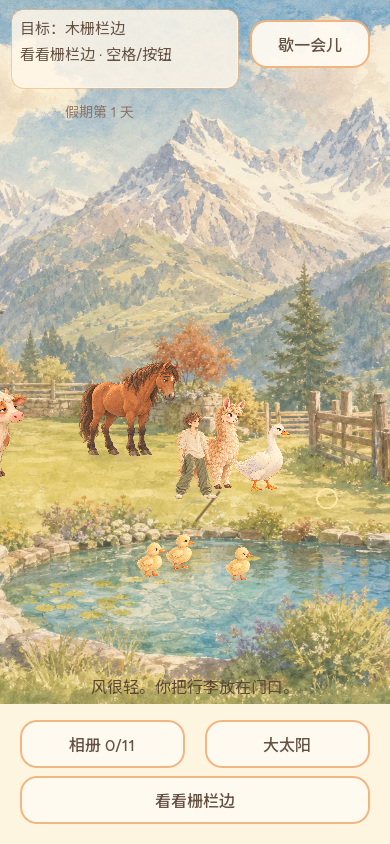
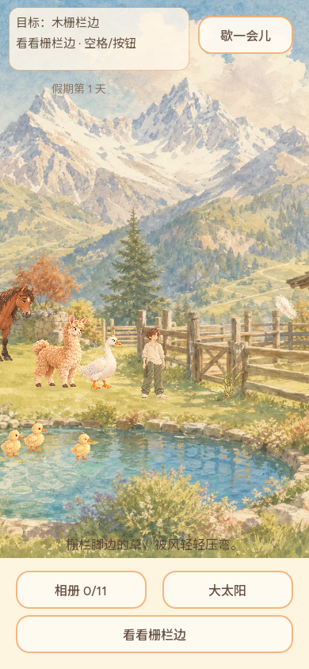
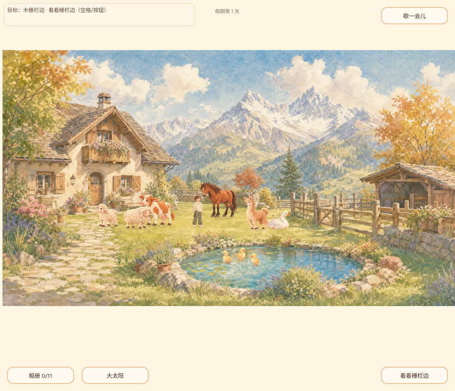
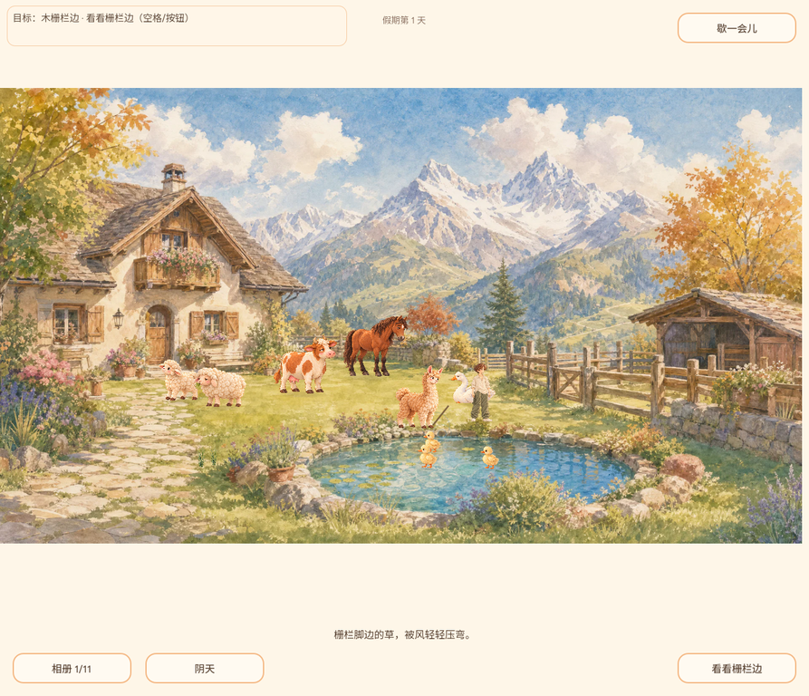

# REQ-20261002-009：木栅栏的风与棚檐一片羽毛（第三处候选）

- 日期：2026-10-02；开发基线 `2fc5bfa58033de624558337f1926af975f903e66`（已上线水塘岸石版）。
- 玩家定位：在画中已存在的木栅栏门旁稍停一停，看见栏脚草叶被风吹弯；路过附近时，棚檐方向偶尔飘来一片羽毛。**不打开木门、不进棚、没有奖励、任务或新的相册格子。**
- [原画母版与运行帧来源、哈希和确定性转换](../../art/concepts/scene_hotspots/fence_gate/README.md)；[同一 REQ-009 的既有花箱与岸石切片](../decisions/REQ-20261002-009.md)。

## 可复查的真实操作

| 操作 | 预期和已核查的代码/画面边界 |
| --- | --- |
| 点画上的木门 `(923,470)` | 指针、触屏将门识别为 `fence_gate`；橙色目标/HUD/行动按钮显示「木栅栏边 · 看看栅栏边」。拒绝棚墙、草坪空白作为门。原有动物、草堆、花圃、水面钓鱼先于环境热点解析。 |
| 从 `(500,518)` 点门、途中按空格或行动按钮 | 只走向门前院内草地 `(830,510)`；没到达不产生任何草叶回应或“成功”通知。木门世界点不可走，玩家不会穿栅栏。改变主意点普通草地可中止待执行动作。 |
| 抵达并观察 | 只有世界距离校验通过才展示一簇草在“直立／轻弯”两幅完整水彩画帧间变化，并给出专属一句回应。低动效保留完整的弯草静帧；更换目标、暂停/相册立即清除瞬时绘画。 |
| 不点门，普通走近 | 若是首次会话靠近，独立的羽毛画会从棚檐的**院侧**短时飘出；在 390×844 竖屏视口实测原先更靠右的锚点不可见，已移到 `(1008,393)`，因此不把离屏效果计为用户见到。停留不足约 1.2 秒就走开，下次回来仍可遇见；低动效静止显示完整羽毛。 |
| 收草、持鱼、甩竿、拍照 | 这些状态不被门目标抢占；观察不消耗携带品，不改变存档、已收相册或照片数据。不能用羽毛冒充拾得道具。 |

## 真正的 Godot 2D 原生渲染画面

| 条件 | 截图 |
| --- | --- |
| 晴天到达，草叶第一幅绘画帧 |  |
| 同脚点，草叶完整第二幅弯曲画帧 |  |
| 阴天院景同调 |  |
| 不点门，棚檐羽毛独立出现；低动效静帧 |  ·  |
| 390×844 玩家相机随角色移动：点门目标与到达后的草叶/羽毛 |  ·  |
| 临时 Web 候选版实际点木门及到达后 |  ·  |

以上截图由 Xvfb 中的 **Godot 4.7.2 OpenGL 实际渲染器**截取，不是无绘制的 `--headless` 测试。音频设备不可用会回退到 dummy driver，不影响上述画面，但不构成声音验收。

## 自动验证与发布边界

- 在未实现时，[`scene_hotspot_suite.gd`](../../test/scene_hotspot_suite.gd) 对真实木门命中先红：`the painted wooden gate is a distinct yard-side observation target` 失败。首次全量回归发现木门多边形向左覆盖旧 `keyboard_ground_suite.gd` `(895,480)` 不可走栏杆点；缩小为真实门身并为该边界加新断言后，最终 `npm run verify:daily` **完整通过，0 Godot 脚本错误**：旧栏杆 **45 项**、栅栏 **93 项**、交互照片 **71 项**、动物生态 **1005 项**及原有 `ui_interaction_suite.gd` 触屏/行动按钮/中英/暂停均通过。
- Web 最终候选导出 `index.pck` SHA-256：`e65f3429d2878e20f4c5b445c5b5770aad832eb4c9da6459197496b2aa27fffd`；三张优化帧在包里，三张高清原画和文档截图不在包里。真实浏览器点门后 HUD 指向木栅栏；走到院内后再次点门出现专属草叶文案。实玩期间相册自动捕获另一次动物瞬间，使相册数字上升；栅栏本身的定向测试确认不增加照片。用户指出自动拍照时画面缩放却没有“成片/题词/入册”的因果，已另建 [REQ-010 issue #40](https://github.com/narutojzm1-dot/youjia/issues/40)，不与此切片混改。
- 独立最终提交审查和正式 Pages 发布仍待执行；**本文件不是正式上线或所有场景热点已经完成的声明**。棚门仍是原背景一部分，未来若用户要真正开门进棚，需另立局部背景底板补绘和路径/相册验收。
