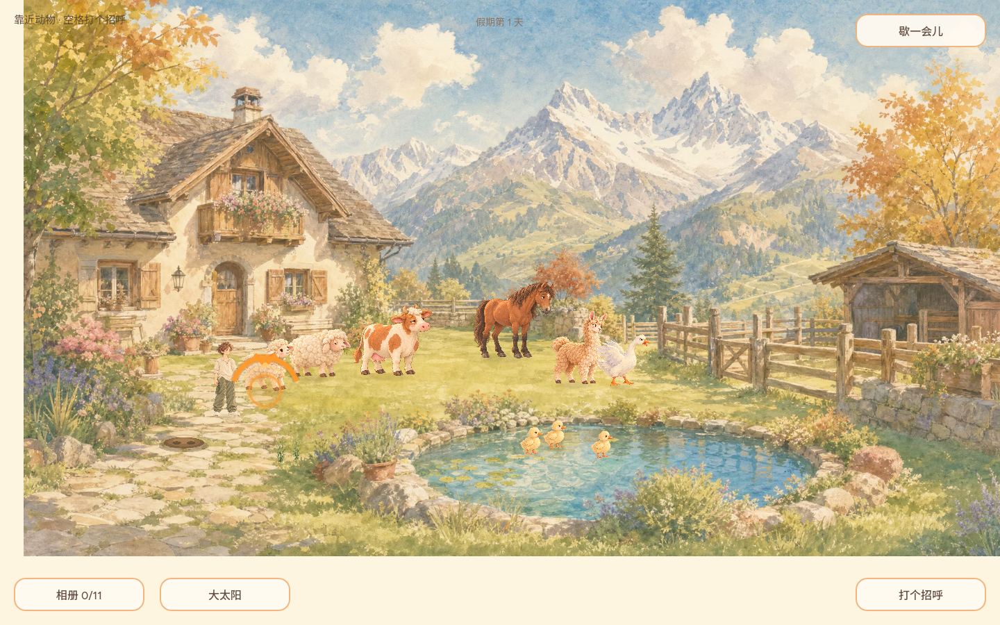
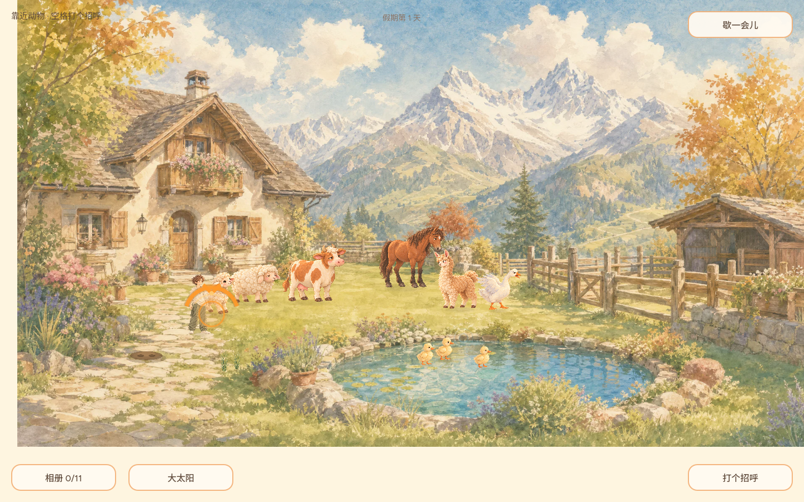
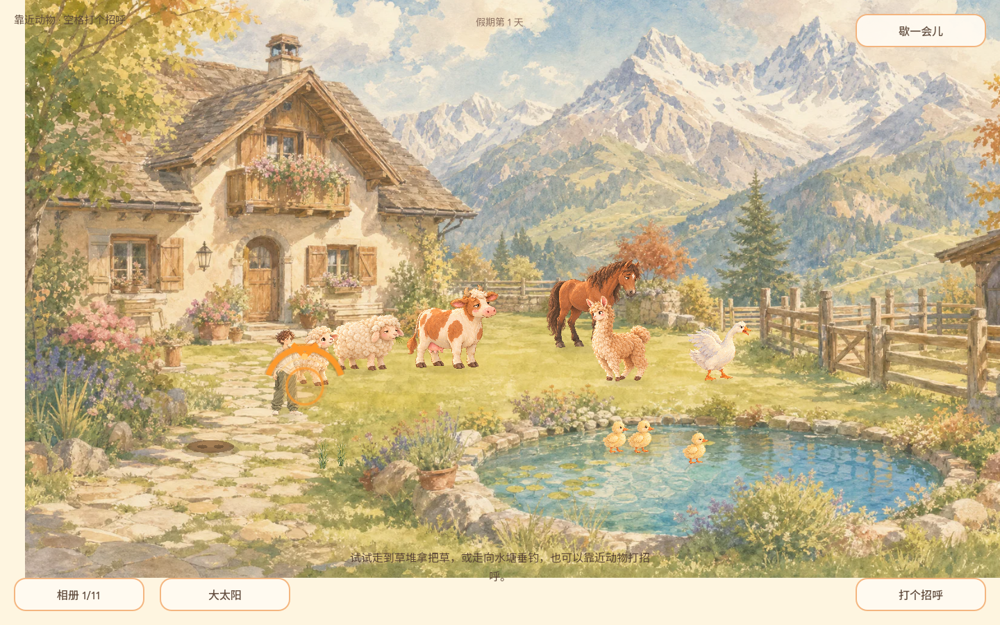
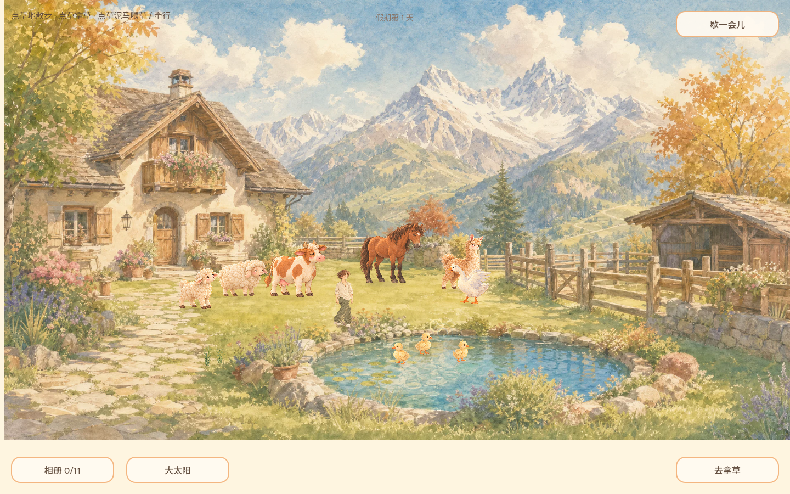

# 在线版游玩复核：game-1347743

- 日期：2026-10-02。
- 目标：复核玩家走动、动物互动、长期游玩理由、动物动态、天气/季节与大型玩法缺口。
- 构建：GitHub Pages 页面标记 `game-1347743`。
- 方式：桌面 Chromium，1440 × 900，空白浏览器存档进入；步行、空格互动、切换天气、等待自动天气、点击水塘。另对照当前脚本确认行动与时间逻辑。
- 限制：此轮未等满一个游戏日，因此季节表现根据游戏时长与绘制逻辑检查，未等待其在线演进到秋季。

## 体验步骤

| 步骤 | 体验 | 健康度 | 观察 |
| --- | --- | --- | --- |
| 1 | 进入院子 | 需改进 | 水彩氛围与动物阵容有吸引力；玩家、目标和可做之事缺少视觉层级。 |
| 2 | 走动并停下 | 需改进 | 在线截图显示走动距离短；源码显示默认序列步速约 39 世界像素/秒。走路与动画步频耦合。 |
| 3 | 走近动物并按空格 | 需改进 | 相册由 0/11 增至 1/11；角色没有明显招呼/抚摸动作，动物回应较轻。橙色弧线没有动物名称或图例。 |
| 4 | 手动切换天气 | 较差 | HUD 从“太阳”变为“阴天”，文字说光线变了；背景构图不变、色调变化不显眼。 |
| 5 | 等待自动天气 | 较差 | 等待后 HUD 又回到“太阳”；状态确实自动轮换，但场景缺少容易辨认的变化。 |
| 6 | 点击水塘 | 需改进 | 角色向点击点移动；画面没有说明这是普通移动还是钓鱼点，HUD 动作和目标不对齐。 |

## 当前运行画面

### 1. 进入院子

### 2. 步行

### 3. 动物互动与相册反馈

### 4. 手动阴天与自动天气状态

### 5. 点击水塘后的移动

## 发现与建议

### P0：移动和互动反馈

- `SequenceResident` 的 16 帧走路序列按 12 FPS 和 52 像素步幅设计，玩家默认移动速度为 96 × 39/96，约 39 世界像素/秒。应保留步态但解耦位移速度与帧播放节奏。
- 玩家只有走路/静止序列；抚摸、招呼、拿草、喂食、收杆没有明显身体动作。先为高频互动增加简短动作和音效。
- 橙色弧线在源码中标记可抚摸动物目标，并非菜单。应显示目标名称和动作，例如“羊 · 抚摸”，并把指示器准确压在目标脚边。
- 钓鱼逻辑有 6 秒收杆窗口；现有“无倒计时、无失败压力”的设计原则与此行为冲突，应在后续修复中一并处理。

### P1：动物动态

- 游玩截图中动物会改变位置与朝向，主要身体仍是静态图；长时间观察鹅没有可辨识的翅膀、眨眼或情绪变化。
- 建议先做共享动物状态（闲逛、休息、注意玩家、被互动后的回应），再为不同物种增加少量独特动作。互动应触发反馈，随机动作错开播放。

### P1：定位与留园理由

- 当前可见循环有捡草、喂/牵羊驼、抚摸部分动物、钓鱼、种花和 11 个相册瞬间，但它们之间没有明确的成长回报。
- README 和既有决策已承诺“没有待办的假期”。建议探索“轻陪伴、轻放置”：离开后动物和园景继续温和变化，回来时提供回顾；不加惩罚、强制每日清单或缺席损失。是否采用离线模拟仍需产品决策。
- 代码中一游戏日是 600 秒游玩时间；花朵需跨多个游戏日。模拟时间按运行中的 `tick` 累积，未见离线推进逻辑。等待时长与未来是否离线成长要一起设计。

### P1/P2：天气与季节

- 天气计时器自动在晴/阴状态间切换，但背景绑定始终取晴天图；阴天只轻调色。应先修复现有资源绑定，再制作能被一眼看出的云影、降雨、落叶或雪景。
- 季节当前是低透明度色层：第 1–3 天春色、第 4–7 天夏色、第 8–12 天晚夏、第 13 天起秋色。按每游戏日 10 分钟计算，秋色最早需约 120 分钟连续在线；不同季节还缺少可见环境与动物行为变化。

## 实施顺序建议

1. 校准移动与步态；补招呼、抚摸、拿取、喂食等角色动作；说明橙色目标标记并同步 HUD 文案。
2. 让动物有日常动作状态和物种差异，并对互动给出可辨识的即时回应。
3. 确定是否采用轻放置和离线模拟，再据此调整花朵与季节节奏。
4. 修复阴天背景绑定；随后确定季节视觉方案，再决定是否新增美术资源。

## 源码核对点

- [默认走路动画速度](../../scripts/entities/sequence_resident.gd)：16 帧、12 FPS、39/96 速度倍率。
- [玩家移动](../../scripts/entities/vacationer.gd)：基础速度取 96，并应用默认步态倍率。
- [天气和花圃计时](../../scripts/game/yard_world.gd)：天气切换计时、600 秒游戏日、花朵跨日生长与晴天背景绑定。
- [季节色层](../../scripts/main.gd)：按天数覆盖低透明度季节色。
