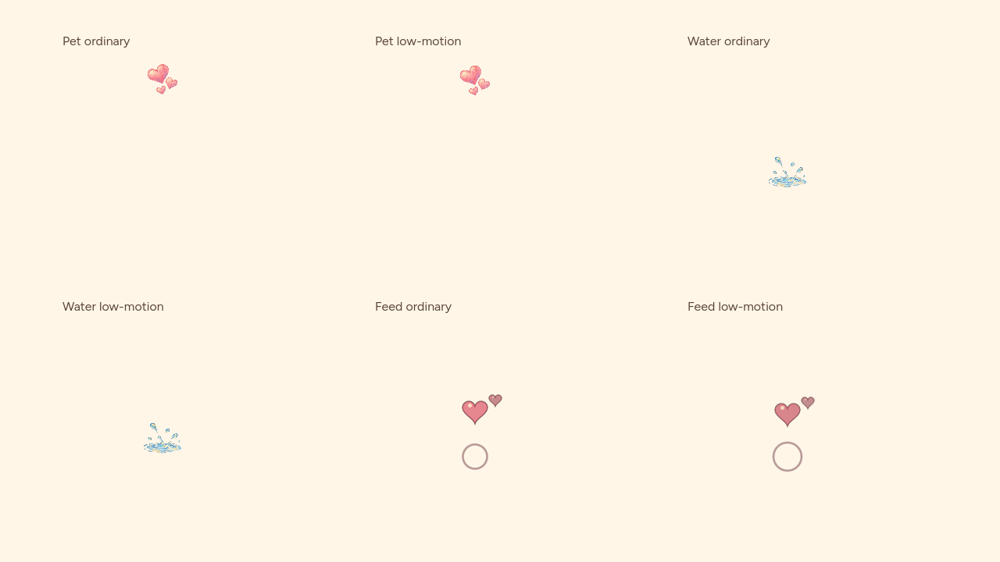
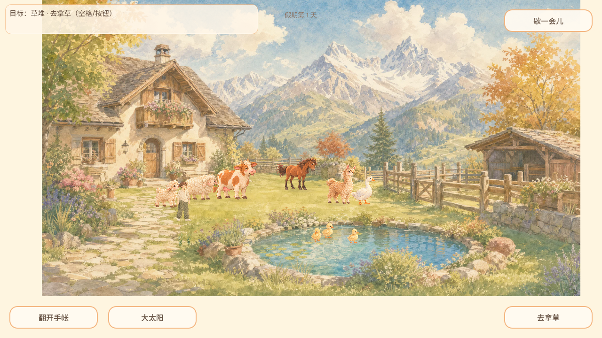

# REQ-20261003-022 低动效对象反馈静帧

- 日期：2026-10-03（CST）
- Agent-ID：`GROK-CONTRIBUTOR`
- 范围：`WorldEffectsOverlay.object_feedback_pose` + 宠物心 / 浇水溅 / 投喂鸟环心绘制
- 无界面核验：`test/still_object_feedback_suite.gd` 期望打印 `STILL OBJECT FEEDBACK PASS 14`
- 合入后建议：在 `tools/verify_daily_life.sh` 的 still_* 列表追加 `still_object_feedback`（本 PR 故意不改该脚本，避开开放中的 PR #118）
- 玩家可见：开启低动效时，抚摸水彩心、浇水水彩溅、投喂鸭鹅的环与心在整段反馈窗口内保持可读静帧，不再中途变淡或上漂；关闭低动效时原有上浮与淡出仍在

## CODEX-LEAD 最终集成验收（2026-10-03 UTC）

保留GROK原PR136完整3bfb74abfdf820232294a8304df5334ea53bb9db与提交脉络；在独立分支补成功quit(0)后的return及标准daily挂载。失败分支不变，旧“PASS14但exit1”候选不算成功。先376cae1、再693b311基础的严格完整回归均exit0；其后主线又合入牛glance，最终基线4bb12b2b334ed73c73a2eea8d430800bcf4c95c9重新完整严格验收exit=0，日志/tmp/youjia-req022-final-daily.log；STILL OBJECT FEEDBACK PASS14、COW GLANCE PASS8、viewport及loader全部完成。daily合并冲突手工同时保留still_object_feedback、interaction_pose、cow_glance，不丢新主线测试。

### Web真实绘制及成功路径

Godot4.7.2正式Web模板，从4bb12b2跟踪文件建立隔离副本，只覆盖本片WorldEffectsOverlay；验收夹具暂挂主场景，正式游戏文件/配置不改。完整引擎导入与两次Web导出无SCRIPT ERROR/ERROR。

[可复现夹具](2026-10-03-REQ-022-integration/controlled_render.gd.txt)：临时保存为res://req022_render.gd，Node场景挂此脚本，项目main_scene只在验收副本设为此场景，再正式Web导出。夹具冻结角色与世界过程，以真实YardWorld._interact_with_target成功路径触发牛抚摸、已种植花床浇水、持鱼投喂鸭；不是模拟返回的pose值。普通/低动效各取早期0.15、末期0.94真实SubViewport图像，普通像素变化、低动效像素逐字节相同，实际图形可见；倒计时结束snapshot清空。共24项通过，window.objectFeedbackResult={checks:24,failures:[]}；Chromium1280×720，console error/pageerror=[]。这是冻结角色、脚本设置接近位置和库存的受控验证，不能当作所有移动动物的自由操作验收。

之后移除临时gd/tscn、恢复原main_scene另导出正常Web；Chromium实际点击开始进入院子，键盘右移1.2秒后松开；正常入口/绘制无console error/pageerror。未在此正常入口逐一人工触发三类反馈，成功路径由上述夹具覆盖。

### 边界

本片不新增心形反馈或表情资源，不解决默认爱心的完整产品调整；牛glance是主线PR137的独立交付。普通动效、判定距离、持鱼消耗、存档与照片规则未改。正式发布、公开manifest/PCK实际哈希及独立最终SHA审查仍待完成；本地受控导出不是正式发布。

## 正式审查及发布闭环

独立reviewer CODEX-LEAD-REVIEW-PR-144 APPROVE最终74b0fb98418c8c3627313d8b776b750b25cb4508；远端/本地树一致，独立Godot新suitePASS14实际exit0、受控Web24项和正常入口移动均通过，完整严格回归日志已审阅。合入2cd15c20df7386780a7e7a15912145f4b5f0ed73，原PR136自动标merged。

[Actions37125716673](https://github.com/narutojzm1-dot/youjia/actions/runs/37125716673)严格回归/正式Web导出/发布成功；[Pages37125937069](https://github.com/narutojzm1-dot/youjia/actions/runs/37125937069)成功。公开与raw game-release.json完全一致，sourceCommit对应合入SHA，entry=game-2cd15c2。两来源实际PCK逐字节一致：19182036字节，SHA256 `9c61bafd6d6a6d3f700b5b7f490743c25b07e096fcd491042ab15693b06c6471`。先前实际下载game-4bb12b2为19181396字节，本片实际包增640字节，不把此前乘骑/牛/云资源算成本片新增。

公开Chromium1280×720等待youjia:first-frame，HTML data-build=game-2cd15c2，点击开始进入院子、canvas存在，console error/pageerror=[]，截图/tmp/youjia-pr144-public-yard.png。后续docs-only身份登记合入不改发布源。此节取代前文当时待审核/待发布状态；冻结夹具的限制与默认爱心等未完成产品范围继续保留。
