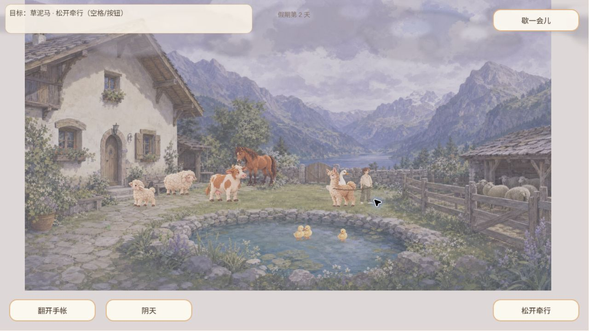
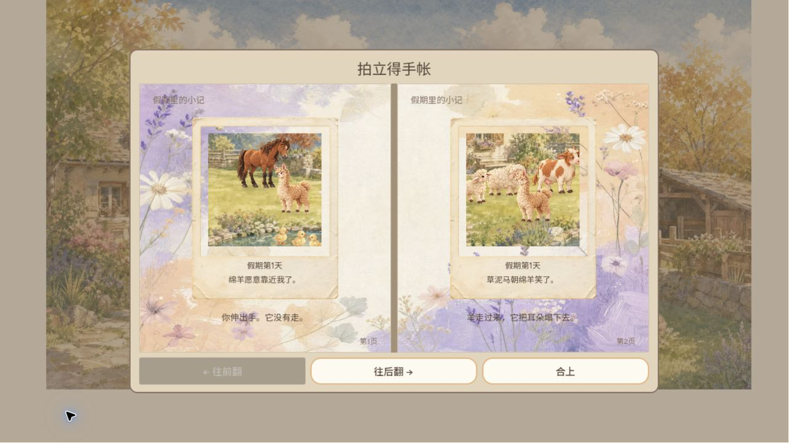
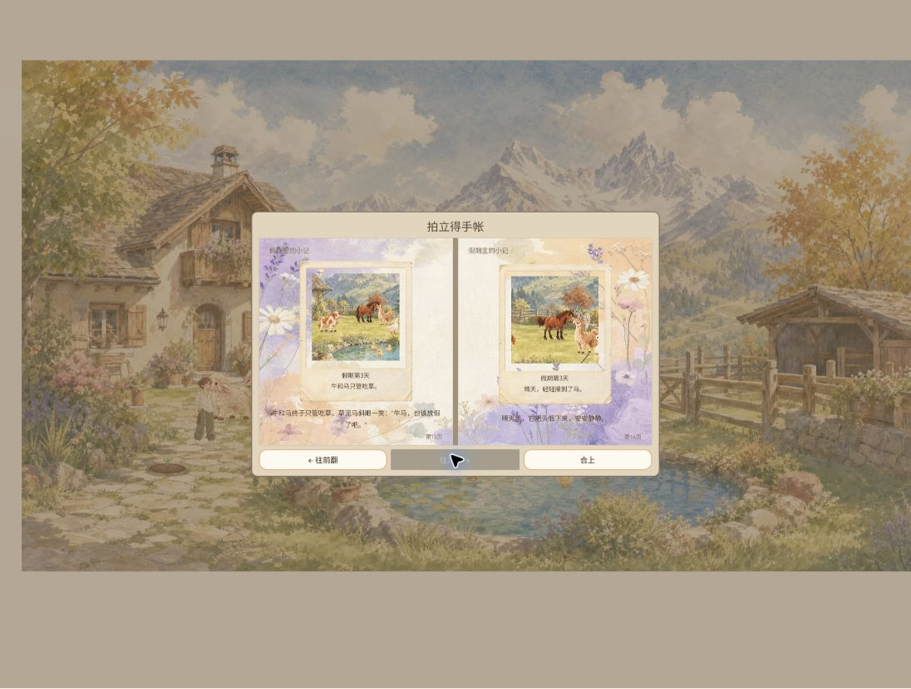
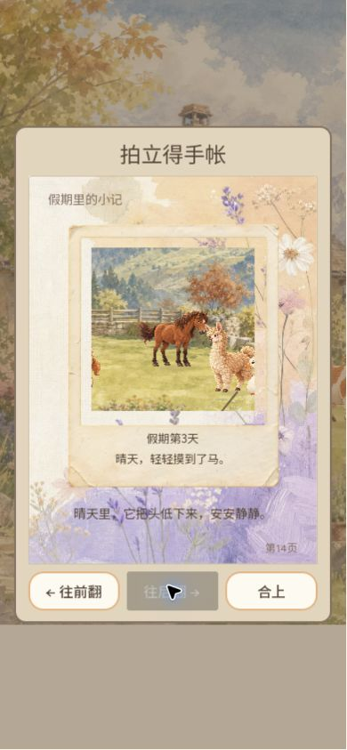

# 2026-10-03 独立游戏体验报告

Agent-ID：GAME-QA（身份登记见配套 PR）。材料类型：**供用户查看**。状态：已实测历史线上构建；报告候选，未代表当前 main 或最新发布通过。

完整叙述、覆盖矩阵及截图见 [HTML 报告](report.html)（下载后在浏览器打开），[原始观察](observations.json)与[BUG 台账](bugs.json)。日期均为北京时间。

## 结论

水彩院子、羊驼牵行和手账形成吸引力，互动对象与回忆之间的对应仍需加强。完成一次主要玩法体验，但**完整游戏覆盖不足，不能判定全量发布通过**。未观察到 P0/P1 不等于已排除。未修改游戏实现。

Windows Chrome，既有存档第 2 天自然至第 3 天。主要游玩页面 data-build 为 `game-5e42fd9`；刷新后为 `game-922be64`，后者只补验加载、恢复和模拟竖屏等项目。版本号来自页面，未核验二进制与完整提交哈希映射；报告提交的 Git SHA 不是被测游戏 SHA。

## 覆盖与限制

| 项目 | 实际结果 |
| --- | --- |
| 启动、走动、暂停恢复、退出确认 | 已操作 |
| 绵羊/马招呼、羊驼牵行松开 | 已见反馈，牵行闭环完成 |
| 环境热点、花圃 | 蝴蝶、草叶/羽毛、涟漪；浇水重复提示可见，成长收获未完成 |
| 钓鱼 | 抛竿、等待、咬钩、重试已体验；工具往返错过窗口，钓获投鱼未确认，不能据此归为产品缺陷 |
| 摄影手账 | 浏览 14 页；旧照片事件不算本轮触发，新照片显影未完整捕获 |
| 刷新升级恢复 | 本样本第 3 天、14 页及末页题词保留 |
| 390×844 模拟竖屏 | 单页翻页、末页禁用、合上可用；非真机触屏验证 |
| 长周期/音频/低动效/自然鹅骑马 | 未验证 |

加载单次样本：界面总资源 56 MiB 为解压后大小；72 秒 87%、82 秒 98%，随后进入标题。网络变量未隔离，不作为稳定性能基准。两次 warn/error 读取为空，不代表持续监控。

## 问题清单

| 编号 | 严重度与状态 | 步骤 / 预期 / 实际 / 复现范围 |
| --- | --- | --- |
| QA-EXP-20261003-001（原 EXP-001） | P2，已观察体验问题 | 院内停留观察晴阴变化；预期同一空间，实际房屋/池塘/围栏透视构图变化。主要构建多次观察，未统计次数。既有天气同构图方向，关联 #51/#168，勿重复派发开发。 |
| QA-EXP-20261003-002（原 EXP-002） | P2，待干净档复核 | 打开既有手账第 1 页；预期绵羊题词对应绵羊入镜，实际可见马/羊驼/鸭子而无绵羊。刷新后仍见；生成版本未知，不认定最新版本回归；跟踪 #40。 |
| QA-EXP-20261003-003（原 EXP-003） | P2，已观察体验问题 | 刷新 game-922be64；预期与小院一致的加载美术，实际科幻机器人迷宫。仅一次样本；跟踪 #167。 |

修复 Owner 待 CODEX-LEAD 分派，本 QA 不认领开发。建议下轮以独立测试档补齐钓获投鱼、种植收获、自然偶遇、长期回访；不得重置用户存档。

## 关键证据

