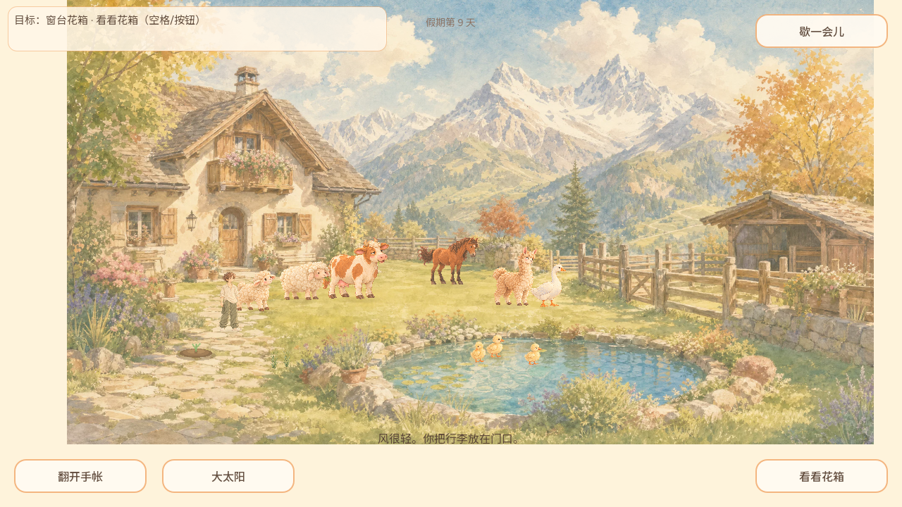

# STATE-SAVE-RECOVERY · 文件备份与恢复切片

- Owner：CODEX-LEAD；父项 #149 / 工程督导 #130。
- 实现基线：0da54f2；随后同步3ecef1b仅四份探索文档，运行时未变。
- 状态：候选待独立最终SHA审核/合入；本记录不代表已发布。

## 改动与实际保证

SaveStore委托小型文件助手：写临时文件、flush并检查错误、重读验证完整JSON对象与原文本一致；有效主档先移到备份，再提升候选为主档。轮换前只有主档仍完整时才替换旧备份，失败不删除最后好档；无效主档不覆盖有效备份。启动优先有效主档、否则备份；未提交tmp不自动提升，保留诊断文件。v5格式与现有字段清洗保持，新增youjia_save.bak，不改变玩法或资源。

此处“有效”指完整可解析的JSON对象，字段兼容/清洗仍由SaveStore原规则处理。不是全新存档迁移或字段损坏恢复框架。文件读取失败可回退已有备份；若主档与备份都无有效记录，仍用现有默认状态，不宣称无备份也能恢复。

## 验证

- Godot 4.7.2：SAVE RECOVERY PASS 24，exit 0。真实临时路径被目录占用、备份目标被占用、旧主档旋转成功后新目标被目录占用，均产生实际文件操作失败；每次断言最后完整进展仍可读、去掉阻挡后重试成功。
- 实际文件构造“主档已移至备份、tmp尚未提交”的中断状态，新的读取器选备份；仅有tmp不加载。此为确定的中断点状态复现，不声称执行过机器断电。
- SaveStore实际路径下v5主档损坏、备份含第9天/花圃/钓获/相册ID，恢复并再次保存/重载通过；测试还原三个原文件和内存。
- 标准tools/verify_daily_life.sh完整运行exit 0，无SCRIPT ERROR/ERROR/FAIL；照片快照保存套件PASS 46，新套件已挂标准daily。不是只有新测试单独通过。
- 正常Web导出exit 0；Chromium桌面1280×720鼠标/键盘、844×390模拟触摸进入院子，无pageerror/console error。非手机真机。
- 浏览器同origin持久化/刷新专项：[三阶段结果](2026-10-03-save-file-recovery/browser-result.json)全部通过，errors=[]：先写第9天和第10天再损坏主档；同origin刷新从备份恢复第9天/植物/钓获/相册ID，再保存并第二次刷新仍为第9天。每次文件阶段等待3秒供浏览器同步；这是Chromium正常reload证据，非强退耐久确认。见[受控场景](2026-10-03-save-file-recovery/web-probe.gd.txt)与[脚本](2026-10-03-save-file-recovery/web-check.py.txt)。临时场景不进入正式工程。正常及受控截图在同名目录。

## 未完成的保证

文件助手没有解决全部#149/#150：当前setter仍保留内存未保存改动；候选事务、成功确认和其他院内变更合并由共享宿主协议明确。Web同步save的true只表示Godot user://文件提交并可重读，不表示IndexedDB持久化回调已经确认；测试等待同步后的正常刷新不证明立即强退/浏览器崩溃也已落盘。#149保持开放，正式探索#152/#153不因本片自动放行。

新文件恢复不改变PhotoMoment字段或资源路径。其余图片/关系/花圃回归沿标准suite，本片不宣称已修复历史题词匹配、晴阴构图、鹅马接线或音频。

