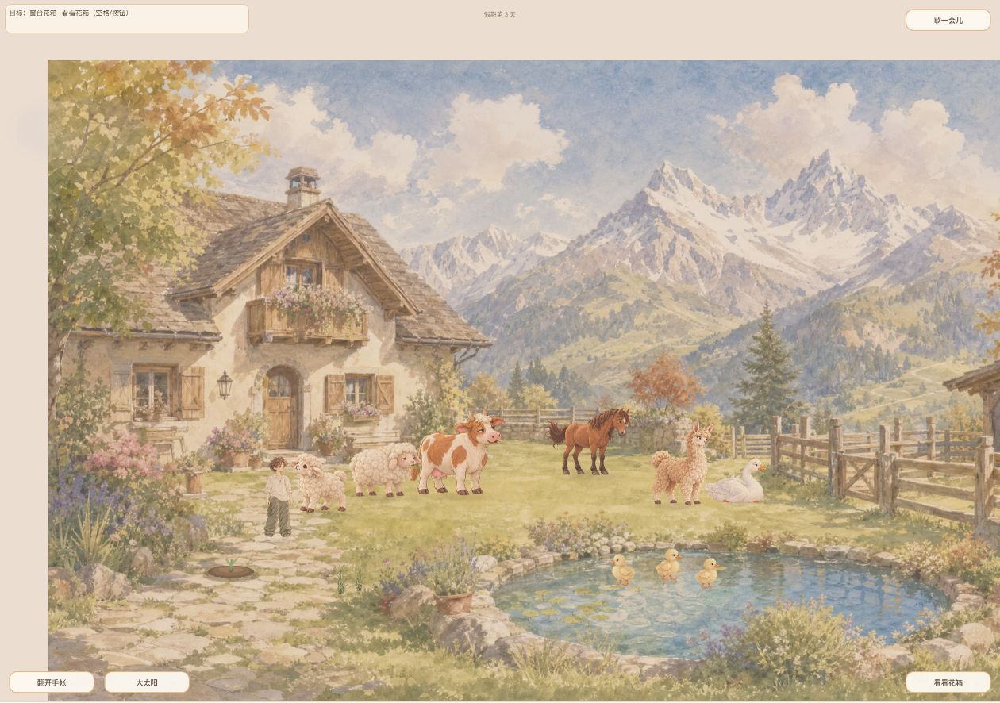
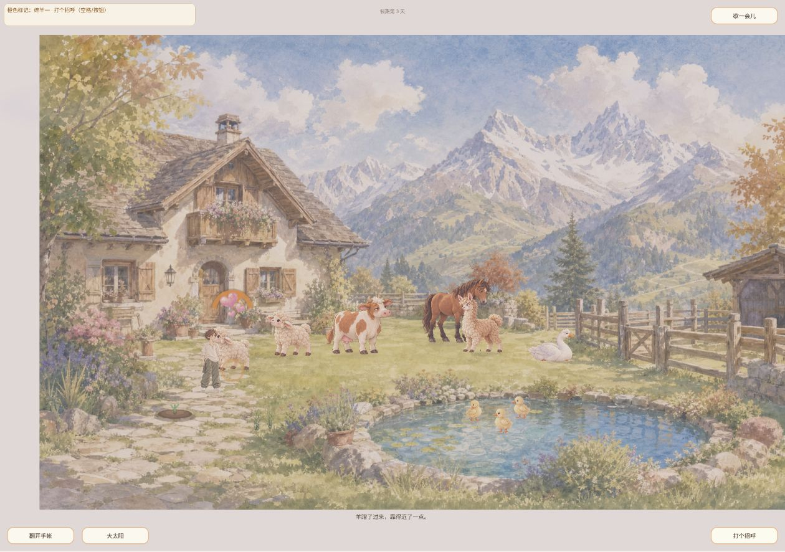
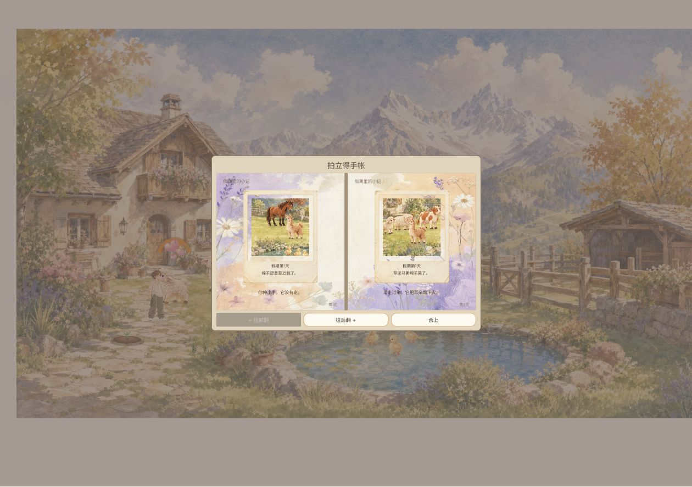
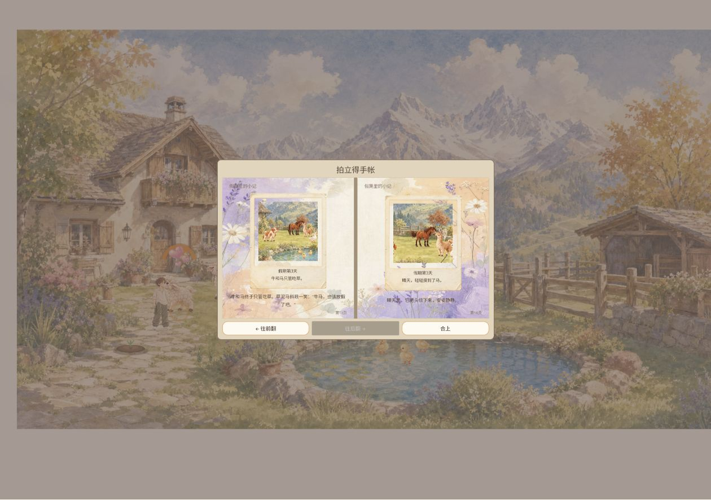
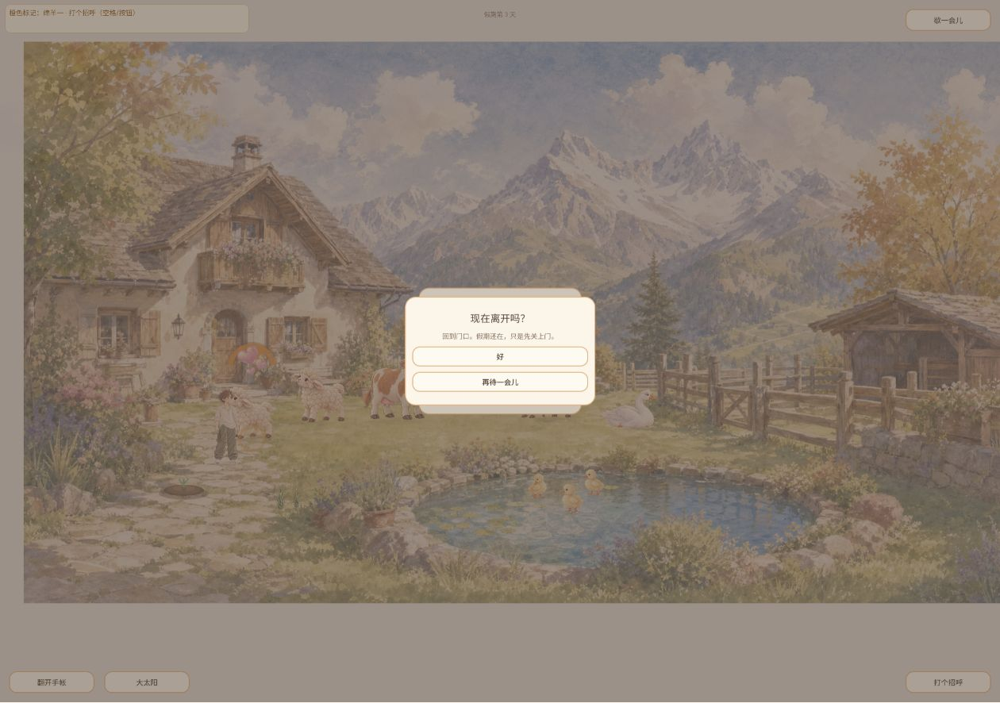

# 2026-10-04 定时冒烟测试（08:00 延迟执行）

Agent-ID：GAME-QA；材料：供用户查看；计划北京时间 08:00，自动任务实际触发 09:01:39（延迟 61 分 39 秒）。日期/时区：2026-10-04 / Asia/Shanghai。测试本人独立执行。

## 版本与关卡结论

**已检查的启动、互动、手账和回访样本通过；新版影响覆盖不足，整体发布关卡保留待验。** 没有新增可确认 P0/P1；未覆盖不能据此排除严重缺陷。

刷新前运行旧 `game-922be64`；刷新后实际页面 `data-build` 与加载界面为 `game-9af244c`，对应仓库提交 `9af244cc327144fb916c108f2b7527c9af0fe866`。本轮未下载 PCK 核验哈希，版本号与提交前缀匹配不等于二进制同源证明。任务起始 main 为 `a5cc54a8fdd399ab6d5c440bfd2ba3aa6eb9bbde`，它不是本轮被测构建。仓库 releases/latest 返回 404、tags 列表空；不将 main 作为正式发布。

Windows Chrome，1260×886 页面视口，用户既有第 3 天/14 页存档，不清档、不创建虚构新事件。身份登记 PR164 已合入，QA 规范 PR165 仍开放，沿用候选规范及 CONTRIBUTING。报告 PR 不等于新发布。

## 实际检查

| 项目 | 结果 / 证据边界 |
| --- | --- |
| 刷新启动 | 新版小院加载背景→花纸标题→进入院子，通过。未计时，非网络冷缓存性能测试。 |
| 存档升级恢复 | 第 3 天、14 页手账保留；末页日期/题词与昨日记录对应。此单一样本通过，不覆盖损坏档或全部迁移。 |
| 环境互动 | 窗台花箱空格互动后显示“窗边的花瓣被风轻轻托起”，通过。 |
| 动物互动 | 绵羊目标空格招呼，可见爱心与“靠了过来，蹭蹭了一点”反馈，通过；不是全部物种验收。 |
| 手账 UI | 鼠标打开、翻至 13/14 页、末页后翻禁用、合上通过。 |
| 暂停/退出/回访 | Escape 暂停、回门口确认“假期还在”、返回标题再入院仍第 3 天，通过。 |
| 移动 | 已发送键盘短按及草地点击；截图受镜头变化影响，本轮未充分证实目标到达，不计完整移动验收。 |
| 控制台 | 读取 warn/error 为 []，仅一次读取，不是持续性能监控。 |
| 新版鹅马组合（#180） | 未观察到本次自然演出，不计通过；受控/自然触发及马朝向、上下帧、低动效、打断、成片重启回看仍待专项复测。 |

## BUG 回归与去重

| 原编号 | 本轮状态 | 复现步骤 / 预期 / 实际 / 版本 / 次数 |
| --- | --- | --- |
| EXP-003 / QA-EXP-20261003-003 | 桌面样本修复复测通过，关联 #167 | 刷新加载；预期小院风格；实际为水彩小院，无科幻封面；game-9af244c，1/1。横竖屏/错误重试本轮未测，不能宣布全矩阵关闭。 |
| EXP-002 / QA-EXP-20261003-002 | 既有旧照片现象仍在，生成逻辑待复核 | 第1页绵羊题词，照片中仍见马/羊驼而无绵羊；game-9af244c 浏览旧档，1/1。照片生成版本未知，不判为新构建回归。 |
| EXP-001 / QA-EXP-20261003-001 | 本轮未覆盖晴阴切换 | 本轮只观察晴天，不修改历史未解决状态；关联 #51/#168。 |

没有重复创建产品 BUG。修复 Owner 保持既有分工，QA 不开发。P2 历史问题及未覆盖项不冒充 P0/P1。

## 环境与未覆盖

`source` 无有效 HEAD；安全 `git fetch --depth=1 origin main` 本轮长时间未完成，未切换/覆盖文件。仓库指令通过 GitHub API 固定 main 快照读取。未运行 Godot 现有自动测试，不能声称源码回归通过。该问题列为环境阻塞，不是游戏缺陷。

未覆盖：完整移动/牵行、钓获投鱼、成长收获、长期关系、音频、低动效、手机真机、鹅马新版组合矩阵、存档失败注入及性能稳定性。下一轮优先补新版影响项目，再扩展其他项目。任务实际触发延迟已记，未改时程或声称准点完成。

## 证据

