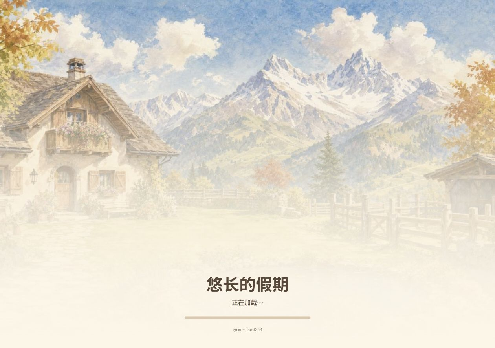
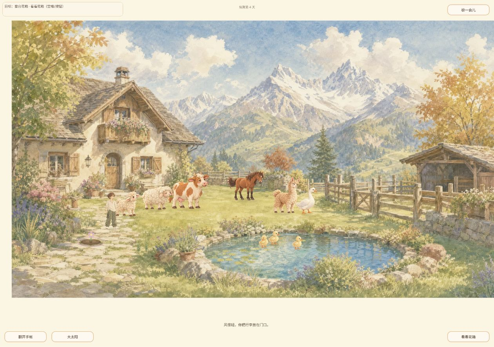
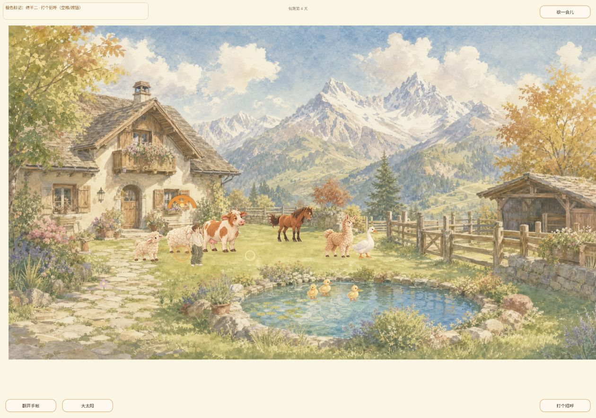
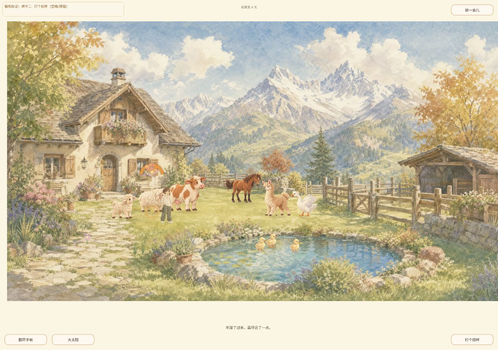
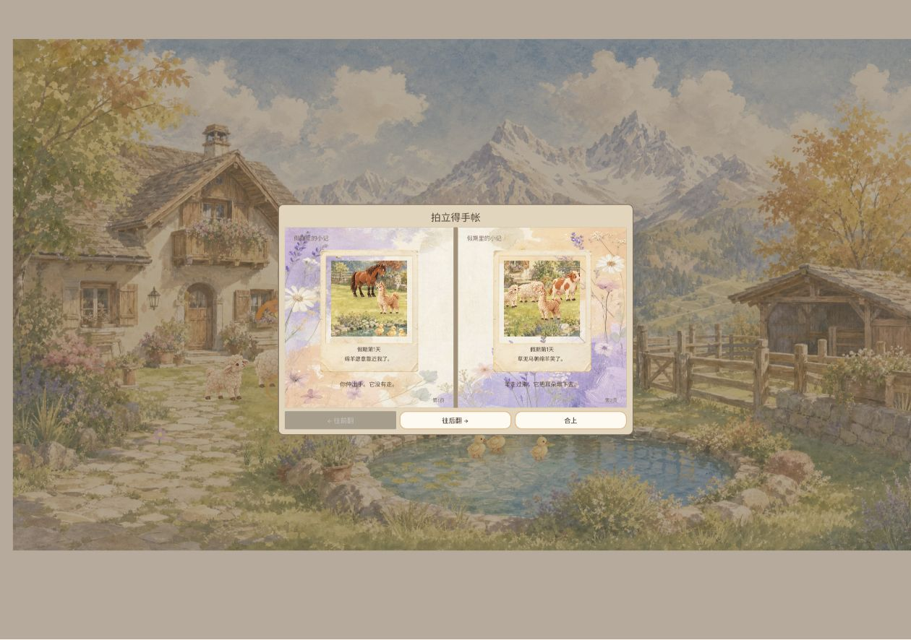
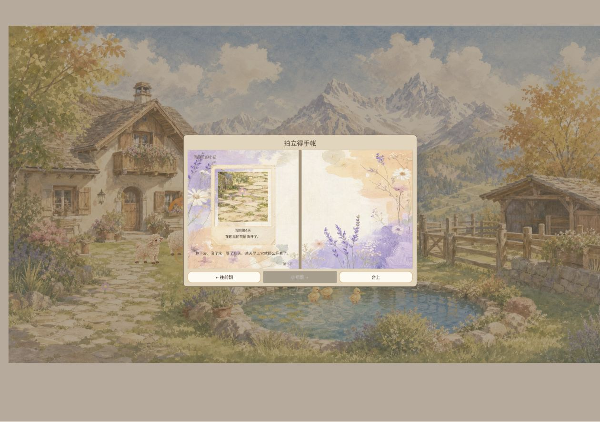
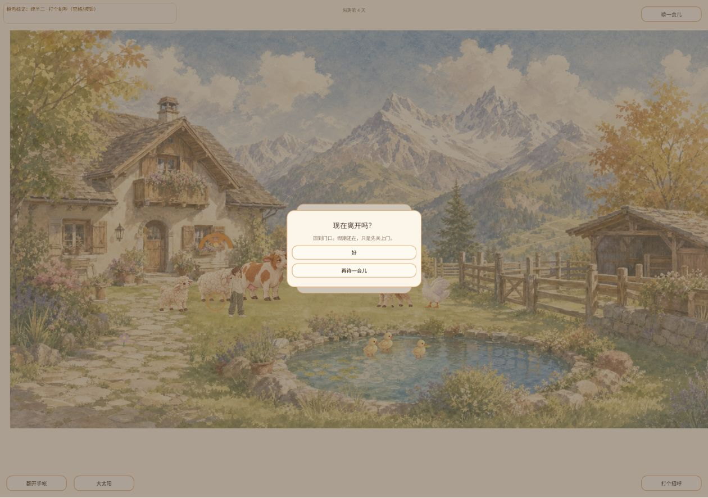
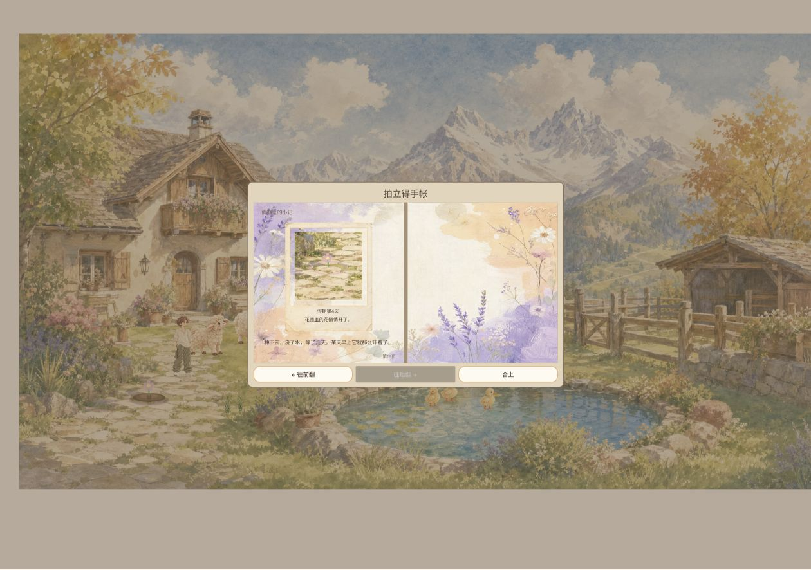

# 2026-10-04 17:35 定时冒烟报告

Agent-ID：GAME-QA。供用户查看，测试独立执行，无游戏开发/修复/发布。自动任务实际触发北京时间 17:35:38；相对最近计划 16:00 延迟 95分38秒。heartbeat 未提供对应计划槽位，不将本轮声称为12点和16点两轮均已执行。

## 版本与结论

实际旧页面 game-9af244c，刷新后加载界面与 DOM 为 **game-fbad3c4**，对应仓库提交 `fbad3c468d000a496092571f338766c776c57e4f`；未下载PCK验证同源。起始main `a104e6b0c442aaa050453794e4538469972312f1`，与被测版分开记录。releases/latest 404，tags空。Windows Chrome，1260×886，既有第4天用户存档，未清档。

**所列冒烟样本通过；完整发布关卡仍待验。** 未新增可确认P0/P1，不代表排除了所有严重缺陷。来源快照已核对AGENTS/CONTRIBUTING/身份/策划/需求/台账；QA规则PR165仍候选。当前有隔离探索研究及资源候选，不能把正式院子游玩当成这些隔离原型通过。

## 实际覆盖

| 项目 | 结果与边界 |
| --- | --- |
| 启动 | 实际小院Web加载壳（截图有game-fbad3c4）→花纸标题→入院，通过；未测冷缓存/加载时长。 |
| 升级恢复 | 第4天可见，历史相册可读；当前15页，多出第4天花朵记录，未观察拍摄瞬间，不能认定本轮新触发。 |
| 移动 | 草地鼠标点击后人物从屋前走向草地，截图位置变化可见；不代表全部路径/键盘验收。 |
| 绵羊互动 | 当前绵羊目标空格后爱心、靠近短句可见，单次反馈通过。 |
| 相册 | 打开、翻页至第15页、末页禁用、合上，通过。 |
| 暂停与回访 | Escape暂停→回门口→保留假期确认→标题→再入院仍第4天；相册再回末页内容保持，通过。 |
| 控制台 | 本轮warn/error读取为[]，非持续监控。 |

## BUG回归

- QA-EXP-20261003-003（旧别名EXP-003，#167，P2）：1/1加载观察为水彩小院，桌面样本修复复测通过，本轮有真实加载截图。手机尺寸/错误重试未测。
- QA-EXP-20261003-002（EXP-002，#40，P2待复核）：旧相册第1页绵羊题词与马/羊驼主体不对应仍见，1/1旧档浏览。拍摄版本未知；干净档新事件及生成逻辑未测，不认定最新回归。
- QA-EXP-20261003-001（EXP-001，#51/#168，P2）：本轮只观察晴天，未复测天气切换；保留历史未解决状态，不以未复现关闭。

## 阻塞与未覆盖

source仍无HEAD；本轮安全fetch因`.git/shallow.lock`存在返回128，未删除锁或覆盖检出。指令与版本经GitHub API读取。未跑仓库自动测试，该环境阻塞不是产品BUG。

未覆盖：鹅马#180演出组合/打断/低动效/成片生成、独立新档照片复核、钓获投鱼、种植完整成长、长期关系、音频、真机触屏、存档故障注入、性能及新探索隔离原型。无历史已确认P0/P1供回归；不将P2或未测冒充高严重度通过。

另响应之前审核：PR165/191统一完整BUG ID、旧别名及跟踪链接；PR191早晨01-loading图实际为花纸标题，已纠正图注并注明当时加载壳仅人工观察无截图，本轮截图不回填为早晨证据。两PR新SHA待独立复审。

## 证据

