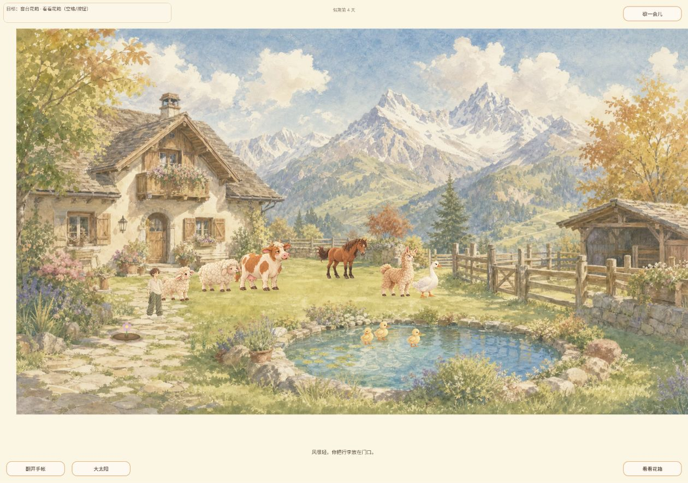
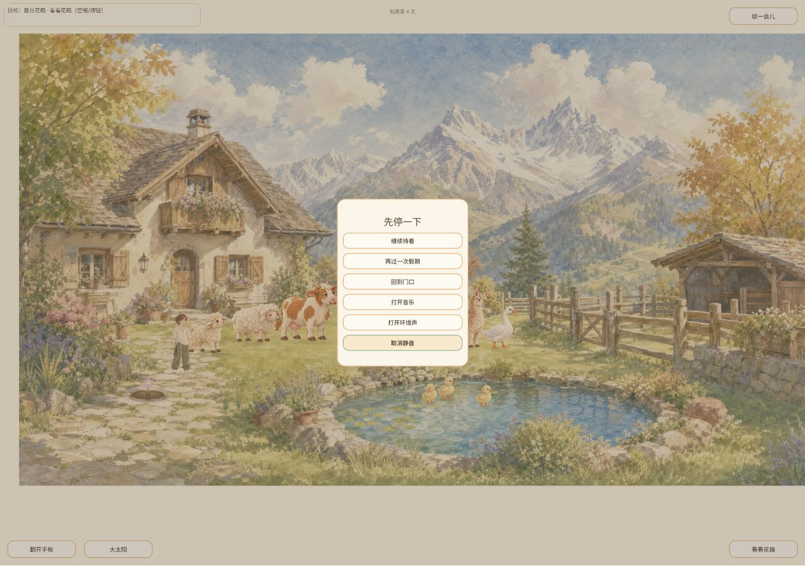
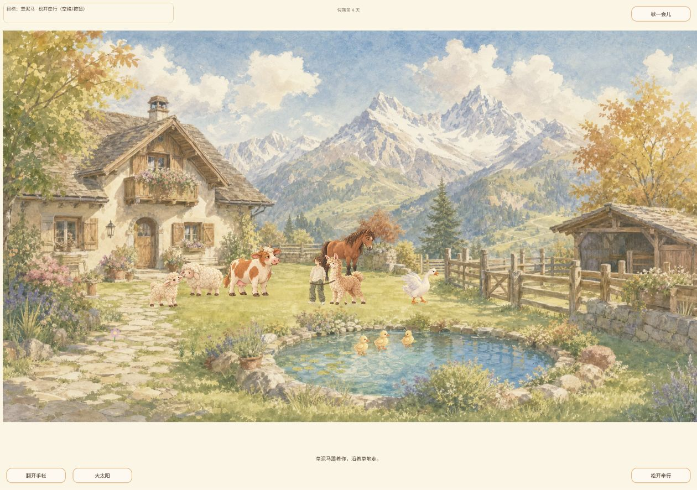
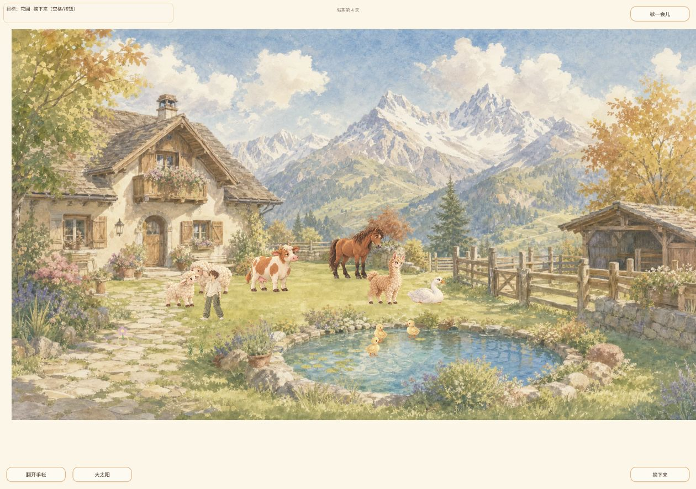
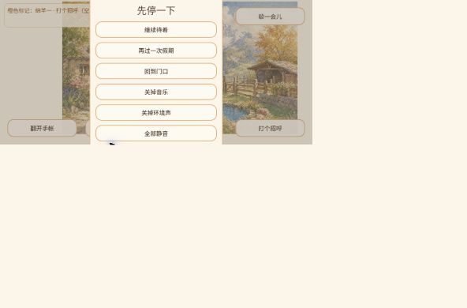
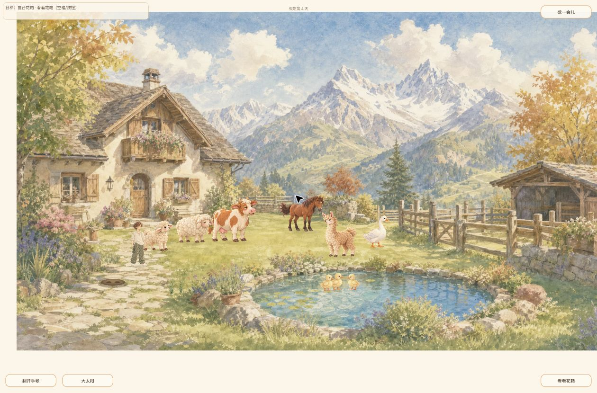

# 2026-10-04 20:00 深度测试（21:13 实际触发）

Agent-ID：GAME-QA；材料类型：供用户查看 / 开发复现证据。计划北京时间20:00，实际21:13:59，延迟73分59秒。独立实际游玩，不委派、不开发、不发布。

## 发布关卡结论

**失败：既有声音启动 P1（#195）在本轮线上构建再次复现。完整玩法覆盖不足，不能给全量通过。** #196 十分钟真实听验仍阻塞；有日志证据不等于已通过扬声器听验。

刷新线上 `game-bda85be`，仓库对应提交 `bda85be4db8257e570569b0022d1b37ab096fd80`；加载截图与DOM构建号一致，未下载PCK逐字节核验。起始main/API及本轮fetch源为 `e6436db8888357f34f415b13be16e1d3125abd73`，不把该main等同被测构建。Release latest404，tags空。

Windows Chrome；初始1260×886，模拟390×844竖屏与844×390横屏，重排时曾出现暂态小画布，最后清除覆盖、DOM核对自然1260×830。模拟鼠标不是触屏/真机/Safari。用户既有第4天15页存档，未清档；花朵在本轮前已成熟。身份与报告规范已合入，历史PR165/191/214均已合入归档。

## 当前 P1 复现

唯一QA条目 `QA-AUDIO-20261004-001`，关联已有 #195（修复Owner GROK-BUILD），听验 #196（GAME-QA），不重复创建开发工单。

步骤：刷新当前公开页面→加载标题→真实鼠标点击进入→截图确认进入院子→Escape暂停→操作音乐、环境声及静音会话按钮。预期首次手势能初始化共享声音后端、暂停和开关不因接口缺失报错。实际控制台记录 `ERROR: No interface '__manusBgm' registered.` 与 `get_interface (platform/web/javascript_bridge_singleton.cpp:305)`；两次错误分别13:16:14Z、13:16:29Z，来源game-bda85be.js。第一次新页面进入样本1/1失败；同页面更多报错不伪装成多次独立冷启动。见 [原始日志](evidence/audio-errors.json)。

会话按钮文字从“关闭音乐/关闭环境声/全部静音”变为“打开音乐/打开环境声/取消静音”，再恢复原文，UI状态检查通过；传输、实际分轨声音、异步resume与前后台生命周期不能仅凭文字判通过。工具无可听输出，未做耳机/扬声器十分钟听验；没有凭听感宣称无声、爆音或音乐比重合适。控制台缺接口是可确认产品问题，不归为环境问题。

## 持续覆盖矩阵（本轮与历史分开）

| 范围 | 本轮实际结果 | 历史/未完成闭环 |
| --- | --- | --- |
| 启动与主入口 | 当前构建加载、标题、入院可用 | 单次33秒时97%/57.0MiB，界面总58.6MiB为解压后；未测真实网络字节/性能分布 |
| 移动与羊驼 | 点目标自动靠近、牵起绳索、点草地随行、松开后恢复自由，通过可见闭环 | 未测所有碰撞/键盘长按/低动效 |
| 钓鱼 | 点钓位→等待浮标，随后走开取消并转为拨水目标，可继续操作 | 未确认钓获→投鱼；本轮未抓到咬钩，工具往返不能归因产品无法钓鱼 |
| 花圃成长/收获 | 已成熟花朵出现“摘下来”；空格后“花摘下来了。土里留着还没散的暖意”，花朵消失，收获可见 | 成熟来自历史存档；本轮不是从播种→成长→成熟完整验证；不声称完整经济系统验收 |
| 手账与记忆 | 竖屏单页第1→15页，末页禁用/合上可用；旧第4天花朵照片保留 | 未捕获新照片显影，不把旧鹅马/鱼事件当本轮触发 |
| 保存/回访 | 退出保留假期、刷新重入检查，第4天、15页及收获后空花圃样本保留（见回访证据） | 无新档、损坏档、强退/配额/失败注入/多版本矩阵 |
| 天气与长期关系 | 本轮主要晴天；未观察完整天气切换或新关系演出 | 历史天气构图问题保留，长期/四季/稀疏记忆未验 |
| 鹅马新版#180 | 只看到鹅马日常存在，未看到完整自然演出 | 马朝向/上下帧/低动效/移动打断/演出照片→重启未完成，不计通过 |
| UI/分辨率 | 桌面音频菜单、竖屏相册分页、横屏院子/HUD可见；视口重排暂态单独注明 | 横屏菜单截图重排不稳定，不据此判产品BUG或完整通过；真触屏未测 |
| 音频 | 首次启动P1已复现，开关UI状态可切换 | 实听、循环接缝、后台恢复、10分钟舒适度阻塞 |
| 稳定性/异常边界 | 无院景崩溃，但音频错误明确 | 未监控FPS/内存/长稳，未测非法输入/存档异常 |
| 模式/关卡/探索 | 正式院子当前可见玩法 | 隔离探索/装饰原型不在本轮公开体验，不按正式内容验收；无凭据的模式标未覆盖 |

## 全部本地历史 BUG 回归

- QA-EXP-20261003-001（EXP-001，P2，#51/#168）：本轮未覆盖晴阴切换，保留历史未解决。
- QA-EXP-20261003-002（EXP-002，P2待复核，#40）：本轮竖屏第1页仍为绵羊题词、马/羊驼图，旧档浏览1/1。首次生成版本未知，独立新档生成逻辑未测；本轮没有可隔离存档的浏览器控制入口，不清用户档。
- QA-EXP-20261003-003（EXP-003，P2，#167）：当前真实加载壳水彩小院桌面样本1/1通过，手机尺寸加载/失败重试未测。
- QA-AUDIO-20261004-001（P1，#195）：本轮日志复现失败；沿用既有工单，不接管开发。历史本地台账之前没有已确认P0，未覆盖不算通过。

## 自动测试与静态检查边界

自动测试：未执行。源码检出HEAD仍缺失，初次fetch被shallow.lock阻挡；确认无git进程后将旧锁移到qa备份，第二次安全`fetch --depth=1 --filter=blob:none origin main`成功，origin/main固定e6436db。未覆盖用户文件或完整checkout，不把fetch成功当Godot套件通过。

静态检查：只读比较fbad3c4→bda85be，确认新增音频Director/后端/Main与分轨资源是当前重点回归范围；只读git show取main后端源码，不把main静态代码分析当线上二进制证明或真实声音验收。游戏运行时代码、资源、存档字段与发布配置均未修改。

下一步：原Owner修复#195后重测同构建首次手势与生命周期矩阵，再具备真实可听条件执行#196；补新档照片、钓获投鱼、完整成长及#180专项。当前P1与覆盖不足不能用日版本节点压力豁免。

## 关键证据

