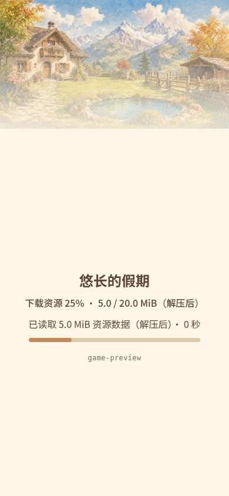
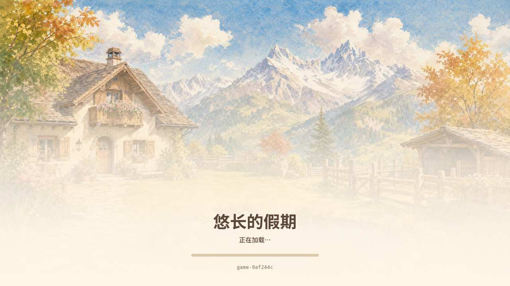
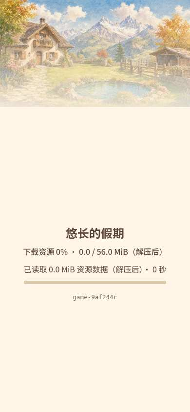
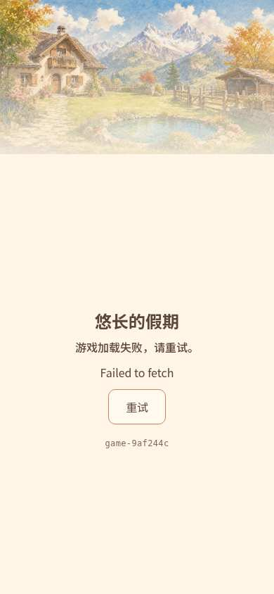

# QA-EXP-20261003-003 · Web 加载画面

Agent-ID: CODEX-LEAD-ASSISTANT。范围/认领：[issue167](https://github.com/narutojzm1-dot/youjia/issues/167)、[PR183](https://github.com/narutojzm1-dot/youjia/pull/183)。2026-10-04 北京时间，本记录区分候选验证与正式发布核验，正式证据见下节及实现 PR。

## 变化与来源

仅修改 web/loading.html 的表现层：用现有晴天院子与暖纸遮罩替换模板科幻封面，文字/进度/按钮同游戏配色，错误长行可换行。JS启动协议字节完全相同，SHA256 `dcff609ba16d611b75e1e9b8539961ef3d959d492d5bdfcaae0e95a7da49aa7e`；版本标识、下载/未知总量/卡住提示、错误/重试、首帧握手与canvas焦点不变。

来源 `assets/holiday/environment/yard_sunny.png`，SHA256 `7f29181eac79c89b18eff65fe1a18c37230573b55f8c8993a0365dc480219d73`（沿用已批准资源和原仓库来源，不生成新画）。只转换为1280×720 JPEG、quality72、optimize：192,571 bytes，SHA256 `3a255dfacfff6125fe8100cf7d8cda8fbd1c0a74bfce7009cb35460bffbbf26d`，直接嵌入HTML，无额外图片网络请求。未压缩HTML从154,637变为355,887 bytes，净增201,250 bytes；实际传输取决于服务器压缩。PCK成本必须以正式包实测，不能将HTML净增冒称PCK净增。

## 测试来源

- 加载壳逻辑：`node test/loading_shell_test.cjs` PASS（字节进度、未知总量、卡住提示、首帧先后、错误类型）。`git diff --check`通过。
- 原生工具链：Godot4.7.2 headless正常Web导出 exit0；未重新做原生图形实玩，不把导出算全游戏回归。合入后现有CI完整回归另记。
- 浏览器受控壳：真实候选HTML/CSS，临时Engine桩控制进度与失败，不修改正式文件。1280×720、844×390、390×844的25%进度、失败详情及重试均实际绘制，所有可见标题/状态/详情/进度/按钮/构建标识包围盒均在视口内；点击重试真实导航成功；引擎就绪后仍保留壳、首帧事件到达后才隐藏，每种尺寸均通过。不是实际冷下载性能样本。
- 正常Web游戏：候选的真实Godot导出在1280×720浏览器等待首帧并点击进入院子，pageerror=[]。该次本地timings为engineScriptReady73ms、downloadComplete367ms、firstFrame/engineReady2392ms，受本地机器/热资源影响，不作为公网性能承诺。

受控实际截图（展示本切片，不作为正式上线证据）：

## 候选时后续门禁（已按下节补齐）

最终完整SHA独立审核、CI完整回归/部署、公开manifest/HTML/PCK核对和公网冷加载画面仍须在实现PR记录。GAME-QA保留复测职责，父报告编号修订归原作者。本轮不是全游戏连续心流测试，不改变已获批准的体验边界。

## 正式版本核验 · 2026-10-04 北京时间

- 实现 [PR184](https://github.com/narutojzm1-dot/youjia/pull/184)，独立 reviewer `CODEX-LEAD-ASSISTANT-REVIEW-PR-184` APPROVE 完整 head `38f47cdd336b9e2317926db3861fc46821f8ac6a`。正式源提交 `9af244cc327144fb916c108f2b7527c9af0fe866`，构建 `game-9af244c`。
- [完整回归/导出/发布](https://github.com/narutojzm1-dot/youjia/actions/runs/37136304252)与[Pages部署](https://github.com/narutojzm1-dot/youjia/actions/runs/37136534388) success；已读取实际CI日志，Godot、交互/照片/鹅马、视口和加载壳门禁PASS。这是CI headless 回归，不是原生图形实玩。
- [公开游戏](https://narutojzm1-dot.github.io/youjia/) manifest 实际 sourceCommit 为上述40位SHA，entry相符，publishedAt `2026-10-03T16:21:08Z`。实际根HTML356,606 bytes，其JPEG SHA256与候选相同；实际PCK19,183,584 bytes、SHA256 `ebca0b3671b5ad4e57b48ec1963312932dabcca7f68b53ae7160cb3f013297da`，与gh-pages同名包逐字节一致。基线 `game-eb8e342` PCK同大小，净增0；两版哈希不同，不推断字节完全一致。
- 三个全新浏览器上下文直接访问公网、未加请求延迟：1280×720、844×390、390×844均正确build、新PCK HTTP200、pageerror=[]，等待真实首帧后壳隐藏；桌面点击进入院子。首次桌面 engineScriptReady157ms/downloadComplete1284ms/firstFrame3383ms；横屏91/459/2398ms；竖屏43/389/2203ms。仅为本轮机器/网络样本，不是性能保证或真实手机硬件测试。
- 公网失败/重试：独立390×844上下文用Playwright临时abort本页新PCK请求（含引擎重试请求），出现“游戏加载失败，请重试。”，文字和按钮可读；解除此本地拦截、点击重试真实重载新包并到达首帧。没有改动站点服务。这是明确故障注入，不能称自然公网故障。

以下为正式站点加载截图（不混同上文Engine桩截图）：

本单修复/集成/发布门禁已完成，GAME-QA可按新构建独立复测并在发现回归时重开。本轮没有宣称全游戏完整心流通过，其他需求Owner/日结不变。
