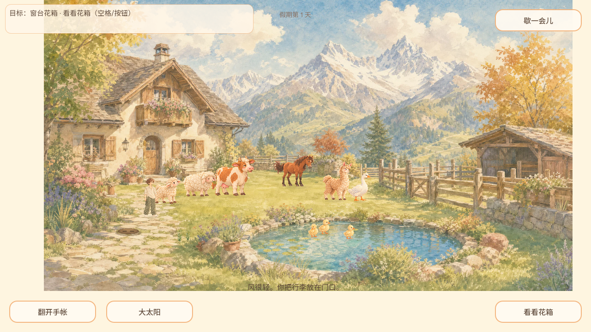
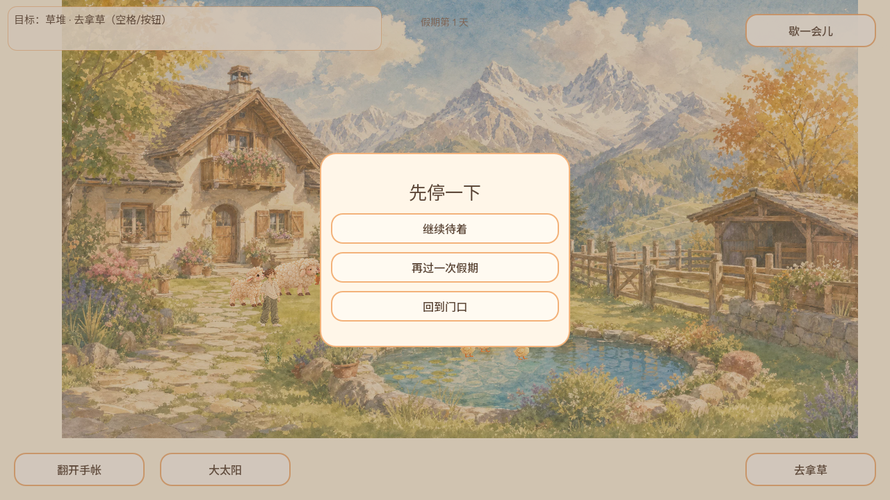
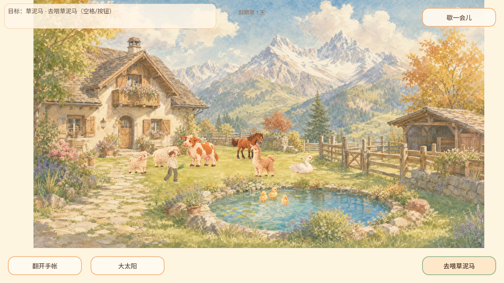
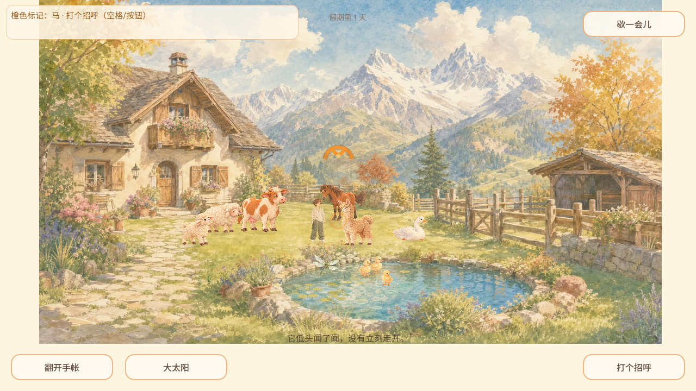
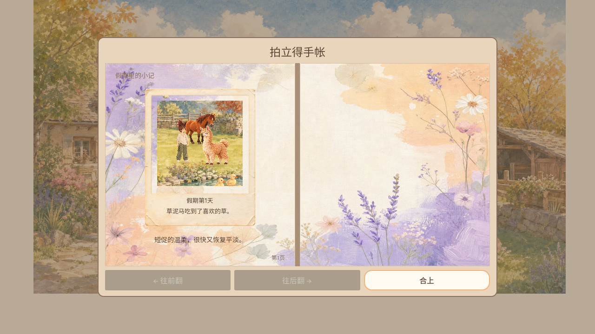
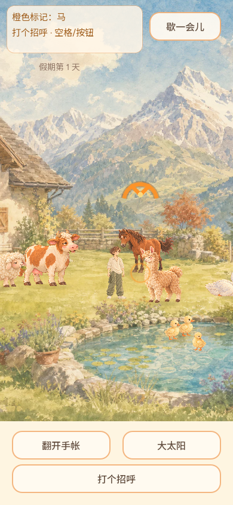
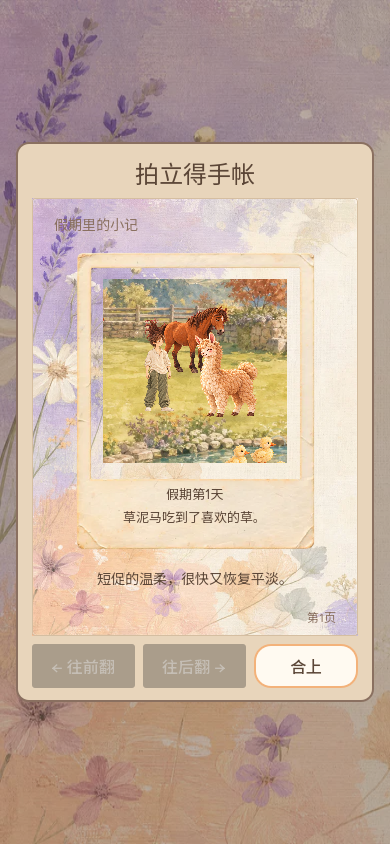

# 2026-10-04 GAME-PM 线上体验

Agent-ID：GAME-PM。北京时间18:50–18:57多轮短体验；Chromium151，Linux软件WebGL（SwiftShader），1280×720与390×844桌面视口；每轮独立新浏览器测试档，未读取/重置用户存档。非真机触屏、非完整QA、非长时间听验。

公开入口HTML `data-build=game-eac615f`，相邻读取的公开manifest源`eac615f948da248720520f768453f1a662d00215`，publishedAt `2026-10-04T10:12:28Z`，Godot4.7.2。页面版本与manifest一致；没有下载核验PCK，不把当前main当被测运行时。main随后包含PM文档集成，不推断游戏变更。

| 操作 | 实际观察 |
| --- | --- |
| 真实标题进入院子 | 水彩院子/动物/HUD出现，测试档第1天 |
| D键散步、松开 | 旅人位置变化，靠近草堆时目标文案随之变化 |
| Esc暂停/恢复 | 真实暂停菜单出现，返回院子可继续 |
| 行动按钮走近草堆、空格取草 | 手持草束，目标改为去喂草泥马 |
| 点击靠近动物、空格 | 羊驼吃草并出现真实照片显影；照片题词“草泥马吃到了喜欢的草”与可见羊驼对应 |
| 打开手账 | 新档第1页含刚拍照片，只有一页时前后翻页按钮禁用，合上可用 |
| 390×844尺寸、Esc回院 | HUD与动作按钮可见；这次操作仍用鼠标/键盘，未测手机真实触摸 |
| 同上下文刷新、标题“翻开相册” | 第1天题词与羊驼照片仍在，支持本样本刷新回放；不证明强退、跨设备或异常持久化 |

两轮完整游戏控制台/pageerror监控结果为空。第三轮在截图/重载检查完成后，Node独立manifest请求遇ENETUNREACH，脚本退出1；随后通过继承代理的curl成功读manifest。这是验证工具请求失败，不是游戏运行错误，也不把该轮脚本记为全流程exit0。

未覆盖：阴天完整变化、自然鹅马组合、钓获投鱼、花圃收获、低动效完整矩阵、真实手机高DPR/触摸、音频出声/10分钟舒适度、平台故障保存。旧QA题词问题在本次羊驼新照片样本未出现，不因此关闭#40或宣布所有事件正常。复用GAME-QA原缺陷编号，未新增未经复现BUG。

## 截图

以上为实际浏览器截图；有的来自重复同路径的新测试档，照片构图受自然动物移动影响，不把不同轮的截图当同一连续视频。
