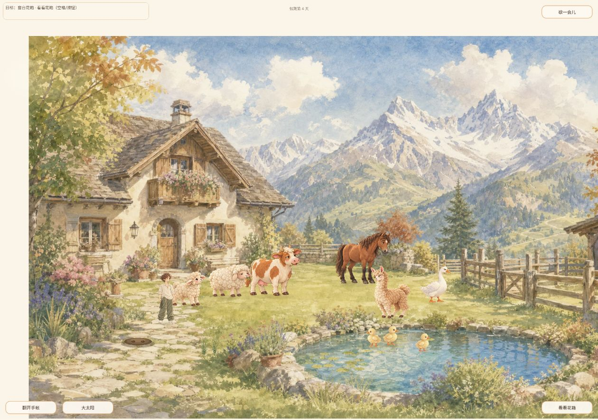
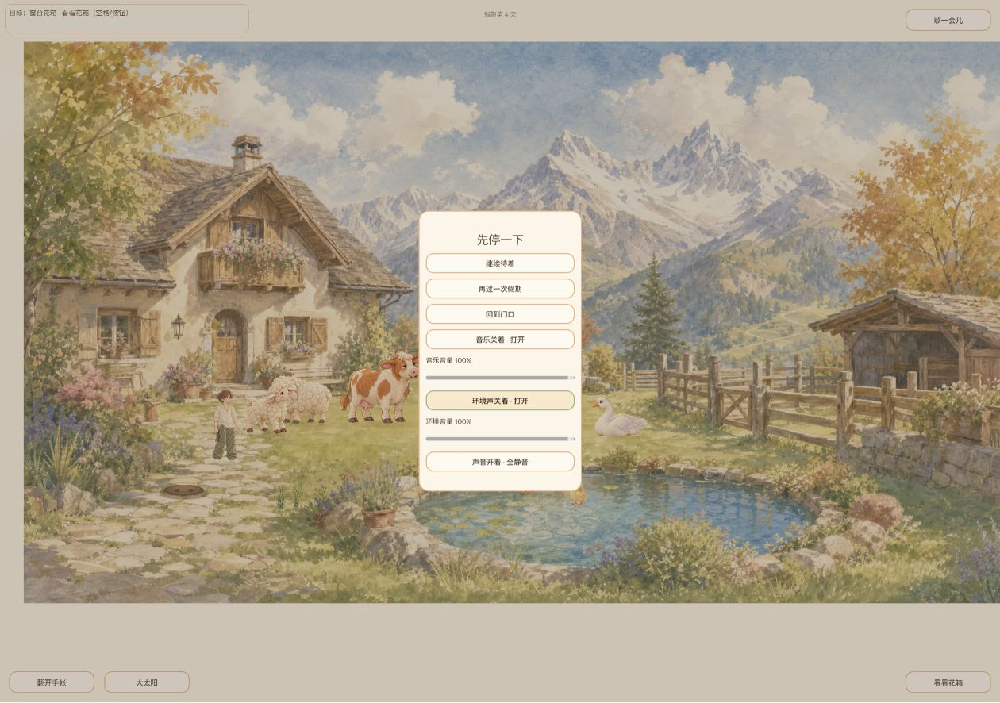
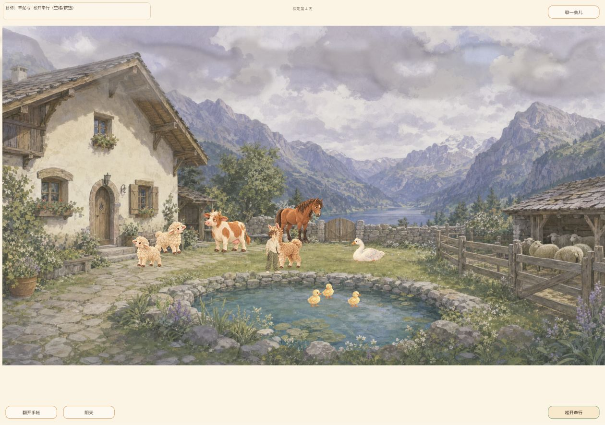
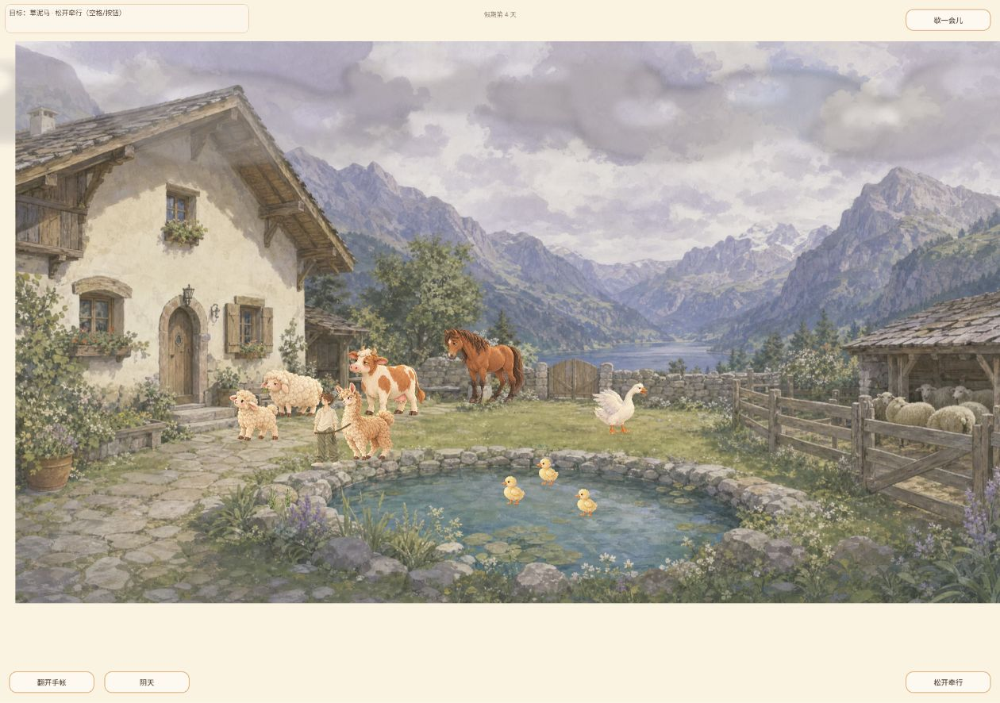
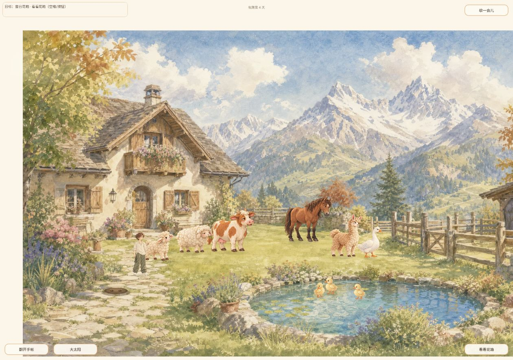

# 2026-10-05 14:34 独立冒烟报告（供用户查看）

Agent-ID: GAME-QA。结论：**部分通过、关卡阻塞；不足以判定全量发布通过**。本轮无新增产品BUG；已知天气构图问题再次观察。旧音频接口错误未复现，但实际音频与高频开关验证不足，不据此关闭音频问题。

## 时间、版本与环境

- 触发北京时间14:34:28；相对最近12:00计划延迟154分28秒，心跳未提供计划槽位，不能认定补齐08:00或12:00轮次。
- 实测线上页面 https://narutojzm1-dot.github.io/youjia/ ，DOM构建号 `game-3ed47d7`，GitHub核验对应SHA `3ed47d7a3d5c608720f54ca3d5d282143d8d2e5d`。
- 开始核对main `c12a3d4750c974a4a34f42c78a2ded89bffefe6b`；报告归档基线 `5a4c66c24e77201d30317e912ae056dd4773d882`。main与线上分别记录；Release和tag列表均为空，不将main当作已发布版本。
- Windows / Chrome扩展连接实例7fbe129d-31ea-4709-8775-b6babc5bc8f8，浏览器3，测试标签250390087，DOM视口1260×886。原游戏标签已关闭，本轮同一Chrome中新开标签，沿用既有存档，没有重置存档。
- 安全fetch成功，但source仍为未完成工作树检出；未执行Godot自动测试，不算测试通过。

## 实际游玩结果

|检查|结果与限制|证据|
|---|---|---|
|启动/标题→院子|通过；首次显示第4天既有存档。点击工具一度超时，但后续截图确认已进入，不重算产品失败|01、02|
|手账入口|通过；可打开既有双页照片及合上。未重新核验全部15页|05|
|花箱入口|点击后目标仍为窗台花箱；本轮未走完接近/操作，不算通过|02|
|动物最短闭环|接近羊驼→牵行按钮→显示“松开牵行”→移动→点击松开。只验证此互动，不能替代种植/钓鱼完整闭环|06、07|
|暂停/设置|通过；音乐与环境声各关闭一次，按钮由“关掉”变“打开”，再恢复；未验证实际声输出、音量滑块、总静音|03、04|
|刷新恢复|刷新后可再次进入院子；不能凭此确认全部存档字段一致，未再次逐页核对相册|08|
|高严重度音频回归|首次进入及同标签刷新warn/error日志未出现旧__manusBgm错误。#195冷启动错误局部未复现；#196频繁关不开/开不关、各10次慢快切换、后台恢复及可听声音未完成，仍阻塞验收|console.json|
|历史天气BUG|自然晴转阴再次出现同一院子布局跳变，P2，1/1，关联#51/#168|02、06|

## BUG与未覆盖

去重台账见[bugs.json](bugs.json)：QA-EXP-20261003-001本轮复现；002旧相册生成版本未知、本轮未独立重现题词问题；003历史桌面加载修复保留，本轮标题截图不作为加载壳证据；QA-AUDIO-20261004-001仅局部回归，不关闭，关联#195/#196。既有开发Owner保持不变。

完整主流程、长期成长经济、钓鱼成功、种植全周期、失败重试、干净新档、移动分辨率、长时性能及所有历史BUG全回归均未覆盖。自动测试0；本轮未做新的源代码静态分析。浏览器接口没有可听音频验证能力、工作树未完整检出属于环境限制，不能作为产品BUG。没有把前轮测试结果当成本轮通过。

## 原始证据

截图为原始可视交互保存，无修改。03/04仅证明按钮标签，08仅证明重新进入场景。

[原始控制台日志](evidence/console.json)

报告PR待独立最终SHA审核；未合入，不发布游戏。
