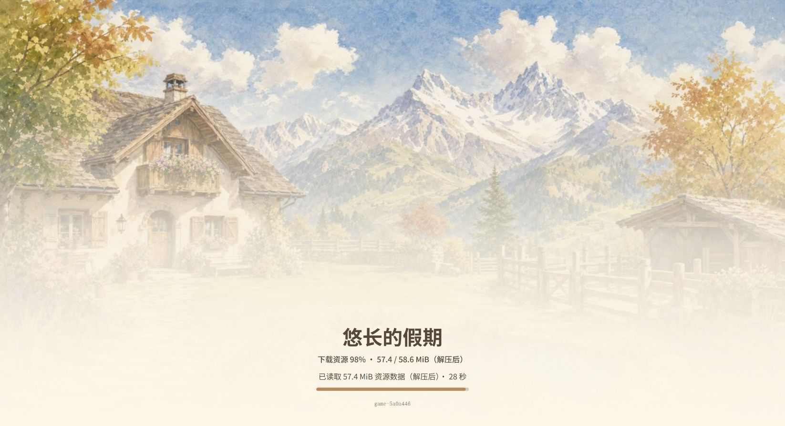
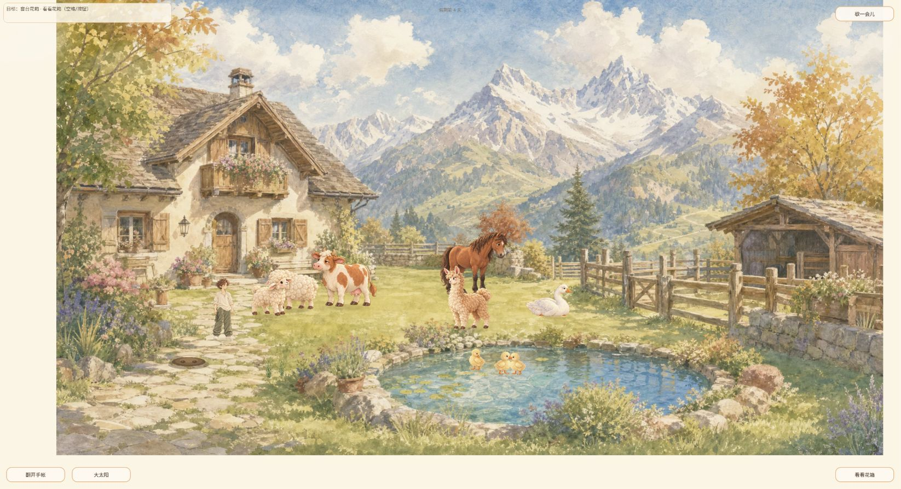
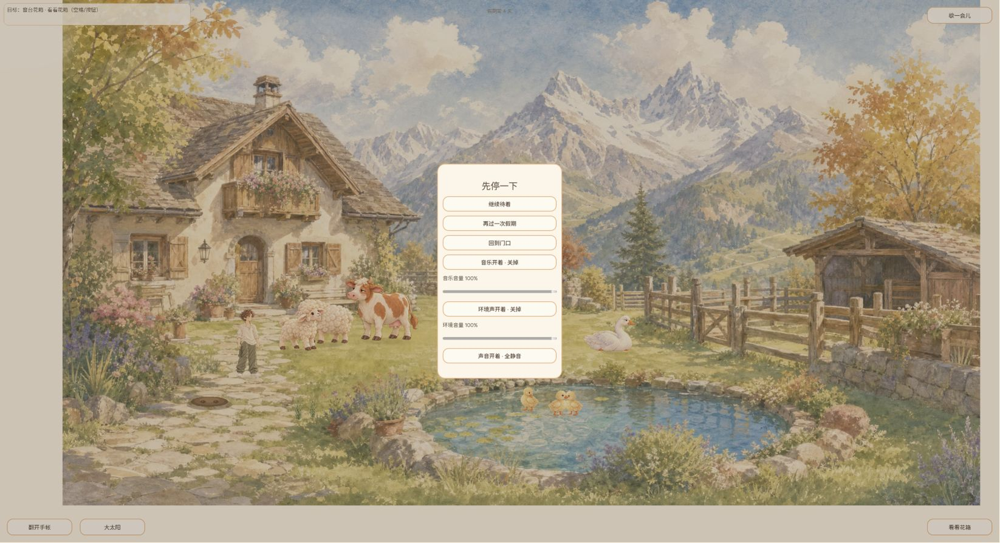
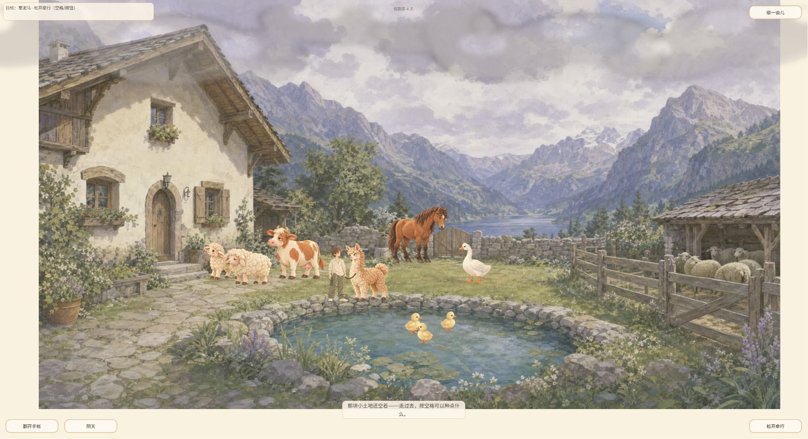
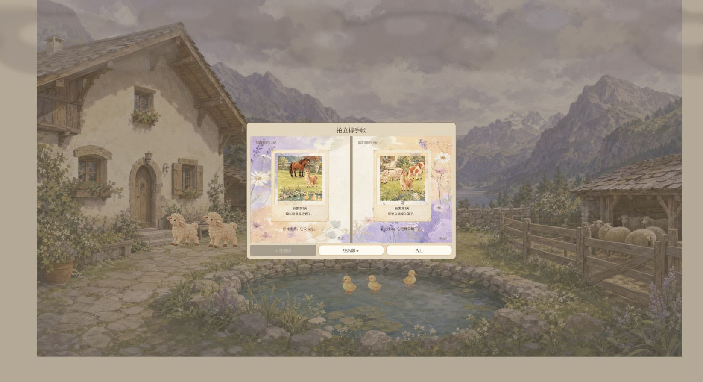
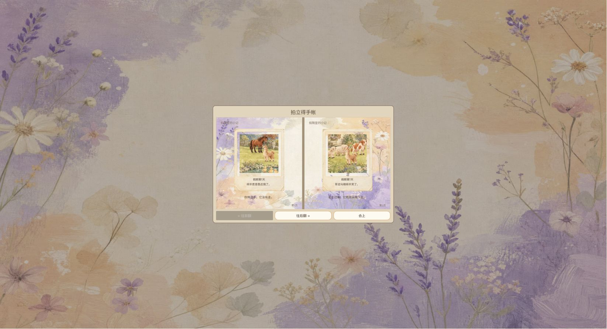

# 2026-10-05 16:02 GAME-QA 冒烟报告（供用户查看）

Agent-ID: GAME-QA。**部分通过、发布关卡阻塞；不足以判定全量发布通过。** 本轮按16:00计划于16:02:00触发，延迟2分钟。实际游玩独立执行，未委派，未修改游戏或发布。无新增产品BUG。

## 版本及环境

- 线上 https://narutojzm1-dot.github.io/youjia/ DOM `game-5a0a446`，核验SHA `5a0a446577eba5916da51ad7f0e926f118045c01`；上轮game-3ed47d7，本轮发现新版本，补做受影响入口与旧照片读取。
- 开始main `f517f912652420202461f8e137da8123d8fe1aa9`，归档main `f517f912652420202461f8e137da8123d8fe1aa9`。Release/tag查询为空，main与Pages不同，不以main替线上。
- Windows，Chrome浏览器3，扩展实例7fbe129d-31ea-4709-8775-b6babc5bc8f8；新建同实例标签250390099，既有第4天存档，不重置。DOM视口1646×894，无人工分辨率覆盖。
- source安全fetch成功，origin/main由c12a3d4更新为f517f91，Git提示forced update，如实记录；未覆盖本地工作树。工作树仍未完整检出，现有Godot自动测试未执行。
- 已读QA执行说明、上一轮报告/BUG、最新AGENTS/CONTRIBUTING/agents/game-design/requirements/decisions及qa-reporting。上一报告PR309为closed，未据此宣称已合入。

## 实测与覆盖

|项目|结果|证据|
|---|---|---|
|下载/启动/入院|成功加载进入第4天。首次鼠标工具超时，截图证明已执行；不作为产品BUG。加载阶段AX显示76%、23秒，截图捕获时已是标题，因此01仅标题证据|01、02|
|音频启动P1|首次进入未见旧__manusBgm接口报错；只1次新标签冷进入样本，缓存未清除|console.json|
|音频开关|暂停音乐、环境声各10次点击，共20次快速交错输入；每轮保存截图，抽查第1/5次均显示打开，第10次关掉，恢复原启用状态。只证明UI响应；未实际听验，不关闭#195/#196|03、audio-01至10|
|羊驼最短互动|选中羊驼后出现牵绳与“松开牵行”，再点击松开后目标变化、绳消失；局部通过|04|
|手账及存档恢复|院子打开旧手账第1/2页；刷新后从标题手账入口读回同两张照片与题词，通过两页读取恢复，不代表全部字段/全部页数一致|05、06|
|新照片影响回归|最新320修复绵羊新照片构图；本轮尝试接近绵羊但实际目标先到水塘/奶牛，未完成轻抚与新照片生成，不标通过|未覆盖|
|天气历史回归|自然晴转阴，房屋/远山/池塘构图跳变仍观察，P2，1/1，关联#51/#168|02、04|
|花箱入口|点击“看看花箱”后未走完有效操作，未验收通过|未覆盖|

## 台账和关卡

见[去重BUG台账](bugs.json)。QA-EXP-20261003-001再次观察；002旧照片继续保留（生成版本未知），不据此否定新照片320修复，也不将开发者验证冒充QA验证；003保留历史桌面加载修复，本轮无加载壳截图；QA-AUDIO-20261004-001本轮旧错误未复现，真实音频和#196慢切/后台恢复未验收。开发Owner遵循原issue与最新分工，不新增认领。

自动测试0，新源码静态分析0。完整种植/钓鱼/喂食、自然新照片生成、全档比对、新档、失败重试、移动/DPR矩阵、长期性能、真实听感、慢速/跨后台音频矩阵与全部历史BUG回归未覆盖。浏览器无听验能力及未完整工作树是环境限制，不能伪装产品失败或通过。关卡阻塞是覆盖缺口，不是宣称当前构建复现音频P1。

## 原始证据

截图未经编辑；01文件名已按实际标题页命名。音频序列不能证明实际声音。报告保持待独立最终SHA审核，不合入、不发布。

[原始日志](evidence/console.json)
