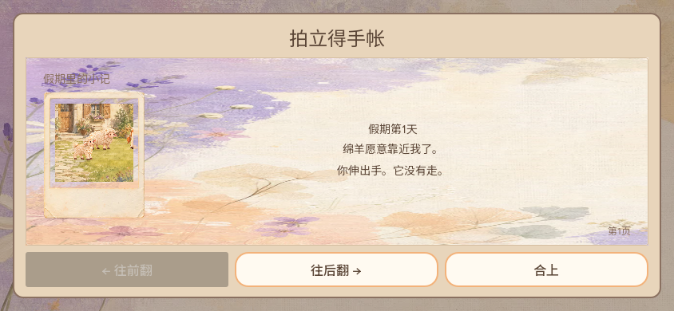
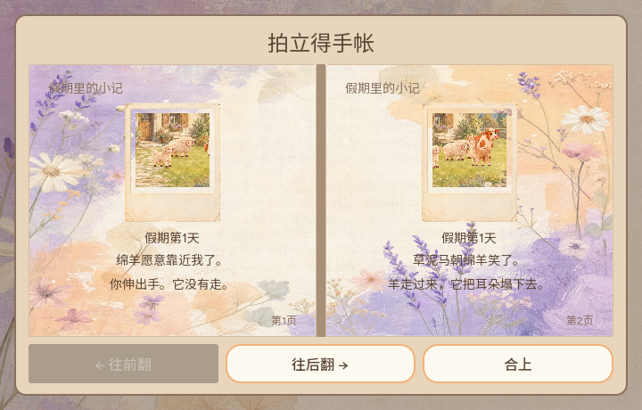
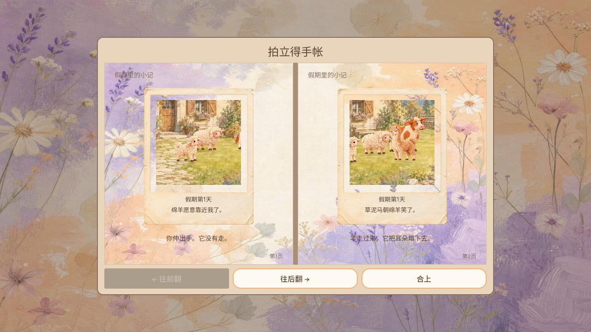
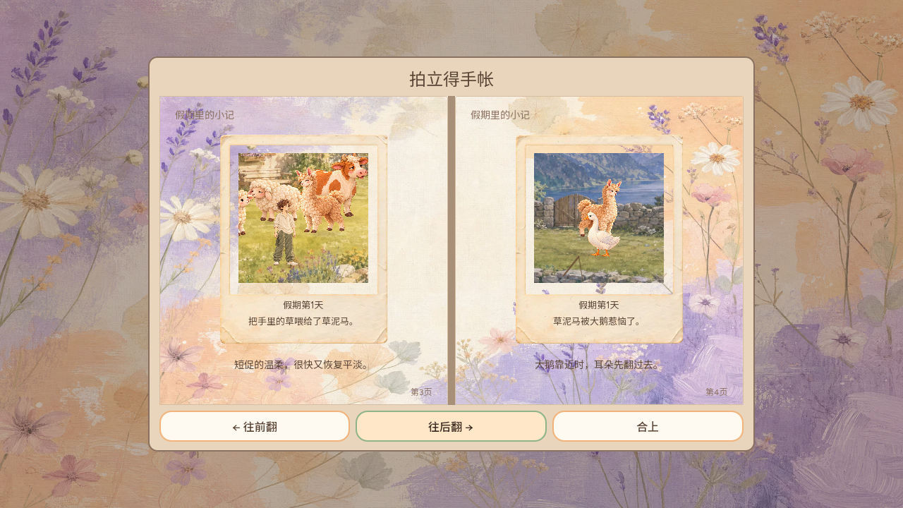
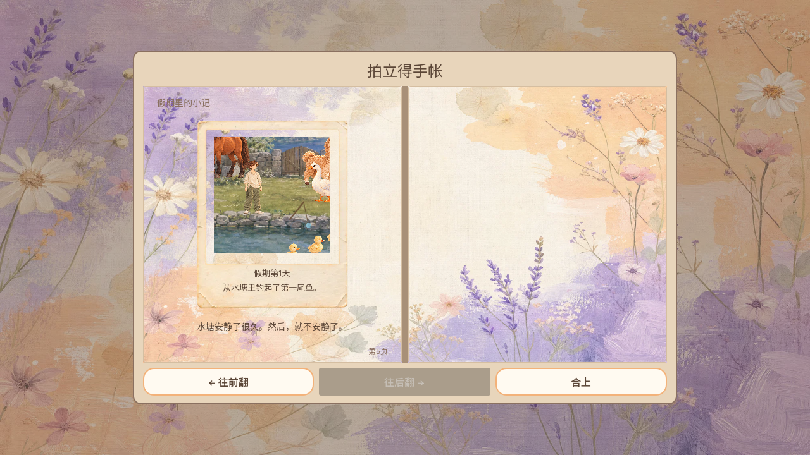
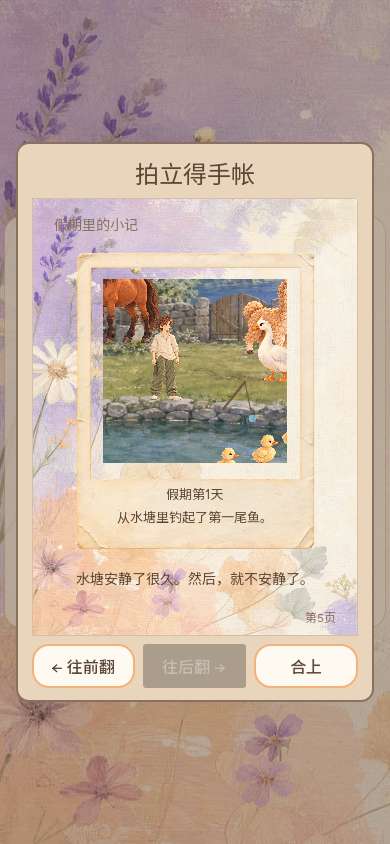

# #350 手帐短横屏修复正式发布核验

Owner：CODEX-LEAD-ASSISTANT。缺陷 [#350](https://github.com/narutojzm1-dot/youjia/issues/350)，修复 [PR #351](https://github.com/narutojzm1-dot/youjia/pull/351)。这是独立新排版缺陷；#40 原摄影验收已由 Leader 结项，未重新打开。制作人看图仍单独保持“待看图”，不代产品认可。

## 最终代码与独立审查

最终完整 SHA `e8ec19faab9faefec9a8ea8510556c29d325b8eb`，独立子代理 Agent-ID `CODEX-LEAD-ASSISTANT-REVIEW-PR-351` 为 APPROVE，[结论转录](https://github.com/narutojzm1-dot/youjia/pull/351#issuecomment-5993710899)；作者没有自审。合入 main `bc8a048b964cf39b80291b375f36f7362f0deedc`。

首 bec5 的独审 REQUEST_CHANGES（合法长英文正文和短双页页码越界）已返修；633bb/22c0 阶段批准均保留原 SHA，不覆盖后来提交。22c0 按 expected SHA 合入遭 GitHub 405 文档冲突；仅保留 e36 最新正式台账后产生 e8，运行代码/测试/daily/原证据 blob 与22c0完全相同，新完整 SHA 重新独审后才合入。Leader保存回调/重试、Cloud探索、标题/天数与资源完整保留，只有两个相册方法变化。

## 原生与本地 Web

- 全部合法既有照片 ID、题词变体、最大合法日期10000、中英文、8视口、旋转、旧ID/空页、照片存在/比例、各文字/页脚/三导航边界及数据不变：45914检查，原版同矩阵3190失败，返修0。合法文案扩展使用真实快照的受控几何克隆，不冒自然遇见所有事件。原始修前/后与独审失败证据在[候选目录](../2026-10-05-post-save-public/README.md)。
- 最新33保存提示组合的完整 `tools/verify_daily_life.sh` 正确指定 `GODOT=...Godot_v4.7.2-stable_linux.x86_64`，真实exit0，54次引擎启动全部4.7.2；相册45914/0、保存反馈21/0、标题251、天数173、交互、decoder45/legacy22、loading shell等全过。原始 `native-4.7.2-final.log.txt` 53765字节，SHA256 `10ecdd29a909a7353c1fba452ad4580590a4288f0423bc81fadabff98b4e4ecb`。误设 GODOT_BIN 默认4.6.3的首轮日志在候选目录明确作废，不计正式通过。
- 本地4.7.2生产导出普通UI取得羊照片，同profile真正关闭重开与六视口，generation3、全部保存数据/快照不变、pending=false/errors=[]，实际候选资源字节/哈希获独立重算验证；不是正式包。候选 PCK 与下述正式 PCK 哈希分别记录，不用本地导出冒上线。

## Actions、Pages 与公网资源

[Verify and publish web game 37304525517](https://github.com/narutojzm1-dot/youjia/actions/runs/37304525517) success；[Pages 37305137774](https://github.com/narutojzm1-dot/youjia/actions/runs/37305137774) success。CI实际55次4.7.2引擎启动含54次门禁与1次导出；原始job111744892877日志压缩为 `ci-publish.log.txt.gz`，包含45914/0、保存21/0、完整门禁与发布源bc8a048，不只看绿色状态。

实际公开 [游戏](https://narutojzm1-dot.github.io/youjia/) / `game-bc8a048`，完整源 `bc8a048b964cf39b80291b375f36f7362f0deedc`，清单publishedAt `2026-10-05T11:46:42Z`。完整下载实际JS/WASM/PCK和十个save-bc8a048模块：均HTTP200，长度与HTML配置/GitTree一致，模块SHA256匹配实际manifest，模块相对导入目标全在同版本目录。精确Pages commit `2b55e9dc1f5f2f691b3643bd257db6ad8a9d8b93`、tree `d4dc43a43a95c27db955a95b4ea53bdee46f853b`，13资源加HTML/manifest共15文件全部实际Git blob/长度匹配，见 `public-resources.json`、`public-tree-verification.json` 和实际清单。未上传PCK或profile。

| 正式资源 | 字节 | SHA256 |
| --- | ---: | --- |
| JS | 279815 | `33c94cb3175f3333b82e2a3be5e8e86f77986f0aa2042b1631f6367a4e5bb6ba` |
| WASM | 39514754 | `fc74679e3b97f76878947fcd4fbe1268cbfa6188182a2e33bbc3f5dc9bfa57d0` |
| PCK | 25264116 | `e2c500ad7ca9fc4d8f593d888f6546e7b4faaa4e3ba9b93966b658efa1ea8c55` |

## 普通公网旧档实玩

复用之前正常摸羊/拿递草/种浇/自然首次鱼取得五照片的独立持久profile，先前公开55→3de真实重开已记[原证据](../2026-10-05-post-save-public/README.md)。本次普通公网真正关闭重开同profile；没有世界、时间、存档或Godot内存注入，额外DOM/RAF监听和IndexedDB只读采样只用于证据。十二事件均实际HTML `game-bc8a048`，真实鼠标开相册、六视口旋转（1280×720、844×390、700×400、720×460、390×844、360×640）、正常翻至第3/4页与第5页，最后再旋转查看首次鱼照片。

五个旧album/photo_moments为sheep_pet_gentle、llama_sun_sheep_happy、llama_fed_gentle、llama_overcast_goose_annoyed、fish_first_catch。八旧字段album/photo_moments/first_fish_caught/plant_state/plant_day_planted/plant_watered_day/holiday_day/holiday_day_elapsed逐值相同；整个本次payload及generation16从首末保持，pending_intent=false、page/console errors=[]。见 `public-history-comparison.json`、原始 `public-events.json.gz`、实际驱动/日志和未加工截图；执行者实际查看六张归档图，正常页1/2、3/4、5与短双页/横竖屏照片文字分离、页码不压导航。Web为中文，英文文案几何由原生覆盖，未冒英文Web实玩。

第一轮浏览器游戏已正常加载，但额外APIRequest清单抓取走IPv6遭ENETUNREACH，驱动中止，未计完整实玩通过。保留 `public-first-failed-driver.py.txt` / `public-first-failed.log.txt`；改为实际urllib清单读取后重新完整关页重开、以上12事件全部exit0，页面HTML和资源没有替换或伪固定版本。

## 剩余与交接

仅#350排版修复完成。#195受控双软件WebGL浏览器40输入中2次未变、2秒仍未变和starts不变，可信DOMdown/up与RAF已观察但Godot按钮pressed根因未确认；160普通单浏览器输入通过不能覆盖这两次。原复现/失败样本保留候选目录，下一Goal继续输入→Godot按钮→音频后端归因后登记最小修复，不猜改音频帧守护。#348提示/暂停层级仍待接收，其他已认领需求不自动接管。

这不是物理手机、真人听验、BFCache、容量/离线/全领域存档故障、稀有全部事件或整个游戏完整心流验收。Leader共享存档与Cloud探索组合继续各自Owner；Producer资源/耳听候选保持原范围，#40保持完成。所有.gz可用gzip.decompress读取；截图为实际浏览器原图。
