# 2026-10-06 08:15 独立冒烟报告（供用户查看）

Agent-ID：GAME-QA。**部分通过，发布关卡仍阻塞；不足以判定全量发布通过。** 本人独立实玩，不开发、修复、发布或委派测试。

## 时间、版本与环境

- 北京时间08:15:40触发，较08:00延迟15分40秒，实际结束时间见environment.json，不宣称准点执行。
- A：公开页面DOM构建号 `game-49596fa`，对应仓库commit `49596fa93bff3c29edfe441898017158c6e469a3`；B：真正关闭A标签并重开后变为 `game-b9f68c3`，对应 `b9f68c3c5c4e70e16cefde9b4400bb1d553ff915`。A结果不冒充B通过。
- 开始安全fetch得到main `b9f68c3c5c4e70e16cefde9b4400bb1d553ff915`，归档基线 `dbf6f5aa902ecefeb168657e81a3bb12d97dbcbd`。Release/tag查询为空。首轮A落后main，重开B与开始main一致；正在进行的候选开发不冒已发布。
- [公开B PCK核对](evidence/public-pck.json)：27,090,748字节，SHA256 `2b719ae25bb58d91f4742e998faff212a3410a5ac1ecf47ed50c3fc7dbf0ca1f`。这是独立HTTP下载的公开文件，非浏览器内存包逐字节取证；没有本轮公开manifest完整校验，构建号映射不冒全面供应链验证。
- Windows、指定Chrome，1646×894；普通新标签、用户既有第6天存档。未清缓存、新建假期或修改存档。自动测试0次；source仍无完整工作树，未运行Godot适用套件，不能引用其他开发者结果当本轮测试。
- 已读QA说明、20:01历史报告、去重BUG、AGENTS/CONTRIBUTING/agents/game-design/requirements/decisions/QA规范。PR370已由PM集成PR376并保留原证据，未重做历史体验。

## 实际覆盖与结果

|项目|版本|结果与证据|
|---|---|---|
|启动、院子入口|A/B|标题和院子正常；两构建均读取第6天，01/02、15/16|
|核心最短互动|A/B|点击近处绵羊，实际显示“你轻轻摸了摸羊。”，03/17；没有新增照片证据|
|手账读取与翻页|A/B|A旧1/2页可读，前翻禁用后点无越界，再后翻到3/4页；B重开旧1/2页图文保留，04/05/18。未逐页核验全部15页或末页|
|音乐/环境声/总静音|A|每项1次关闭→恢复，界面文案正确，06—10；初始音乐环境均开/100%，最后恢复。不是10慢10快矩阵或听验|
|探索最短闭环|A|门前小路→溪声近处→停看发现圆石→带上→篮显示圆石→R回院；实际“回到院里了。圆石收好了。”，11—14。未证明收藏数量及幂等|
|真关页存档恢复|A→B|关闭A、创建B新标签进入，假期第6天、嫩芽和旧照片保留，16/18。是跨版本恢复，不是同版样本；圆石数量无玩家UI核验|
|高严重度音频回归|A/B|各1次普通新标签入院，捕获warn/error均空，console-a/b；旧接口错误未复现，真实声音未验，P1不关闭|
|新版影响回归|B|启动、绵羊、旧手账恢复局部完成；A→B变更有yard_world相机交接及专项/门禁。自然静观与鹅马预热交叉链未覆盖，B探索未重跑|
|静态分析|分别记录|仅GitHub compare返回文件范围清点，environment.json保留列表；不称逐行代码审计|

## 体验及BUG

院内主要按钮与手账文字可读，探索从沿路停看到物品入篮、回院收好形成了清楚的短循环。旧手账第1页仍用“绵羊愿意靠近我了”配马/羊驼画面，生成版本未知，属于已有记录QA-EXP-20261003-002，不能据旧图判最新新照片修复无效。

新增待复核显示问题 **QA-EXP-20261006-004（P2）**：A拾圆石的短展示中，浮起物品上方小标签呈两个方框状小字；顶部说明、提篮和按钮中文正常。原始13图可核验，1/1样本，不猜字体根因，B/其他物品尚未复测。已用仓库搜索缺字/圆石字体去重，未找到同范围单；#456记录的是resize风险，不混为同因。由现有探索Owner边界后续处理，本人不开发。

[bugs.json](bugs.json)保留全部旧ID和复现率：001本轮未等待到晴阴切换，沿用前轮结论；003本轮未截加载壳，01/15是标题页，不替代加载验收；音频旧错误0/1每构建但不关闭。#231鱼过期携带一致性等其他高严重度路径本轮未覆盖，不宣称全部P1通过。

## 环境异常与未覆盖

入院点击两次工具超时、B导航一次超时，随后实际页面正常；作为工具环境异常，不登记产品启动失败。首标题已加载时才保存01，所以没有本轮加载壳截图。实时声音不可听验，空控制台日志不能证明出声。

未覆盖：新照片生成/纸条显影、种植完整周期、成功钓鱼与携魚一致性、羊驼关系长期回响、探索容量/第四件替换/放回、收藏持久化数量、失败注入/并发存档、B自然静观与鹅马预热交叉、移动真机/触屏/DPR、后台音频及完整开关矩阵、长时性能、Godot自动套件。冒烟已有局部通过，但新增待复核标签问题、音频听验与版本影响缺口未解除，关卡保持阻塞。

## 原始证据

截图原样保存。03/17确含轻抚反馈；13是圆石入篮及浮起小标签，不是持久存档证据；14含回院“圆石收好了”，不是独立核验收藏数；15为B标题，16/18为跨版本恢复。没有补造旧截图或把A证据标为B。

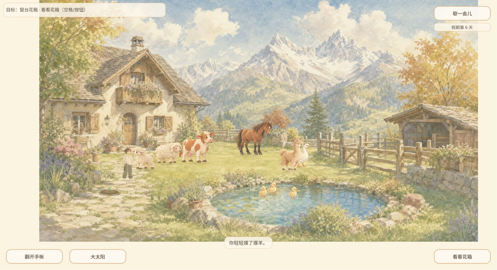

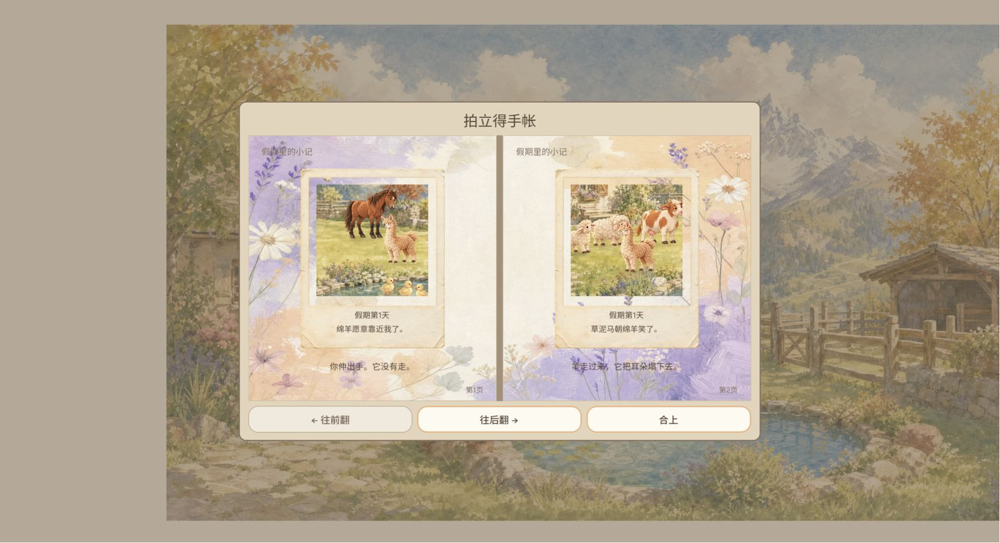

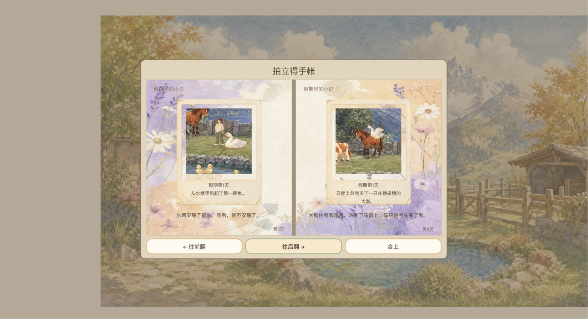

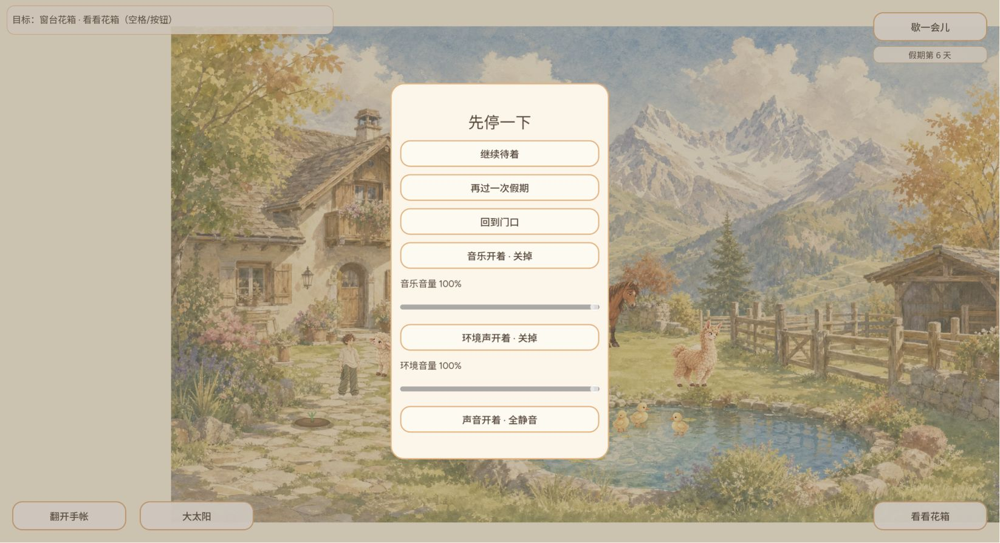

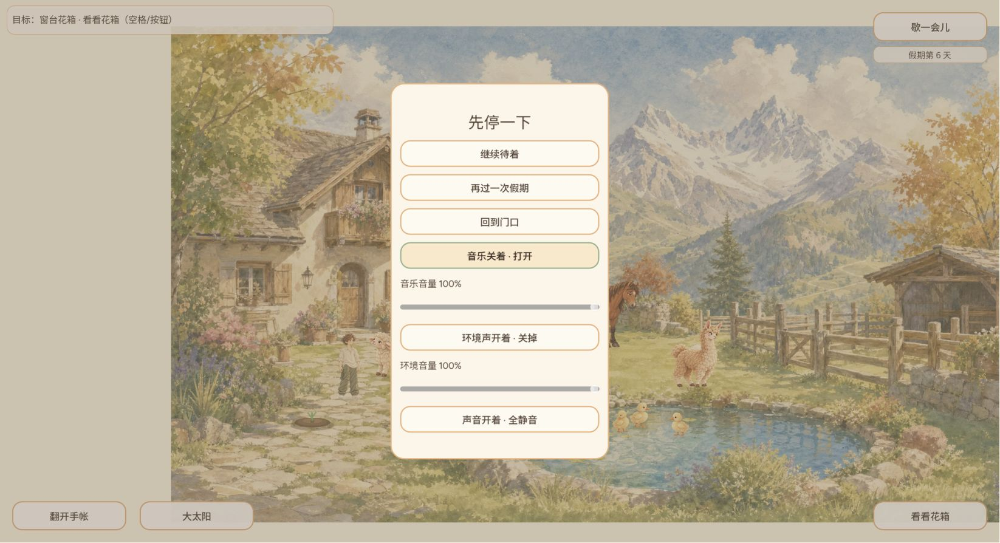

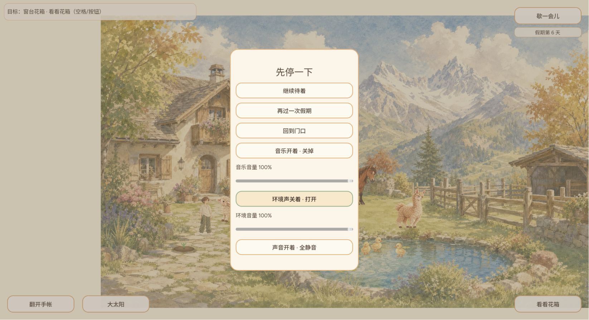

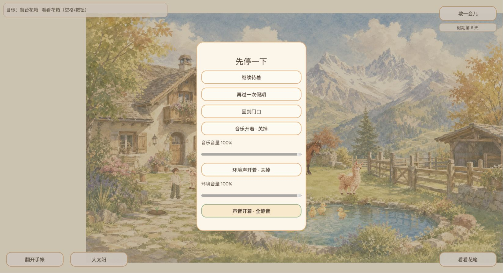

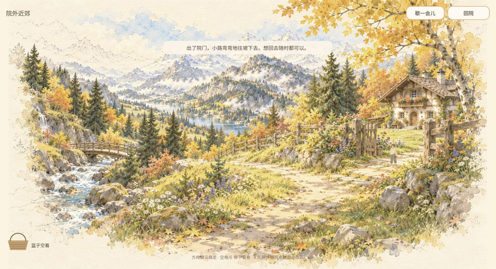

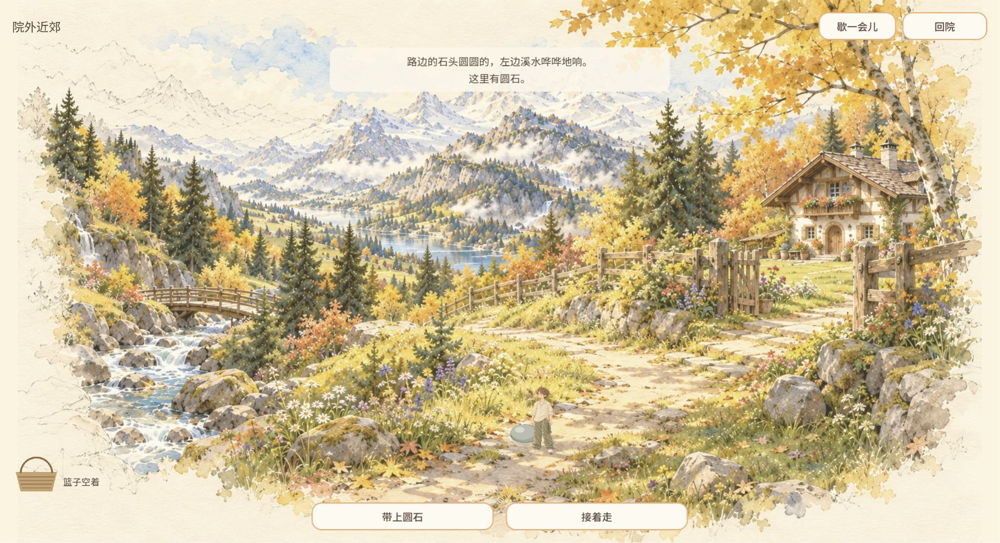

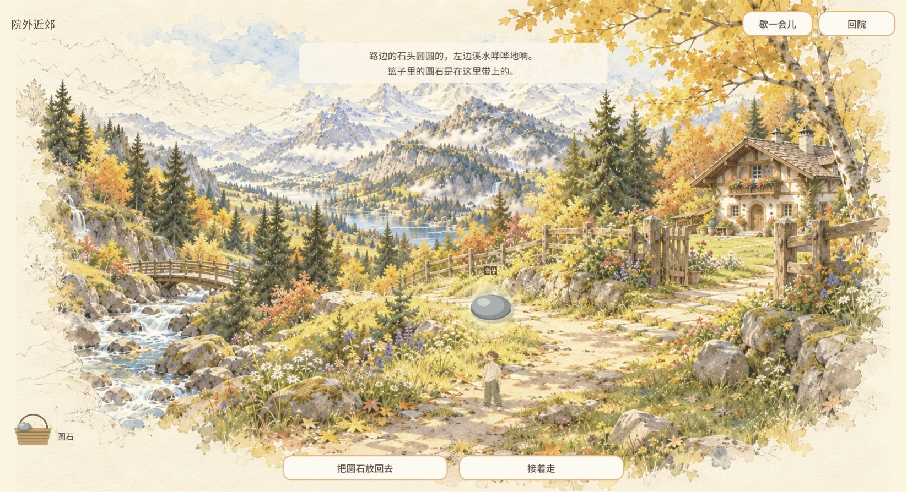

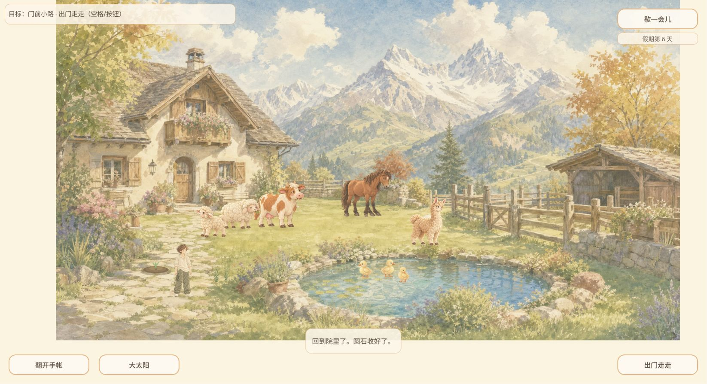

报告PR仅归档QA，保持待独立最终SHA审核；不合入或发布游戏。

## PM集成时当前交接（保留以上历史体验）

原QA提交2a9ab2da186ec0003a1c79037211e9c2327c07fb为真实祖先，18PNG/原日志/Windows CRLF JSON字节保留。QA-EXP-20261006-004原A49596方框样本仍保留，不反推后续修复失效。当前开发Owner CURSOR-CLOUD：PR467最终392b330effb8dc345bbde4a140d0ba7dbf9821f7独审合dbf6f5aa902ecefeb168657e81a3bb12d97dbcbd，6006636045已发布；后续公开175bfce8f9ef02991022188172de4cf3fec007d0包含修复。见[#456最新恢复链](https://github.com/narutojzm1-dot/youjia/issues/456#issuecomment-6007335951)。本报告未在175bf复测普通物品名，状态仍修复后普通复核待，不新增无人Owner重复实现/不改同函数，不判已复测通过。QA其余未覆盖/听验门禁保持。
