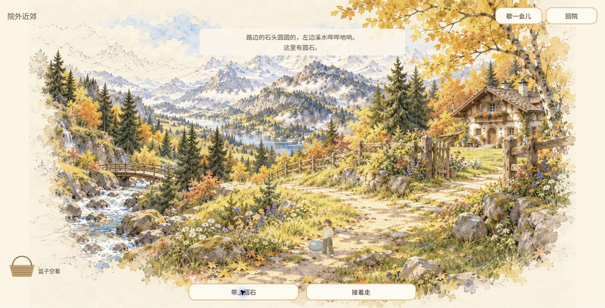
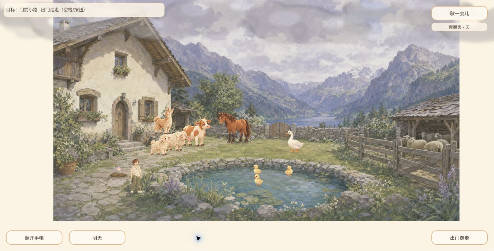
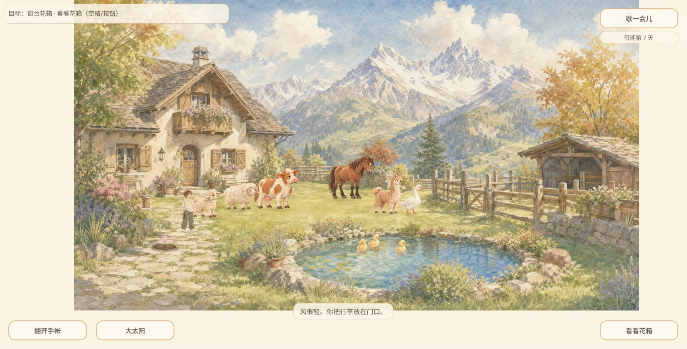
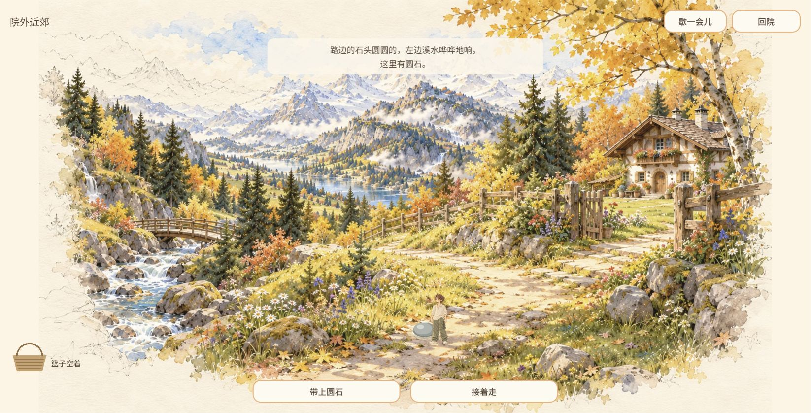
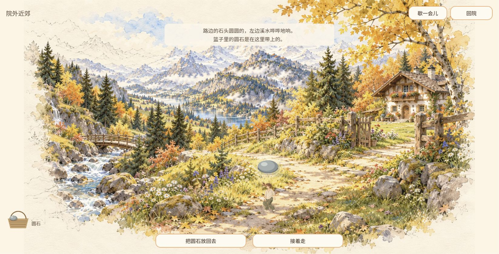
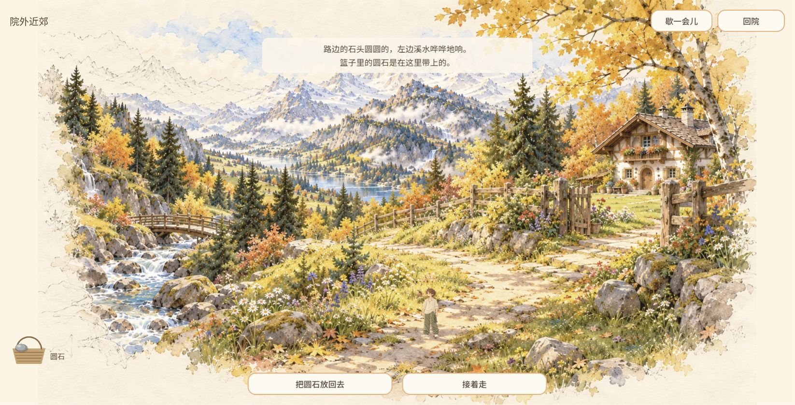
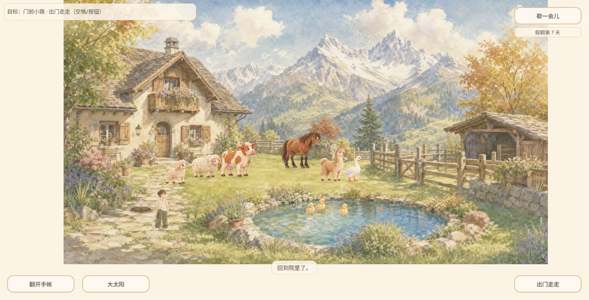
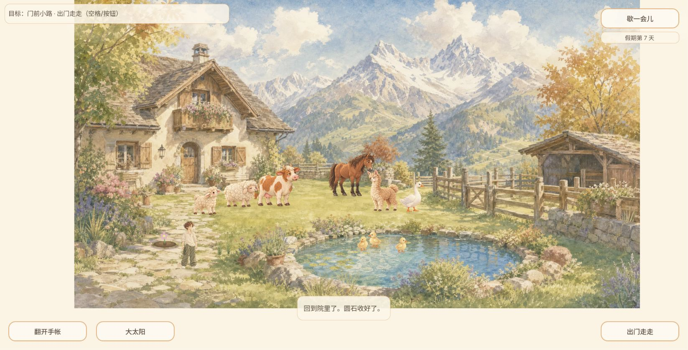

# 2026-10-06 09:49 独立补测：拾物缺字修复（供用户查看）

GAME-QA，本人普通输入实玩，未委派、未开发或发布。**QA-EXP-20261006-004桌面中文圆石样本修复通过；整游戏覆盖仍不足，不足以判定全量发布通过。**

本轮由用户“继续工作”启动，不冒定时12:00已执行。09:49:43首次时钟核对，结束见environment.json。早晨PR472已由PM集成477，保留原提交与18原图；本轮独立PR归档新增证据，不改写早晨历史报告。

## 版本及来源

- B为保留标签的 `game-b9f68c3` / `b9f68c3c5c4e70e16cefde9b4400bb1d553ff915`；C真正关B、新建标签打开线上，DOM为 `game-d21030d` / `d21030dfc243926b7e6a1849151ada1eadab75ef`。Chrome1646×838，视口自然变化，非本轮人为设备模拟。用户既有存档第7天，C恢复日数与花朵。
- 最新安全fetch至267b0cb3，归档基线 `267b0cb3df5842170877bf55e438917ad4253ce8`；main与游戏构建分别记录。Release/tag早晨查询为空，补测不声称重新完整查询。
- C公开PCK实际下载27,094,188字节，SHA256 `59071b1e79ab52cadee04e2b6dfeb0647b1739e5929bcbdc9159455f56248ab1`，见public-pck-c.json；不是浏览器内存PCK取证/完整manifest校验。
- 已核最新仓库协作记录与PR472/477、Cloud467/456衔接。修复由CURSOR-CLOUD，字体提交 `392b330effb8dc345bbde4a140d0ba7dbf9821f7`；本轮只读核源码，旧绘制用ThemeDB.fallback_font，新版优先label_font。这是静态线索，与下面独立普通体验分列；没有把作者测试当本轮重跑。

## 实际步骤、预期与结果

1. B普通出门→点击路面→溪声近处停看发现圆石→带上。首次截图20已经错过短展示，不作字体通过/失败证据。
2. B点击把圆石放回去，21篮为空；再点击带上，22/23连续原始帧中浮起圆石上方再次方框，23可辨。与早晨A原13同现象，确认旧版本问题，保留唯一编号004。R回院，24已是阴天；保存确认文字未捕获，不夸作收藏持久化验证。
3. C新标签正常进院，25第7天、花朵可见；出门→沿路→停看→发现圆石26→带上27/28。早期帧27仍是旧一帧、28字较淡，不能把27题成已完成或仅凭28判全部文字可读。
4. C普通放回圆石，再带上，用6次顺序截图捕获短展示（没有改seed/计时/位置/存档或延长演出）。29序列第6帧清楚显示“圆石”，没有旧方框，**限定中文圆石桌面可读性通过1个明确可辨样本**。没有无限刷随机，每构建一趟，仅为取证在同地点放回再拾。
5. C按R回院，31先“回到院里了”，32后“回到院里了。圆石收好了”。两阶段原件分开，空错误日志见console-c.json。只验证玩家确认，未读取收藏持久化数量或假冒#305完整验收。

## BUG与剩余门禁

[bugs.json](bugs.json)更新004为旧版本确认、C限定样本已修复；Owner同步既有Cloud467，不认领开发、不重复建新issue。其他物品、resize演出/触屏/全部语言与分辨率未测，#456已关闭的作者矩阵不冒本轮完成。

B补测前晴天、24回院阴天，房屋与池塘构图明显不同，既有QA-EXP-20261003-001继续保留。没有连续天气录制，且C未等待天气改变，不把B结果写成C仍失败。第6天嫩芽→第7天花朵只属自然成长观察，没有本轮浇水→采摘闭环。

音频真实听验、全部P1（含携鱼一致性）、完整存档故障/数量、自然鹅马与静观相机交叉、全玩法与长期性能、Godot自动套件仍未覆盖，不能宣称完整体验/全部BUG通过。自动测试0；静态分析仅上述字体绘制线索。入院CDP点击超时后实际成功，为环境工具异常。

## 原始证据

所有PNG原样归档。20没有短展示；22/23属B，27/28及29序列属C；31和32分别为回院与保存确认。全部原始帧保留，不删低可读早期帧。六帧是顺序静态截图，不冒连续视频或FPS采样。

仅QA归档，PR待独立最终SHA审核，不自行合入。

## 后续10:03原生测试补充

本报告普通游玩结束后恢复本地检出，在独立main 267b0cb3原生工程完成5专项/45,956检查；原生来源与公开C不同，不改写先前自动测试0的时间事实。两次环境拒绝及最终全部原件见[自动回归补充](../2026-10-06-1003-game-qa-native/README.md)。完整发布门禁仍不足。
