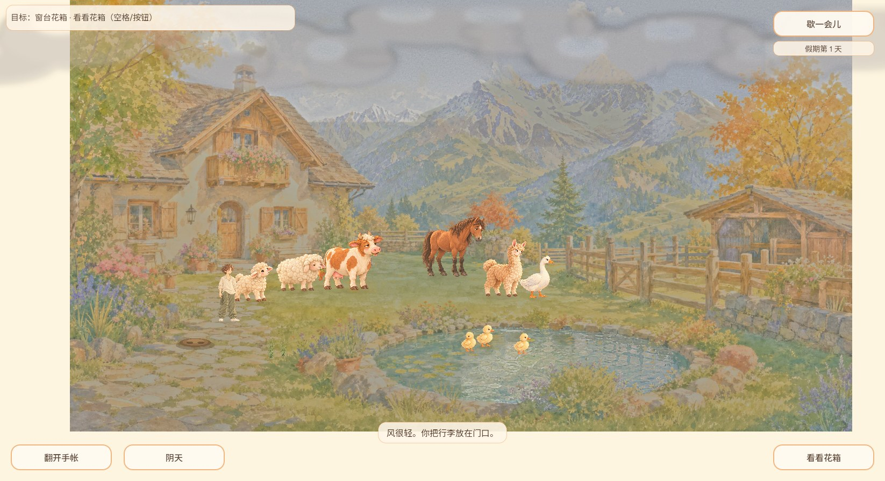
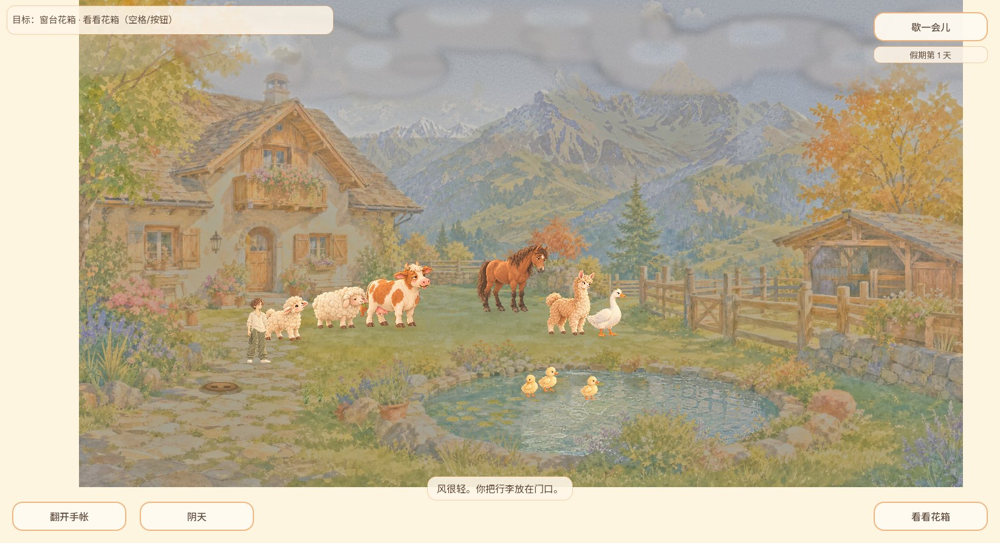

# #400 云带越出纸边：CODEX-LEAD 接续

针对 QA PR497 的 QA-EXP-20261006-005；基于 main `2963e3ede434747d63c19f84b8aba4b880c04f8a`。只修循环云带在世界背景左右边界的绘制，不改原画、相机、输入或存档协议，也不关闭原用户未知路径的 #400 总单。

根因：两个宽1280的循环云Sprite直接向世界外绘制，宽屏纸边能看见云纹和竖边。现在按源纹理整像素分成互补的两个region，两片在世界内拼满1280宽；漂移计时仍连续。整像素切分避免Sprite2D截断小数region大小形成细缝。照片沿用已有v1 region字段记录、JSON恢复和回放，旧照片无需重写。

## 验证

- 旧实现增强边界测试实际失败，日志在本机 `readiness-80ae10eed66a41fe8d55eb8e9257d677`。第一版小数裁切又被覆盖完整性测试拦截（`readiness-18d11452ed4a4bb1833c3e26081c86c0`）；最终整像素方案通过。
- Godot4.7.2 Windows：天气75、照片1349、镜头背景44734、镜头交接202、UI63，共46423检查通过；导入与Web导出通过。完整运行 `readiness-e3798bc83c8a4ee0a8f3ac32f8cf44e0`，增强天气最终补跑 `readiness-0bc8a72959374936b7c4b456a4e3e09c`。没有将首次45项天气旧数量混算。
- `tools/capture_cloud_bounds.gd` 在隔离用户目录、1646×894真实OpenGL渲染器、相同seed/阴天/scroll320下生成before/after。修改前左右纸边有云，修改后干净；两图未经裁剪，仅转JPEG归档。这是受控渲染证据，不冒称普通用户路径。
- 普通Web `dist/cloud400/index.html`、1646×894：正常标题进入院子，点击天气按钮、观察晴/阴过渡，画卷两侧没有云溢出；日志warn/error为空。期间天气又回晴，稳定阴天的长期观察及旋转/探索往返组合尚未覆盖，不凭截图文件名冒充该覆盖。输入首次超时报错后读取画面证实已成功进入小院，没有重复启动。
- 本地导出PCK SHA256 `bf0b19fec48344f016238f20f9b2df54ab0a4db7cf526e6e62d1c29019674686`。最终PR CI、公开发布及后验另在PR记录。

## 图像

## 同轮已交付

PR495 已合入 `06d0349c2346f2f009830e355a94039360955847`，发布37434254312、Pages37435246413成功。公开PCK27699400字节，SHA256 `cf08dcf4640ef7264bd1fb49af0c6e0ed0006a4b8086a468e2631fceb5bb470b`，git blob `b39c0fae09b77399b17443fd2085cd9c2d3759b2`；公开HTML入口与10个存档模块匹配。松果/落羽视觉交付不代表圆石资源、音频听验或正式布置完成。

PR496最终组合CI37434424927通过，已合入本片基线2963e3e；发布37473805923、Pages37474778603成功。最终组合原生986项及普通Web取消确认→音量保持100%→新拖至49%→恢复并继续通过；鼠标证据不冒充新实体触屏。公开字节核验与后验另记PR496，#459焦点另留。

公开后验已补：2963e3e实际PCK27699640B，SHA256 `ac877d4b04bd56e69d98c6cdd5e4b43796460c5216ad4000411facaac360d020`，Git blob `147ca267f101318879ebb3b16e9665e46d68457e`；HTML/manifest及10模块逐项匹配。公开浏览器第一次下载在91%停滞，使用页面重试后加载成功；1280×720普通鼠标实测标题→院子→暂停→确认→取消保持两个音量100%→继续小院通过。参见[公开字节回执](https://github.com/narutojzm1-dot/youjia/pull/496#issuecomment-6018019663)与[体验回执](https://github.com/narutojzm1-dot/youjia/pull/496#issuecomment-6018198778)。
