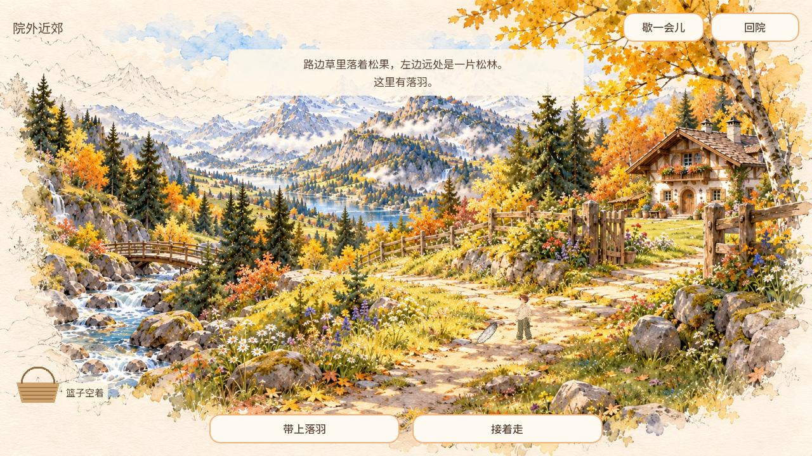
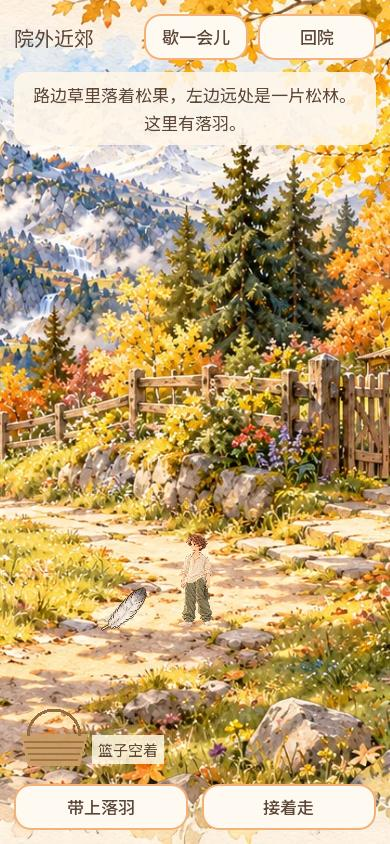
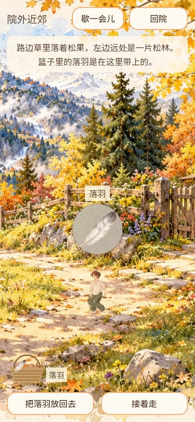

# 2026-10-06 近郊拾物视觉接续

Owner: CODEX-LEAD（兼制作人）。原Cloud PR375 head96c3215完整保留；本地受测源2507f0a19288dc63b7e2d5a13313fc8ac17ee9ee与远端73986dbb3c69977420dd8e829da65881afdf811d树完全一致：a89d24d95db3cc1c21b09892350b1af0d09e1a1a。

松果/落羽原画接入路面、拾起展示、提篮。白羽地面静止墨边保留原尺寸/锚点；展示暖灰纸、中文字体与篮名底板清楚。音频不随本片打包，原359/375候选等待真实听验；圆石占位保留。

## 验证

Windows Godot4.7.2实际执行探索切片296/296、探索核心357、天气27、UI63，共743检查，导入与Web导出退出0且无ERROR/SCRIPT ERROR。日志目录：C:/Users/Zengm/AppData/Local/Temp/youjia-local-tools/readiness-48c89962bf6343bfb8f0a08bda38446d。首轮84b8a078目录有稀疏检出缺JSON夹具导致错误，保留失败，恢复HEAD原件后重跑。

真实渲染器capture_find_reveal.gd输出1280×720与390×844发现/展示/提篮、正常/低动效。该工具使用内存宿主和固定种子，只作为实绘证据，不冒普通Web/生产持久化。此处JPEG是同尺寸截图编码，未裁切或改画。

普通浏览器使用本地导出http://127.0.0.1:8765/find155/index.html、846×859：标题进入小院，点击院门小路出院，沿近郊路径停步观察坡路草边，实际随机得到松果，点击带上，纸片松果/中文名字/篮名可见，再点击回院返回小院；重载后可重新进入院子，假期第3天保持。捕获warn/error为空。原图在C:/Users/Zengm/.codex/visualizations/2026/10/06/find155/web-pine-discovered.jpeg、web-pine-carried.jpeg、web-returned.jpeg。未借隐藏API强制生成物件。没有普通Web落羽随机样本，不把原生固定种子截图冒该项，也未通过物品库存UI确认回院松果长期持有；不冒整个探索持久化或手机真机验收。

本地受测PCK SHA256：2e1bc09b4c17f920a02f2873928ac25a477934231e85d1a516bec5000e6fb229。最初新标签双页触发正常存档互斥，随后复用原测试页；本地导出漏复制web/save模块导致首载失败，补齐十模块后成功。两者不隐去、不当作线上失败。

完整PR CI及公开发布另以PR495最终记录为准，当前未声称已发布。
