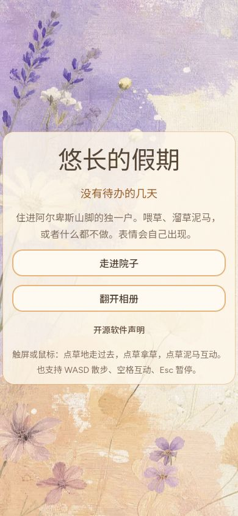
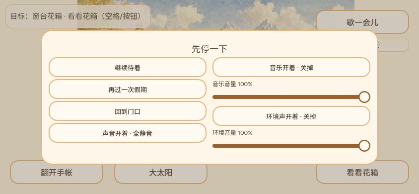
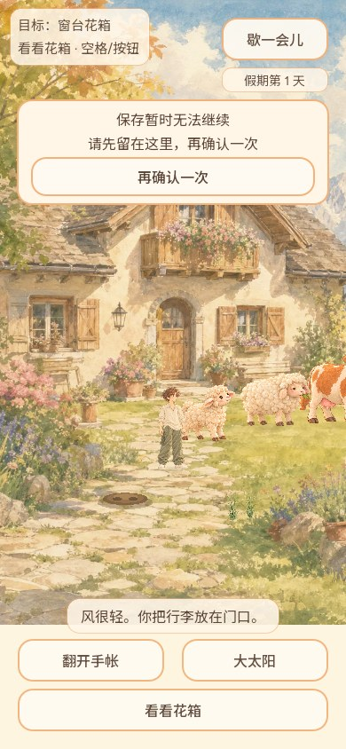
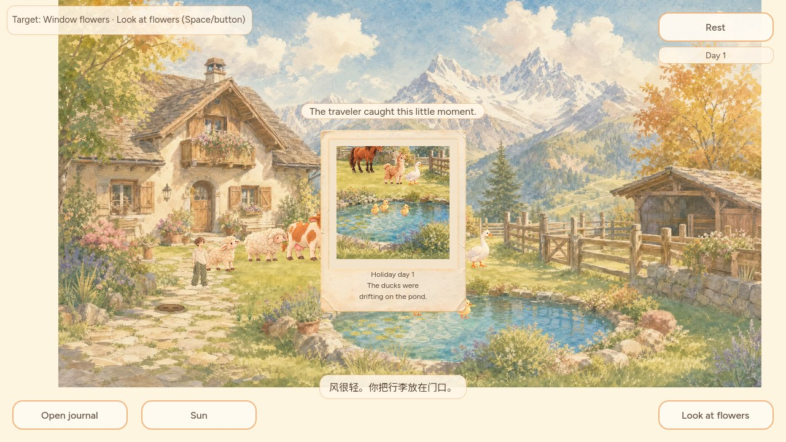

# Grok五项界面组合验收

CODEX-LEAD兼制作人负责集中审查与集成。保留原作者下列提交为真实父提交；不改其运行时实现，不恢复独立PM/Producer审批。基线为云带修复已合入的 `6557240172b504a61b9d66710383e891106cc21c`。

| PR | 原作者head | 范围 |
|---|---|---|
| #487 | 2e00e18f5b3c8157cfed465eed0bc15a71f2f85d | 存档等待纸片避让顶栏、窄屏/矮屏和双语 |
| #492 | 683410fd6d69bd57ebfcacae395675cbc332a5cd | 横屏暂停纸片贴合实际内容 |
| #493 | 526a203f135f871344889dacb7d54f2a7306772d | 标题简介/说明平衡换行 |
| #498 | 47fb9c3be2f06151939c0ccc6f6cc90cb9883f46 | 院内目标纸片随文字收窄 |
| #499 | e3fa24acb1ea478a366cdb7fcb76d455af3837a9 | 照片题词保持在纸条内、改善孤词 |

## 审查与测试

五项方法边界互不覆盖，未改#382输入、保存重试成功条件、天气或探索协议。作者的源提交、失败样例和各自决定记录保留。Leader补 `photo_caption_fit` 的daily调用与严格完成登记；shell文件模式保持100755。

Windows Godot4.7.2组合：save_status_paper573、pause_panel_fit1228、title_copy_balance580、hint_paper_width9264、photo_caption_fit1884、modal_touch_input270、save_feedback50、photo_arrival_combo656、photo_arrival_fit418、ui_interaction63，共14986检查通过，导入/Web导出通过。隔离目录 `readiness-daad0cb0a0ca4b60a795d11190e781f2`。本地PCK SHA256 `2d1878e86a8e1e1380328880c802e3c2d5a77a27e1dc96a416ee9fca33c5189a`。

`tools/capture_grok_ui_integration.gd` 用正式Main及其UI CanvasLayer生成390×844标题/院内/存档提示、844×390暂停、1280×720英文照片真实渲染；最终目录 `readiness-155f4af4d4f7432aac3df2973bf9818f`，无脚本错误。最早工具静态引用PhotoArrival导致autoload编译时序错误，第二版放在根Canvas而非生产UI层；这些工具错误已修，旧截图不作通过证据。存档失败和照片事件是受控触发，不冒真实磁盘失败/自然偶遇。

普通Web `dist/grok-ui/index.html`：实际390×844标题简介不再拆散末行，进入院子目标纸片收窄；暂停时旋转844×390，两列纸片贴合，回门口确认→取消后两个音量仍100%，再继续游戏。重排瞬间截到临时尺寸，等待实际布局稳定后才归档。测试tab旧公开资源下载network error有历史日志，本候选URL没有新warn/error。没有实体触屏/DPR或普通Web真实存档故障注入，也没有以这些渲染替代音频听验。

最终远端SHA、CI、合入和公开发布结果在组合PR记录。

