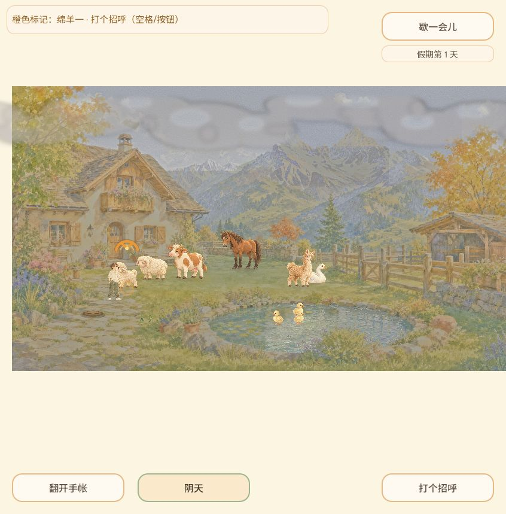
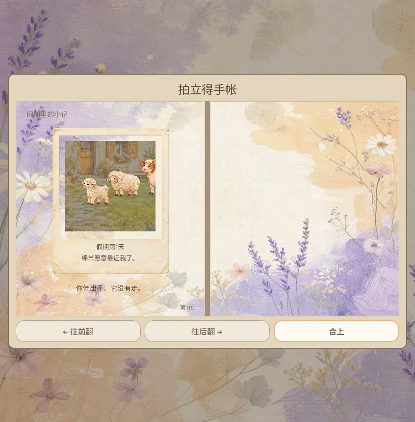
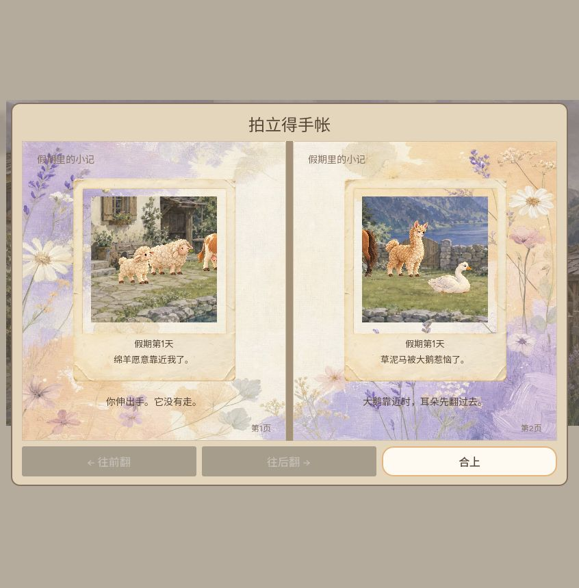
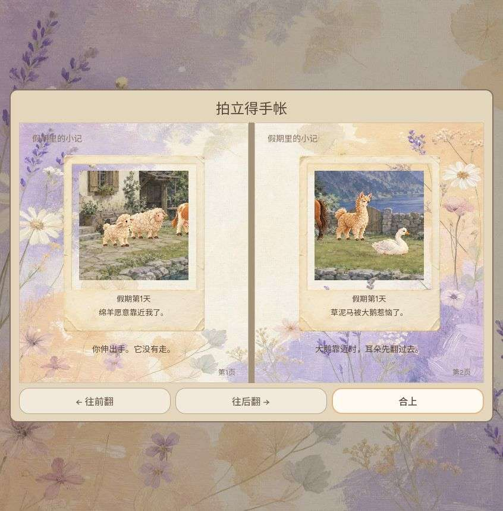

# #168 同构图阴天：本地接续验证

Owner CODEX-LEAD（兼制作人），2026-10-06。按用户当日授权取消逐 PR 外部审核等待；必要测试和每日发版前整体审查保留。

## 来源与构建
- Producer 原 head `1c18a20febacea6d78a7720b2515a40430fdebfe` 保留为真实祖先。
- 受测远端生产 head `58459a6f3d130030762cb861685c33f9740b67ef`，本地 merge `c4b817794b121e00fe75cf412432f30a6fc9d8c4`；两者 tree 均为 `57d2e0a89e80ff935705be083fba5ecf810468fe`，含 PR484 探索字幕修复和 PR485 新分工。
- Godot `4.7.2.stable.official.ed1daf0bf` Windows；Web PCK 27,553,356 bytes，SHA256 `0c7a8c0d7e9f408d31727ea8be09da5b55c70a2c32ed9e00a396282c69da3e05`。相对本机旧514eded包增474,352 bytes；此差值包含其间其他主线改动，不冒称阴天单功能净成本。
- 旧包源 `514eded6b71a058332273ff50490c26e88698f7c`，PCK SHA256 `6a9aad571a1b12368ce02b751f3a54d05cce4f25ab4b6db01f9b09650884fe48`。
- [完整 Linux CI](https://github.com/narutojzm1-dot/youjia/actions/runs/37405849302) success：game verification、存储模块/包保留检查及 Web export 均通过。
- 本归档提交只加 docs，不改变上述代码、测试、资源或导出配置。

## 本地回归
Windows 隔离 APPDATA/LOCALAPPDATA，运行前用真实 Godot user_data_dir 检查在临时目录内；适用套件附同路径 XDG_DATA_HOME/隔离标记，未删改隔离保护。
天气27、UI63、照片渲染1395、照片落盘49、探索285、镜头交接202，共2021 checks。直接退出0且日志无 ERROR/SCRIPT ERROR/FAIL 才通过。
实际 PCK 从空目录挂载后通过资源/排除项/字体/启动/玩法验收，包含新旧阴天图。

保留失败口径：首次探索因 sparse checkout 缺 `art/concepts/producer_world_20261005/near_path_anchors.candidate.json` 而失败，即使有部分 PASS 也未放行；补齐 HEAD 原 blob 后285完整通过。首次源码目录挂 PCK 会回退看见开发文件，排除检查失败；改空目录重验后通过，不改测试。
本机原始日志位于 `%TEMP%/youjia-local-tools/readiness-54a2bebba7e548fea90eeabd7a700e83`、`readiness-1de08181182d44709d96b727254fd40f` 和最终打包验收 `readiness-fa200f88958748b385231a7c9ab77d37`。

## 实际浏览器
Codex IAB，846×859；普通鼠标输入，没有注入游戏状态。
1. 新候选标题→院子→点击天气由晴转阴；阴天正常显示。
2. 实际绵羊互动产生照片→手帐查看→整页刷新→从标题重开手帐，照片和拍摄光色保留。
3. 转旧514eded本地页面，切旧阴天并正常游玩获得两张旧背景照片；切回新候选，从标题打开手帐，两张照片保留旧背景/构图。原旧背景没有被新天气重算。
4. 最后读取捕获的 warn/error 日志为空。

截图工具实际返回 JPEG 字节，按正确扩展名归档；最后一图是同尺寸 quality60 编码副本，未裁剪或重绘。该图原字节 Git blob hash `2de852651b59f94e1f36d1d67cb6d85f11fe18db`，原件保留本机 `C:/Users/Zengm/.codex/visualizations/2026/10/06/weather168/legacy-photos-reopened-in-new-version.jpeg`，其余三图为原返回字节。

范围限制：连续反转/暂停/晨晚夜/低动效/过渡中间帧属于自动及原 Producer 受控渲染验证；本轮普通浏览器未将所有组合重演。未宣称真机、音频听验、全键盘、设置跨刷新或长期压力验证；正式公开部署另核，未将本地候选冒称日版本发布。
