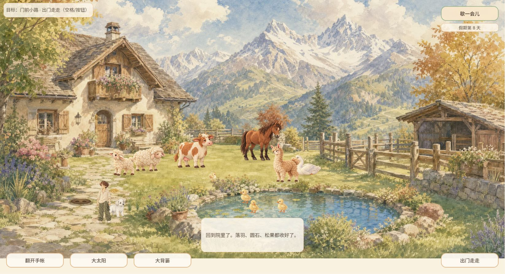
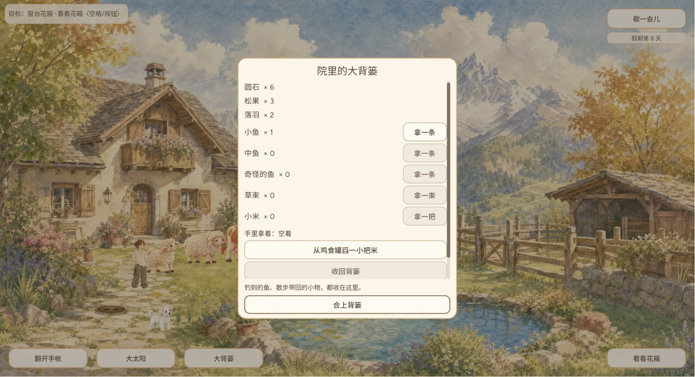
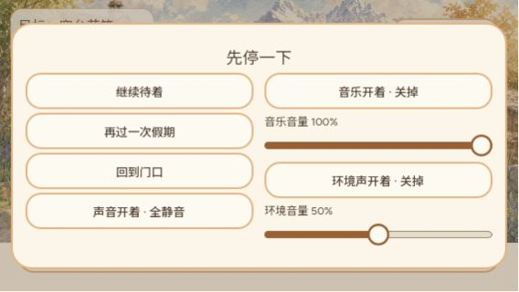

# GAME-QA：2026-10-07 20点深度体验（覆盖不足）

Agent-ID: GAME-QA。供用户查看；只测试和报告，没有游戏开发、修复或发布。实际游玩本人独立完成。

本轮局部流程通过：钓鱼、鱼取放、圆石摆放与收回、近郊三件物品跨页回院、村边收养 beibei、跨版本刷新恢复。旧相册首张照片题词错配继续存在。长期成长、全部动物关系、真实音频及全平台等未完成，**不足以判定全量发布通过**。

## 时间、版本与环境

计划北京时间20:00，心跳实际20:19:46.032，迟到19分46.032秒，不宣称准点完成。实际开始按该触发，本轮收尾北京时间2026-10-07T21:02:22.445708+08:00；自动测试分段时间见原始JSON。Windows / Chrome 3，标签250390156，自然1646×894，模拟390×844和568×320后已reset。使用既有第8天存档，未重置、未注入数据，正常游玩会增加物品及收养幼犬。

- A实际线上 `game-2bc6655`，短号对应仓库 `2bc66558c1865efe549c7b8ab9464b8e7e72c5f7`，原生源码同SHA。
- B刷新后实际线上 `game-d4f29e3`，对应 `d4f29e371cd699ace745196cb0677306017fddac`，原生影响回归同SHA。不能将A所有玩法样本算成B实测。
- 初次版本查询main已是d4；结束查询main又到 `cf7cf8cde2d921847c0646e575fb15fe71dc1de9`。该main未作为线上游戏测试。Release/tag查询空，详情[初始](evidence/version.json)/[结束](evidence/version-end.json)。构建号为页面实际DOM/加载页；源码SHA由仓库短号匹配，未独立验证线上PCK逐字节来源。
- A→B静态差异含`main.gd`暂停布局、`pause_panel_fit_suite.gd`及文档；B额外检查暂停适配。静态差异不当实际玩法证明。
- 两次入院点击有控制工具鼠标派发超时，重新观察显示已经入院，列环境工具问题，不列游戏BUG。初次加载图显示下载已完成耗时56秒、引擎仍启动，最终成功；没有受控网络基准，不判产品加载性能达标。

## 实际体验与证据

背篓基线圆石5/松果2/落羽1。圆石摆放占用一件，收回恢复5；鱼咬钩后Space收杆成功，库存小鱼1，拿起0、竖屏收回1。舀米并放地上完成，但没有确认小鸡吃完，不能称喂养成长通过。

近郊拾取落羽、圆石、松果，正确中文短提示分别保存29/32/34末帧；落羽曾放回再拿。背篓三件通过坡下换页保持。村边停下观察幼犬并选择“带beibei回家”，湖边观察后回院，圆石6/松果3/落羽2；幼犬出现在院里。没有第四物品机会，三件容量不等于第四件替换边界通过。

刷新恰遇A→B更新，B普通入院幼犬保留，圆石6/松果3/落羽2/小鱼1/手空保留。刷新时天气回晴，未拿天气自动保持作为需求/BUG结论。音频UI仍音乐100%、环境50%、总声音开。

B竖屏暂停纸片完整，短横屏双列没有按钮截断，横屏点击继续与自然窗口Esc暂停恢复可用。模拟窗口不代表实体移动设备触摸已测。

证据注意：`24-explore.png`实际还在院子，真正进入近郊为25；`38-stray.png`是走路中，真正观察与收养为40/41；`53-reload-new-build.png`是B标题页，不能当加载壳图；`60/61-dog-*`只显示幼犬在场，没有证明抚摸成功。短提示四帧全部保留，结论引用实际可见末帧。所有图原件和SHA256见[证据清单](evidence/evidence-manifest.json)。

## 覆盖矩阵

|范围|类型/版本|结果与限制|
|---|---|---|
|启动/入口|实际 / 2bc|通过：水彩加载→标题→旧档第8天入院；56秒下载后引擎启动等待，不作性能达标|
|钓鱼最短闭环|实际 / 2bc|通过：点击池塘→咬钩→Space收杆→小鱼入库1|
|鱼携带资源一致|实际 / 2bc|通过：小鱼1→0手持→390竖屏收回1，手空|
|院内布置/经济|实际 / 2bc|通过：圆石5→摆放4→收回5；移动按钮执行；未覆盖三位置全部物件及刷新时摆放|
|鸡喂食|实际 / 2bc|部分：舀米→地面放米；未确认小鸡吃完/成长|
|探索路线/携带|实际 / 2bc|通过：门前落羽、溪边圆石、坡下松果→三件跨页村边→回院库存5/2/1变6/3/2；落羽放回再拾|
|村边收养/湖边|实际 / 2bc|通过：观察小狗→带beibei回家→院内幼犬；湖边观察可退出。未成年、未全动物关系|
|背篓容量异常|实际+自动 / 2bc/d4|实际三件容量及跨页收养通过；没有遇到第四物品替换，容量边界只含自动套件|
|存档迁移/恢复|实际 / 2bc→d4|通过一轮：刷新新版入院幼犬仍在；圆石6松果3落羽2小鱼1手空；非新存档/未断电破坏|
|旧相册/小屏|实际 / 2bc|入口、翻页及390×844/568×320布局可用；首张旧图题词错配失败|
|晴阴/边缘|实际+自动 / 2bc；自动d4|限定通过44/47构图与自然窗口阴天边缘；没有连续视频/原大屏，不全局关闭#400|
|音频|界面+自动 / 2bc/d4|三开关关闭/恢复及跨版配置保持；warn/error空。真实听感未执行|
|新版暂停适配|实际+自动 / d4|390×844单列、568×320双列均完整可见；横屏继续/Esc暂停恢复通过；1291自动检查通过|
|长期成长/经济全量|静态+未完成 / 2bc/d4|读代码一天600秒、beibei三天；不等于实际成年。全资源产消/全关系、新照片未完成|
|失败重试/异常存档|自动 / 2bc/d4|恢复24、协调86各自通过；实际自然脱钩后重试、断电/旧版本全谱未覆盖|
|性能/稳定性/兼容|实际限定 / Chrome Windows|多流程和刷新可用；不具备FPS/内存长时曲线，未测实体触屏/iOS/Safari/音频输出|
|完整主流程/模式关卡|覆盖不足 / 本轮两版|未完成全动物关系、幼犬成年、全部事件/照片、所有历史原环境。不能全量放行|

## 自动测试（独立于实际体验）

A原生10专项59194检查通过，导入另计；B原生11专项60485检查通过，导入另计，不将两版本叠加称同版全量。两版相同10项：音频648、鱼携带79、探索300、存档协调86、恢复24、布置持久15、布置集成52、beibei46、相册短横屏57869、天气75；B另暂停1291。57869是套件断言数量，不是57869设备或完整游玩次数。

原始[ A结果](native/results.json)、[B结果](native-impact/results.json)、逐项完整引擎/包装日志与runner同目录。官方Godot4.7.2；APPDATA/XDG每专项新隔离目录，OS实际用户目录探针验证后运行。已登记专项按verified_godot完成行、进程退出与完整日志错误门禁；暂停新套件未在登记表中，由同一底层门禁显式约束`PASS: pause_panel_fit [0-9]+ checks`，没有修改游戏或测试实现。自动恢复/成长断言不代实际长期成长/断电测试。

tracked变化仅5个已确认引擎生成import，保存patch后恢复；其他未跟踪UID保留，没有覆盖用户修改。证据目录归档加.gdignore。

## BUG去重与发布关卡

六条历史台账保留，细项步骤、预期/实际、严重度、版本、证据、次数及旧轮记录见[bugs.json](bugs.json)。002旧题词错配本轮2bc读取1/1失败，链接原#40，生成版本未知；003水彩壳限定通过；004三种中文拾取提示桌面限定通过；001晴阴主景及005自然窗口阴天边缘限定通过，原大屏/所有过渡帧未覆盖，沿用#51/#168/#400；音频P1接口专项两版648通过、日志warn/error空，真实听验未做，保留#195/#196。未新增已证实产品BUG，没有将环境超时重复建单。鱼#231自动79及A实际携带回收通过，自然失效全路径未实测。

发布关卡：局部通过、旧相册体验失败、完整覆盖不足；不得全量放行。下一轮优先B/更新部署的探索中文与天气、幼犬真实三天成长、各动物喂养/事件照片、自然钓鱼失败重试、满背篓第四件替换、真实听验、原2444×1502纸边环境和实体移动端。长期稳定性无曲线与设备证据，不能标通过。

## 提交与审核

按qa-reporting与CONTRIBUTING独立PR提交，不推main。本心跳要求最终SHA独立审核；最新AGENTS集中Leader23:00审查文字与旧逐PR子代理要求冲突。QA不自审、不合入，保持待审交Leader处理；本轮测试未委派。报告提交不等于获准发布。#242只提交本轮QA产物回执。已有youjia/youjia-2定时任务沿用，不重复创建；心跳触发只证明本次实际执行开始，不证明其它未留报告的轮次已完成。
