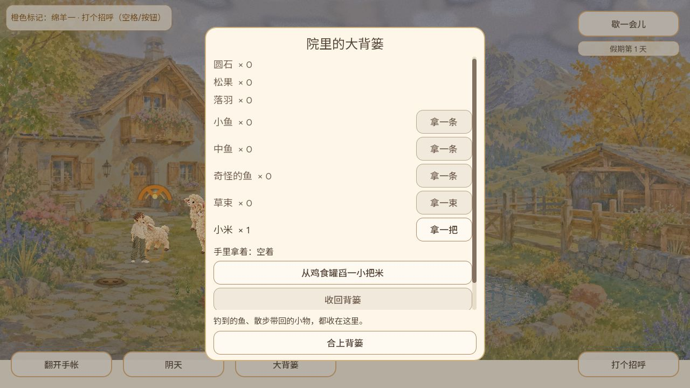
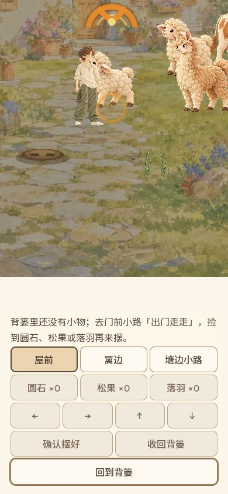
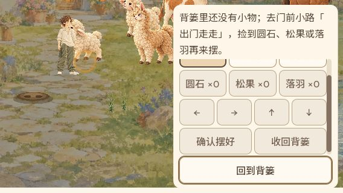

# 空背篓行与无物件布置引导集成

Owner：GROK-CONTRIBUTOR制作、CODEX-LEAD集成。基线main cf7cf8cde2d921847c0646e575fb15fe71dc1de9，保留原提交d589f14bac9487015640eb8ad1e0c8152544b90d和fc30ccc2bd1adb6e7433f0fdb4dfe3e116462b34。

两项只修改背篓行颜色与布置状态提示；没有改变数量、可用性或存档。Leader补daily/完成行登记、集成回归和普通Web证据。

Godot4.7.2隔离数据目录：空行130、无物件提示204、背篓集成66、微调限制204、布置集成52、通用416项通过，无引擎错误。原始本地结果目录为youjia-basket-check-fa3339f9-ce04-4b8c-9f1b-d1a07837b255；日志随本文归档。Web导出成功，PCK SHA256 b3ecf36593440d10d43d2c7d9ce12ba4c09b0c2b702c58cc635bfab214131251（本地候选，不等于正式发布包）。

普通浏览器使用localhost独立来源的新第1天存档，未重置127.0.0.1原存档，也未注入存档。背篓初始全部0；正常舀米后收回，变为小米1，有货行变深且拿取按钮可用，其他0行保持淡色。

背篓滚到底部进入布置：没有小物时说明去门前小路「出门走走」拾取圆石/松果/落羽。1280和390×844文本可读，390返回按钮完整可见。

568×320长提示固定在顶部，操作区滚动；初始最后一行不能完全显示，滚动后确认/收回均可见。返回按钮固定在底部，两次实际点击均返回背篓。不是所有操作同屏，也不是实体手机触摸验证。

原生套件另覆盖中英、全部摆出、已有物件、预览、保存忙/失败/未知优先级。普通实玩尚未覆盖“全部摆出”文案和英文；上述自动覆盖不冒充普通实玩。完整PR CI、合入及公开包验证接续。
