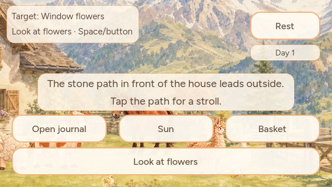
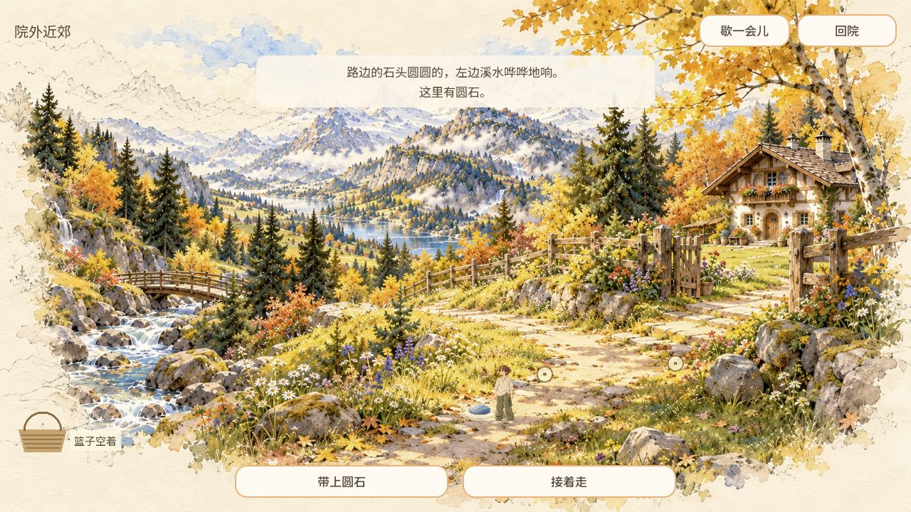
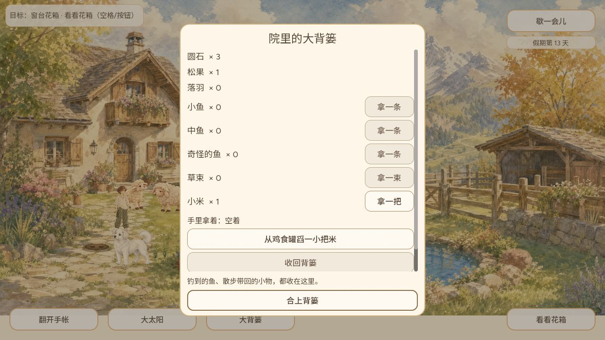

# 出院软提示纠偏与公开往返实玩

Agent-ID / Owner CODEX-LEAD；#535、#153。认领回执153/6035457421。仅修订中英文 `notice.hint.go_explore`，不修改Grok #545/#548组件或移动/保存协议。

原提示“院子右边还有羊圈没去过”沿用探索开放前的文字，实际会引导玩家去右侧木栏。正式出院入口却是屋前向画面左下延伸的石板路。改为“点一下屋前石板小路，去院外散散步？”；英文说明同一入口。保留无任务的轻提示、原轮播节奏和玩家选择。

## 本次修订验证

- 现有 notice_paper 49、generic 416 检查通过，无ERROR/FAIL。没有为两条文案新建镜像测试。
- 隔离原生Main受控绘制，中英两种语言分别检查390×844、568×320。最终中文单行可读，英文两行完整，均在纸面内且不盖行动按钮。初稿中文在568宽产生孤行，缩短后重新绘制四个组合；本目录展示最终中文390和英文568。该夹具停止Main进程以固定提示，不把背景镜头取景当普通游戏验收。
- 最终Web导出exit0且无ERROR，PCK SHA256 `b65b3f9635598f7e62719c0626b7d75a7698c732b842e5dff918b9a5b0edb8ea`。最初导出后曾尝试复制不存在的loader-cjk.js；它并非HTML依赖，当前字体已内嵌，存档bridge及模块目录已复制。最终重新导出无此复制步骤。
- 不将受控提示图冒充普通轮播截图；最终远端CI/发布核验另在PR记录。

## 公开 game-681f522 的完整普通往返

此段验证已发布的移动/物品链，不含尚未发布的提示文案。精确source `681f52275dd4a687ee20c54972e5cc7f0964f63b`，公开包核验见[上一回执](../2026-10-07-playable-loop-receipt/README.md)。普通1280浏览器，没有注入状态或改存档。

1. 第13天背篓起始：圆石2、松果1、落羽0、小米1，空手。
2. 先点右边木门，实际只能观察栅栏；随后点屋前左下石板路，旅人走近后自然出院。
3. 在近郊点击溪边圆标记，沿路走到“溪声近处”，出现圆石与“带上圆石”。明确点击带上后，篮子显示圆石，原按钮变成“把圆石放回去”。没有自动发放。
4. 接着走，并点击北向支路；旅人沿分叉走到远处道路，透视缩小，篮内圆石保留。再点击画中院门，旅人沿路到门口自然返院，未用右上“回院”代替这条路径。
5. 小院背篓圆石2→3，松果仍1，落羽仍0。真正关闭公开页面并重新打开，仍是第13天、圆石3。加载过程在61秒时仍54%，继续等待后成功到标题，不把慢下载判为已失败或重新启动另一趟。

已证明该次鼠标操作的出院→发现→拾取→分叉散步→自然返院→入篓→关页恢复。没有把它扩大为实体手机、所有掉落、动物同行寻物、途中中断恢复或全部探索完成；这些保持各自证据边界。
