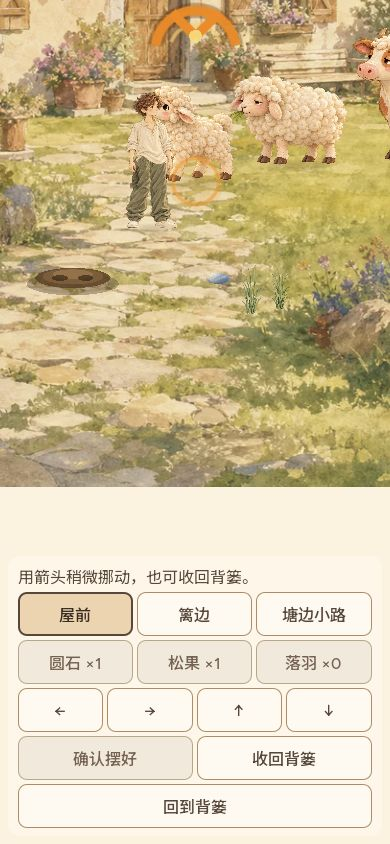
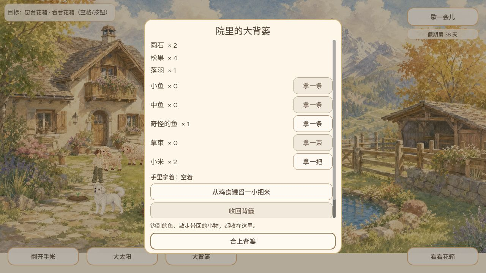
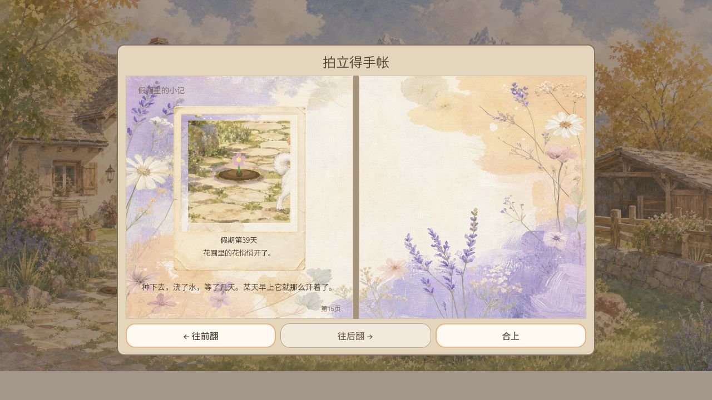

# 2026-10-07 小院闭环与公开版本验收补记

Owner CODEX-LEAD。本页补齐已完成验收，保留早期候选记录，不把分项通过扩大为整游戏完成。对应 #535、#546、#547；用户邮件全文留在私人邮箱，仅产品结论进入仓库。

## 构建与公开交付

最终公开 source `681f52275dd4a687ee20c54972e5cc7f0964f63b`，入口 `game-681f522`，代码树 `5c603739df6eafd96276ff77716135100a88318f`。#546 保留 Grok #538/#541 作者提交，#547 处理布置编辑中动物遮挡。

- #546 CI 37595615563、#547 CI 37596686278 成功。
- 最终 Publish 37598299957、Pages 37599956175 成功；gh-pages 提交 `ccfc3767efc9717c4f8cee50e1e47c1fca7c6f91`。
- 实际下载 PCK 43,902,868 字节；SHA-256 `4820627b30642617bb53e8885099faadfb250e22bab84daab94e7b7e78dfbcc7`。
- git blob `29196ffcb03dd7621f9164b57383351b8ebffa7c`；公开 manifest source、HTML 入口及 10 个存档模块全部一致，见 [verification.json](verification.json)。
- 验证旧 e75af7f 时 HTML 已更新至681，旧脚本因此拒绝通过；最终681重新完成一致性验证。未把发布中的混合版本判为成功。

公开普通 UI 使用既有第13天存档：小米取出1→0/手持，收回恢复1/空手；屋前石头2→1，向右微调一次后确认；1280、390×844、568×320 均可操作。真正关闭页面再打开，库存1和已调整的位置恢复；收回后石头恢复2，beibei恢复原透明度。重开页面 warn/error 日志为空。以下为公开390布局，浏览器视口模拟不等同实体手机测试。

## 本地同树普通游玩：钓鱼、种花与照片

本地 Web URL `/decor-visibility/index.html`，PCK SHA-256 `7088c7343475dae4f41a85b56a564a1301618fd0e12ffcbdabb0383adc8fe09f`，导出于本地 `b6fe47c4d49f3d91042da75f0b92253b95006966`，与上述公开 source 同树。以下使用另一份既有存档，不冒充公开服钓鱼流程。

1. 第37/38天走到池边钓鱼；第一次错过收杆窗口，第二次成功钓到奇怪的鱼。背篓显示1；真正关闭页面并重新进入，第38天背篓仍1。取出后背篓0、手持鱼，点击丢在地上后手持清空并出现成功提示。没有捕捉到动物实际吃鱼瞬间，这一段不计实玩通过。
2. 既有花苗第38天普通点击浇水，显示浇水反馈；未加速游戏时钟，自然到第39天开花。点击采摘显示采摘提示并恢复空土。
3. 再次真正关闭页面、重开进入第39天，相册第15页保存当天粉色花朵与“花圃里的花悄悄开了”题词，图文一致。首尾旧植物状态来自之前保存，本轮不宣称从新档播种开始。
4. 相册第12页钓鱼照片仍是第11天旧记录，不能当作本轮新拍鱼照片。第13/14页第30天鸡龟故事也仍在；仅验证保留，不重复算新解锁。

## 天气辨识的普通操作复核

同一第39天存档，使用玩家可见天气按钮切换。1280及390×844中，晴天为蓝天暖光，阴天为灰云及较冷暗的屋舍草地；两种原画和天气层实际不同。390视口重排结束后检查，草地/屋舍满幅，HUD可用。截图不是修改存档或注入天气状态所得。

这是对第1项“看起来像同一张原画”的当前构建反证，支持 #537 之后差异已可观察；不宣称已覆盖所有昼夜/季节组合或用户最终美术认可。保留原有水彩方向，未因旧版本反馈盲目替换已有资源。

## 未完成与下一步

- #542 两地音乐仍为Draft，实际听验、连续循环及内存验收未完成；不随本页发布音乐。
- 实体手机、所有输入设备、完整长时稳定性与所有天气/昼夜组合仍未覆盖。
- #535整体仍开放；近郊完整往返、所有探索所得与故事链按各自原单证据验收，不用本页的小院流程代替。
- #545/#548 为 Grok 在途界面切片；本页不修改其方法。日版本23:00仍须集中审查、公开核验与邮件去重。
