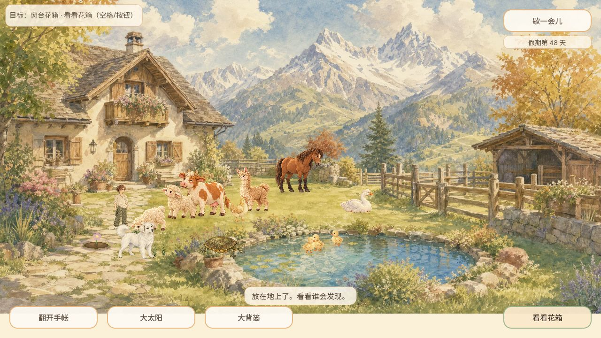
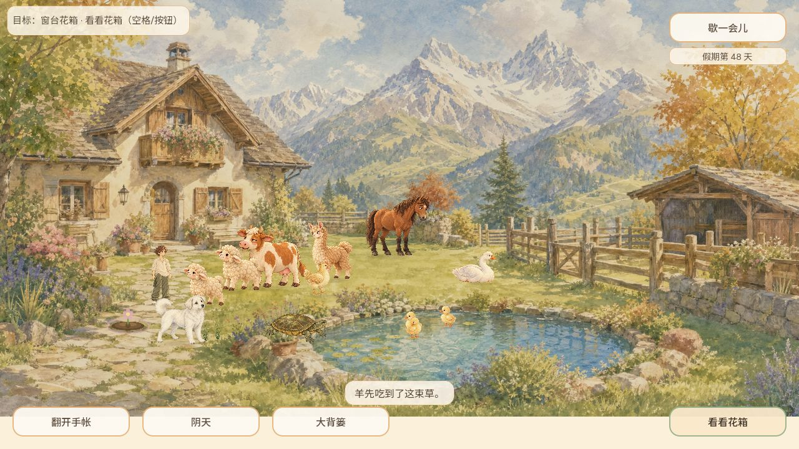
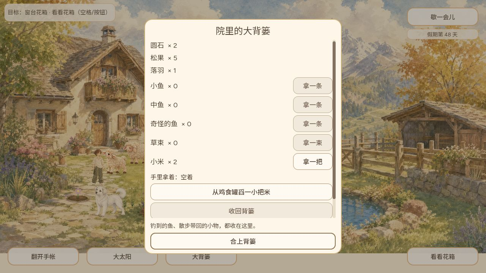
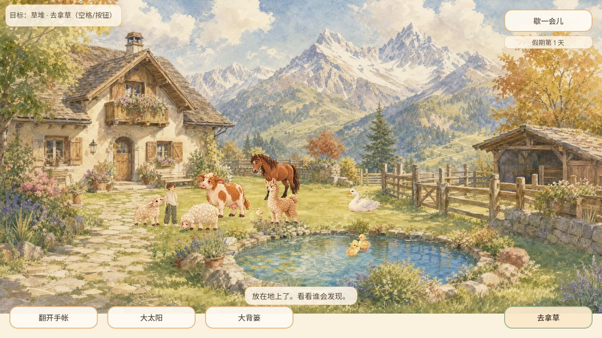
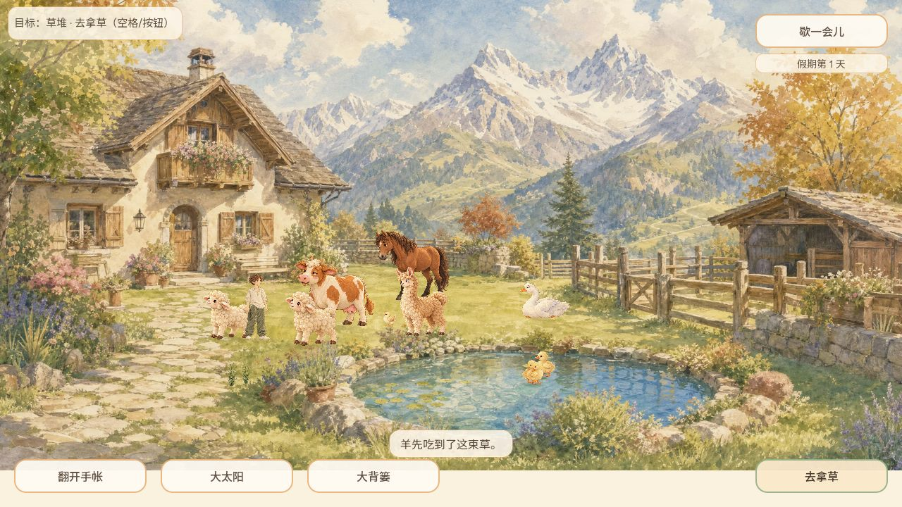
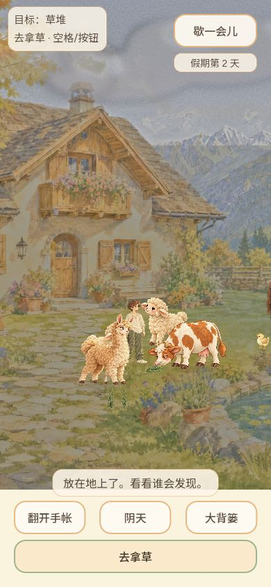
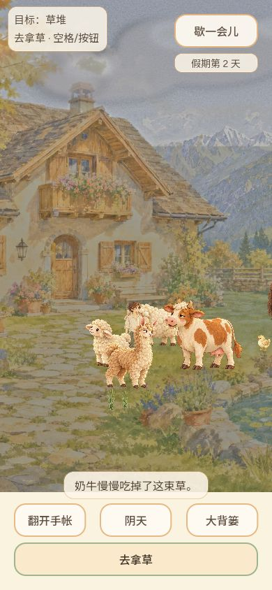

# 双羊地面取食候选 — #504

Owner: CODEX-LEAD。基线 cf7cf8cde2d921847c0646e575fb15fe71dc1de9。

本片为黏人羊、呆羊分别接入完整低头原画，按原画嘴部/脚底锚点寻找取食站位。近侧被挡时，只尝试仍在合法地面且不碰撞的另一侧；不扩大咬食距离、不移动草、不改变持久化协议。已有抚摸关注姿态保留。

## 验证

- Godot 4.7.2：双羊姿态96、牛姿态48、真实库存/地面食物运行75、通用416项通过。各套独立数据目录，日志无SCRIPT ERROR/ERROR；摘要见 native-results.json。
- 双羊姿态覆盖两个身份、两个朝向、0.75/1.25视觉倍率、低动效开关、嘴部接触、脚底不跳、照片JSON往返和动作结束。
- 运行套保留双羊竞争同一草束且只消费一次，新增两只羊各自实际走近、嘴部接触、一次提交、原生重新读取无复活；不是只靠竞争赢家验证两个身份。
- 早期回归发现近侧站位被挡不能吃，现有对侧合法站位回退修复。旧以身体中心距离判定吃草的断言改为实际原画嘴部接触；未放大消费阈值。
- Web 导出成功；候选 PCK SHA256 d6e465df630dcfa97783bf2ad36d951a8e3e062df328451b7798bb1962957b17。导出后的变更仅为增加运行测试和本文。

## 普通浏览器实玩（1280×720）

第47–48天，通过背篓拿草、合上、投地，连续截图捕获黏人羊低头接草及“羊先吃到了这束草”。两次自然竞争均黏人羊先吃，不将其记作呆羊实玩通过。真正关闭页面后重新打开候选：第48天、草束0、空手、圆石2/松果5/落羽1/小米2保持。未注入浏览器存档或移动动物。

呆羊两个朝向已经原生GPU受控截图检查，嘴部接触独立地面草；受控截图不等于普通玩家自然取食。普通Web呆羊清晰咬食画面、手机候选实玩、完整PR CI及公开包核验尚未完成；本片仍为候选，不关闭#504。

## 资源

使用内置 image_gen，以既有 cast_v2/sheep_clingy.png、sheep_dull.png 分别作已检查参考。完整生成透明PNG原样复制，未裁切、拼头或用代码变形。

| 文件（assets/holiday/characters/ground_feed/） | 大小 | SHA256 |
| --- | --- | --- |
| sheep-clingy-graze-v1.png | 1,188,420 bytes; 1254×1254 RGBA | 6848c47db3adbc6607d0009fcfcda151cf552afee5b4402b88e73910909016ee |
| sheep-dull-graze-v1.png | 1,291,878 bytes; 1254×1254 RGBA | d3a36f1977601fe6acb71e447270a4d445d066b369587410924d00e6bddabb82 |

锚点/透明边界记录于 scripts/game/sheep_ground_art.gd，导入配置随资源提交。黏人羊保留明亮眼睛与奶油卷毛，面向右低头；呆羊保留圆身体和半闭眼，面向左低头。均移除画内食物，由库存地面物独立呈现。

提示词要点：以对应既有羊为编辑目标；保持水彩笔触、个体身份和自然全身体态；四腿站立，嘴降至蹄部地面；透明正方形、完整边缘；无食物、地面、阴影、文字或第二只动物。禁止拆头旋转、跪姿和身体压缩。

## 22:46 普通实玩补验（运行代码未变）

此前待补的呆羊自然取食已验证。localhost独立第1天存档（没有重置127.0.0.1原存档）正常点击草堆拿草、走到呆羊附近、按钮投草。连续130帧中45/52/60帧清楚显示呆羊嘴部接触草束，75帧草消失且出现“羊先吃到了这束草”；黏人羊站在旁边，未消费。没有注入浏览器存档、设置动物位置或禁用竞争。

390×844普通拿草、投地与自然竞争也完成，此次由牛先吃，完整低头原画和“奶牛慢慢吃掉了这束草”反馈可见。它验证此候选的竖屏投食操作及竞争，不冒称手机羊获胜。568×320背篓滚动和关闭另已实际验证。模拟视口仍不等于实体手机触摸，英文及全部照片组合保持自动/受控覆盖边界。

代码head2e67889cd122e50402e77d3be0a3db4982d138a1完整CI37629848118已success；本次增量仅归档截图与说明，正式合入后公开包核验尚未完成。上文“呆羊尚未拍到”为此前实测快照，以本节新增证据更新该项状态。
