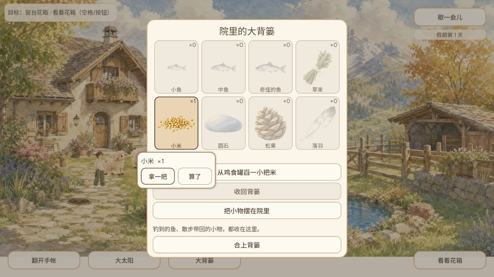
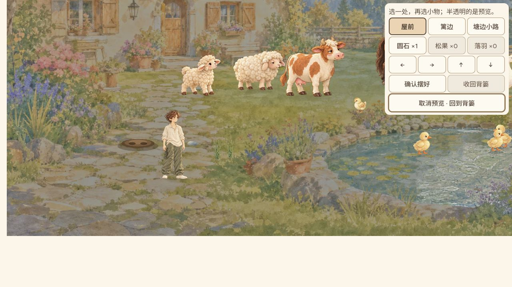
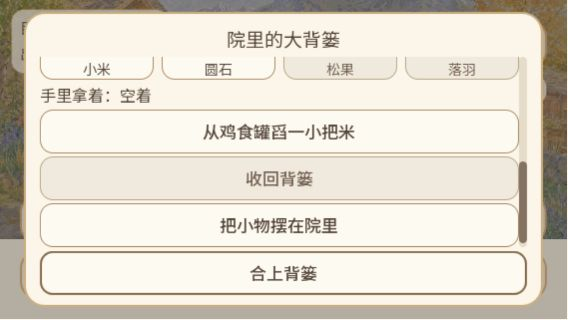

# GAME-QA：10月8日8点冒烟与新增功能影响回归

Agent-ID: GAME-QA。本人独立测试；只QA，无开发/修复/发布。供用户查看。

**关卡：局部功能通过，自动回归失败，不能放行全量。** 新格子背篓、菜单取放、圆石拖出预览/确认/收回、左微调边界和空库存说明已实测；牛进食与自然天气轮换/跨日待补。鱼提示专项两次失败，原始失败保留，不报全套通过。未改动旧问题不重复专项测试，不在前部反复列旧相册错配。

## 当日新增功能与覆盖缺口

比较上次受测d4f29e3与当前实际cf48222，提交/PR与文件原件见[current-delta.json](evidence/current-delta.json)，每日可接续矩阵见[coverage.json](evidence/coverage.json)。这是跨轮累积新功能，非声称全部功能于今日提交。

| 新增/变更范围 | 实際与自动结果 | 后续缺口 |
|---|---|---|
|格子背篓与点按菜单（#575 / #565）|限定通过：实测0→手持→库存1→取出0→收回1；物品名字、图与角标可见|390×844全部格及按钮可见；568×320滚动可达操作区；空格图文变淡。实体触屏、全部物件菜单未测；12点补全部物品菜单及280窄屏|
|从格子拖出圆石进入摆放预览（#575）|限定通过：实际拖出进入预览，库存仍1；确认后0；收回后1|中途半透明帧未抓取；无效落点取消/已占槽/手机拖放未实测，自动120检查通过；12点补无效落点取消及占槽边界|
|布置微调边界按钮禁用（#557 / #554）|限定通过：到左边界后左箭头变灰，其他方向可用；正常确认、收回|只实测左边界；其余方向自动204检查，不冒全方向实际；12点补其余方向与其它槽|
|空库存格子的淡墨与可辨名称（#562 / #556）|限定通过：四类食物与三种小物加小米，空量0、图案淡墨、名称可辨；米/石有货后恢复有货外观|已切换新格子实现，旧行版不重复测；390/568有限观察；20点结合最新UI复查新影响|
|空背篓布置说明（#562 / #559）|限定通过：提示背篓还没有小物，去门前小路找圆石/松果/落羽；零库存按钮灰，返回可用|只有既有空档状态；占槽但可用0的专项由原生覆盖；12点补已摆满/剩余0说明|
|共享区域天气持久化、探索期间推进同一时钟（#571 / #566）|部分通过：19回院仍阴天；刷新结果以recovery.json为准。真实自然天气轮换与跨日未完成|存档sanitize、运行时及探索时钟共198/15/300自动检查通过；没有用墙钟代游戏时钟；12点补自然天气轮换/探索跨日；20点长时段|
|牛吃地面草的完整原画姿态与接触（#553 / #504）|实际未覆盖；自动通过：当前仅原生姿态48、地面食物运行时63通过；本轮普通浏览器牛进食未完成|牛朝向/低动效/拍照保存/小屏接触未实际验证；12点优先普通采草、放草、牛进食和留影|
|共享时间/库存影响回归（#571 / #575）|自动测试失败2/2：两次107检查均有1个S7奇怪鱼HUD提示断言失败；持有、库存、投放相关断言未失败|尚未取得普通玩家奇怪鱼反馈，产品原因与测试契约需定位；不能因其余检查过而报套件通过；交Leader/Assistant定位；QA下一轮核对相关修订部署后定向复测|

## 版本、环境与迟到

计划北京时间08:00，实际心跳08:25:33.899，迟到25分33.899秒。实际结束时间见end.json。Chrome 3本轮连接不可用，按官方浏览器控制排障确认已不在可用清单；改用已有应用内浏览器2/标签1，1280×720及模拟390×844/568×320，最终reset。使用该浏览器既有第1天空库存档，**不是昨晚Chrome第8天档**，不能把两浏览器差异当丢档。未重置、未修改引擎/网页隐藏状态；米与圆石均普通操作取得。

开始应用内旧标签 `game-9af244c`（源码短号对应9af244cc327144fb916c108f2b7527c9af0fe866），仅标题和一次入院观察；不当当前版本验收。刷新后实际 `game-cf48222`，源码/main查询cf482229b70b57ca6255c3a99a238167172d96af；Release/tag查询空。[version.json](evidence/version.json)保留初始旧标签状态，[recovery.json](evidence/recovery.json)记录当前恢复状态，不能用初始version字段冒最终线上号。页面构建号与源码短号映射已核对，未独立核验公开PCK逐字节hash。

旧标签音频worklet请求9af资源出现404（日志08:27:41），属于旧部署资源/缓存上下文，不能冒当前cf接口错误。cf首次下载停在41%、127秒，08:32:53记录network error；点击公开重试后进度31→80并成功到标题/院子。恢复刷新仍需下载，具体结果另列。网络失败与鼠标派发超时列环境/加载事件；尚无受控网络性能基准，不判当前产品根因。

## 实际普通操作与证据

- cf普通入院成功；大背篓显示八个格子，空量0仍有淡墨图与名字。舀米→收回米1→点击格子菜单拿米0手持→收回米1，没有凭空扣重。
- 零小物布置说明明确去门前小路，按钮不可用，返回可用。选阴天后实际出门，门前捡圆石，回院石1且阴天仍保留。
- 圆石格拖到院内屋前进入半透明物品预览，面板圆石1，尚未扣；左微调到边界后箭头变灰。确认石0，收回石1。中途面板透明/合法区着色帧没留图，不声称该视觉已验；只确认最终预览结果。
- 390×844实际仍四列，名字/角标与关闭可见；568×320清单滚动可达取放/布置操作，关闭固定可见。模拟窗口不等于实体触摸已验。标题页、菜单、布置面板均为真实浏览器截图。

刷新恢复记录：{"build": "game-cf48222", "viewport": {"height": 720, "width": 1280}, "result": "尚未完成：同版本刷新资源加载301秒仍77%，未入院，不能验证天气/圆石1/小米1恢复", "status": "未测，加载限制", "evidence": "29-reload-state.png / 30-reload-title.png", "note": "30文件名title实际是下载中，不是标题；正常前段同版本阴天回院19通过"}。

照片图注：01是旧9af标题，不是加载壳；04/05是cf下载中，不是标题；08才是cf标题。25图为390四列，工具标题曾写三列，报告以实际图为准。未对旧相册专项复现。

## 自动影响回归与失败

相同cf SHA官方Godot4.7.2，OS实际用户目录探针先验证，每专项独立APPDATA/XDG/隔离marker。14专项11737检查通过（格子1320、真实Main入口50、拖出120、面板适配8875、空行淡墨130、空提示204、微调204、天气198、天气runtime15、牛48、地面食物63、探索300、协调86、恢复24）；import单独退出0。均按已注册完成行、实际退出与完整错误日志门禁。

第15项鱼携带一致性**失败**，107检查中1个S7 HUD断言失败，退出1；第二全新隔离目录原样复跑同107/1失败。因此14项通过不等于15项全过，鱼库存/投放断言过也不抵消HUD失败。原件[native/results.json](native/results.json)、[重复结果](native-recheck/results.json)及全部引擎/包装日志。复跑是定位新失败，不是重复运行无改动已通过专项；未跑未受影响音频/旧相册全套。

BUG记录 `QA-FISH-20261008-001` 关联已有#231，暂定P2提示范围，类型为“自动失败待定位”，不是已证实浏览器丢鱼。[bugs.json](bugs.json)含复现步骤、期望/实际、次数/版本/证据。没有新建重复GitHub issue，也没有改测试让它转绿。此前六条记录保存原证据与最后专项版本，本轮未再专项复现。

## 后续与发布限制

12点首先补牛普通采草、地面进食姿态与实际照片，拖出无效落点取消/占槽边界、其它微调方向和窄屏菜单，跟进鱼提示专项相关修订；20点按当日矩阵补自然天气轮换、探索跨日/长期成长。真实听验、实体触摸/其它平台及长时稳定性尚未执行，不称全部新功能已通过。当前自动门禁失败及覆盖不足，发布关卡不放行。

源checkout变更前实际normalized diff空；原生运行5个已知生成import保存patch后恢复，未跟踪UID保留。报告独立PR，仅docs；不推main、不自审、不合入，交Leader23:00集中审查，并保留本聊天最终SHA待审要求。相关身份、规则与角色记录已读取。首个生成runner时shell quoting语法失败、未运行Godot，随后正确生成并运行；不把工具失败混作产品BUG。

本轮还修复了两项既有定时提示前半段乱码，改为完整中文并检查无替换字符，ACTIVE及08/12/16、20点安排保持。没有重复创建任务；未来执行仍需实际报告证明。
