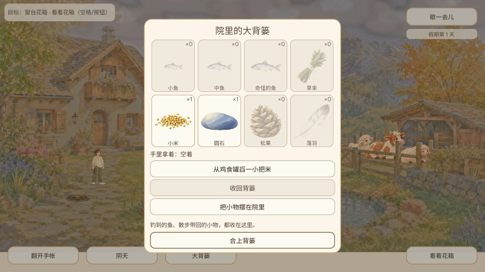
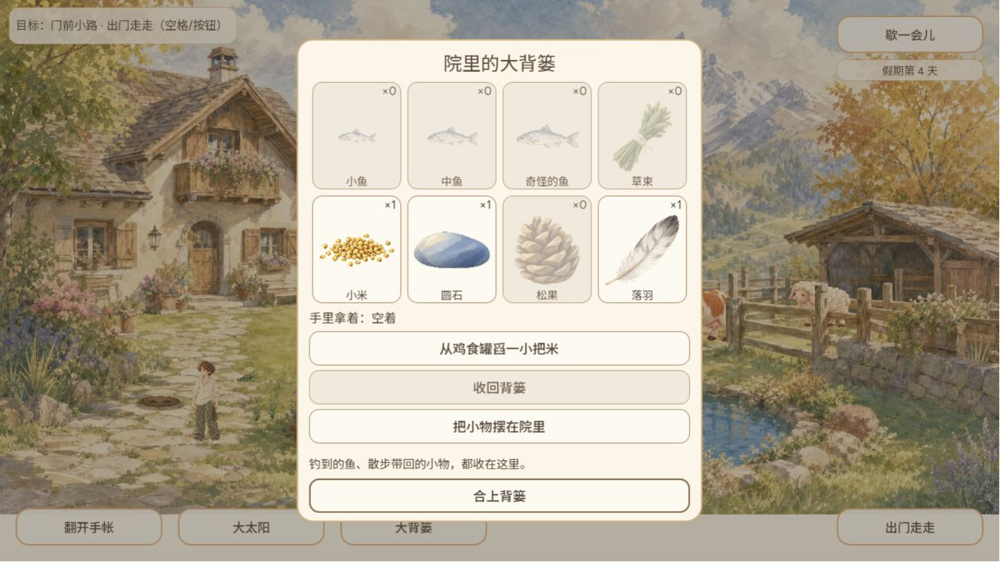

# GAME-QA 2026-10-08 晚间续接冒烟与深测

结论：新增功能已取得限定通过证据，但实际吃草完整闭环、雨中跨场景、长期成长及真实听验仍有缺口，**不足以判定全量发布通过**。没有把未执行项计为通过。本次无新确证产品BUG；#231测试时序修正后的定向自动复测通过。

## 当日新增功能与覆盖缺口（优先）

本轮基线cf482229b70b57ca6255c3a99a238167172d96af → 实际线上game-070ae5a / `070ae5a4f45f73105801cc029a1f86def87b6f6b`。上午已覆盖的新背篓/拖放/空态/微调保留在[daily-coverage](evidence/daily-coverage.json)的原行，未无理由重跑；以下是此后增量。

| 功能 | 需求/PR | 实际玩家证据 | 自动/边界限制 | 结果 |
|---|---|---|---|---|
| 附近局部视图与直接拾取 | #569/#585 | 实际落羽0→1，原米1石1保留，13–16图 | 189检查通过；实体触控/双触点未测 | 限定通过 |
| 围栏门持久化与可行走入口 | #600 | 按钮开/关互换，动物出棚；07–09图 | 41检查通过；重载门状态与门口占用拒绝仅自动 | 限定通过 |
| 牛羊住棚、夜晚回棚 | #602 | 09图羊出棚牛在门口；后续牛羊均出棚；10–12图回棚过程，未完整逐帧捕获3只回床 | 34检查通过；完整自然队列/长时堵门未测 | 部分覆盖 |
| 共享细雨、池塘涟漪与避雨 | #603 | 10–11图细雨状态与夜色；12图已切大太阳，不是雨图 | 35检查通过；雨中跨场景、涟漪细节与音频未验 | 部分覆盖 |
| 跨场景昼夜照明、月色、共享时钟 | #580/#591 | 05/07夜色、08昼、13附近夜、14附近昼、15回院第4天 | 181+18检查通过；全部相位连续帧未测 | 限定通过 |
| 两只羊地面吃草动作及持久化 | #574/#504 | 拿草/落地做过，雨夜回棚优先；未捕获羊或牛低头咬食完整闭环 | sheep96+ground75检查通过；实际吃草未通过 | 部分覆盖 |
| 动物瞥视不覆盖行走朝向 | #565 | 行走/出棚可见，无全朝向专项视觉证据 | 48检查通过 | 自动通过/实际缺口 |
| 奇怪鱼HUD专项时序修正 | #587/#231 | 未实际钓到奇怪鱼，不关闭玩家侧全部范围 | 107检查通过；收杆时抓取提示代替等待保存后的瞬时提示 | 自动复测通过 |
| 新增天气/门/居民相关保存兼容 | #565 | 04图米1石1阴天、第1天恢复；16图新增羽1 | save coordinator86/recovery24通过；新门状态再次刷新未测 | 限定通过 |
| 草中蜗牛/苜蓿候选资源 | #599/#117 | 仅art/concepts候选；不宣称已接入或线上新玩法 | 静态差异确认，不重复运行无关专项 | 候选未接入 |

优先补测顺序：牛羊正常白天地面食物完整低头咬食、雨中院子/附近一致性、门开关保存后刷新、队列占位失败边界；随后成长/花园/关系和真听。未接入候选资源单列，不当线上玩法。原始[提交/文件差异](evidence/delta.json)可追溯。

## 时间、环境与版本

- GAME-QA本人执行测试，不委派。冒烟心跳北京时间19:15:50.494送达；最早保留截图实际为2026-10-08T21:53:37.935255+08:00。这不是16点准点完成，也不补造未运行的12点轮次。20点深测心跳实际22:03:47.326送达，在进行中的同一会话续接，统一归档，未重复跑相同专项。
- 收尾约2026-10-08T22:34:29.223062+08:00。原文件目录含1915表示心跳，不是实际开始时间；报告目录2153对应首份截图实际时间。
- Windows，Codex IAB浏览器2/tab1，Godot官方4.7.2原生隔离测试。自然视口曾从1280×720变为678×729；为门入口覆盖临时设置1280×720，最后reset并确认暂停菜单在678×729显示。17图是reset瞬间过渡帧，18图才是稳定自然窗口结果。
- 起始旧cf页面保留network error；点击公开重试后加载壳AX显示game-070ae5a，随后进入花纸标题和院子。02图文件名loading实际是标题页，不作加载进度证据。DOM body dataset为空（build-dom.json），不冒称从中取得SHA。
- GitHub提交API将070ae5a解析为完整SHA；当时main相同，Release/tag均空。收尾main `95bc78bcee6461e02faf61957d43fed640b9220e` 仅记录，未重新受测。初次schannel fetch失败，改用单命令OpenSSL后成功，未关闭证书验证；安全切换detached到受测SHA，未覆盖本地修改。
- IAB沿用上午第1天档；与旧Chrome独立档不混淆。没有注入游戏全局、改存档或造道具。原生每套独立APPDATA/XDG，profile-probe验证测试数据目录。

## 实际游玩

1. 旧页加载失败→重试→新标题→进院。入院点击工具曾报派发超时，但后续截图确实在院中，记录为工具时序，不是游戏崩溃。
2. 跨cf→070恢复：第1天、阴天、米1圆石1，手空；04图与上午基线一致，补齐上午恢复阻塞的证据。
3. 木门靠近后显示关门，点击后显示开门，再开门并让开入口，羊先出、牛经过门口，随后牛羊均在院里。07–09图可核验。夜色与细雨时见回棚过程，不宣称每只动物全过程和所有堵门分支完成。
4. 实际拿草→手持食物→丢地，11图可见脚边草束。雨夜回棚优先，未捕获低头咬食动作，因此牛羊吃草实际项仍未通过。两次天气按钮后12图是大太阳；不能因文件名ground-rain把它算雨图。10/11图才显示细雨标签；雨线/涟漪细节没有足够动态证据。
5. 出门到新局部附近视图，点击路面可见落羽，角色走近后篮子显示落羽；回院背篓羽0→1，米1石1仍在（13–16图）。无需旧停点弹窗完成拾取。附近从夜色到昼色，院内日数1→4为自然运行观察，非全成长验收。
6. 结束通过歇一会儿暂停，恢复自然视口；18图确认菜单可见。未点击再次假期、未清档。

## 自动测试与静态分析

12专项共934检查全部通过（另import通过），详见[native/results.json](native/results.json)：附近直接拾取189、动物朝向48、羊吃草96、昼夜181、雨35、门41、棚34、天气运行18、地面食物75、保存协调86、恢复24、鱼107。自动数据与实际体验不互相替代。

#231此次复测有明确触发：#587修改了断言时机，在收杆动作读取短暂HUD提示，避免等待两次持久化后提示已过期。当前107检查通过；cf早晨2/2失败原证据保留，不篡改为当时通过，也没有证明早晨丢鱼。玩家侧奇怪鱼完整提示仍未测试。

原生runner/隔离探针/verified wrapper/原始日志保留。引擎改写5个已知import已保存patch后恢复，tracked diff为空，未跟踪UID保留。没有修改游戏实现。旧相册题词错配#40没有专项重测，不新增重复issue；天气依赖变化只做当前新功能覆盖，历史专项结论不外推。

## 完整体验矩阵与关卡

- mainLoop：启动→院内走动→附近拾取→回院入库通过；无终局完成声明
- growthEconomy：实际日1→4，小鸡外观成长可见但未量化；全关系/成年犬/花园经济未测
- save：cf→070旧档米1石1阴天恢复，当前新增门状态重载未测
- failureRetry：旧cf network error→公开重试成功进入070；native持久化异常测试通过
- boundaries：门/直接拾取/天气边界仅自动；触控双点、低端设备未测
- inputUI：鼠标点击实际；678×729自然窗口背篓/暂停可见，1280×720门与附近可用；移动端本轮未测
- audio：按钮显示音乐100/环境50且开着；没有真人听验，不判听感通过
- stability：本轮约38分钟混合观察及操作、日1→4无可见崩溃；非连续性能采样，不报告FPS或泄漏结论
- historical：按变化选择，仅#231时序改动触发复测；#40原错配逻辑未改，不专项重复

当前保存兼容、直接拾取短闭环、门操作和适用自动专项限定通过；覆盖不足的整体验收仍不放行。环境网络失败与产品缺陷分开记录，没有新确证产品BUG可启动简单修复。

## 用户2026-10-08授权变更

用户允许关联少、简单的问题由独立子代理A修复、另一个子代理B复核，最终审核与检查通过后提交PR并合入。主QA负责独立测试和协调，不亲自修复或自审。复杂、共享协议、存档或影响不明的问题仍报告交接。授权详见同PR更新的qa-reporting；两个既有定时任务已同步，时刻08/12/16和20不变。本轮没有造出修复任务，没有启动修复子代理。

本QA报告PR保持待审、不自审不合入；没有发布游戏。修复PR今后按新授权独立流程处理。
