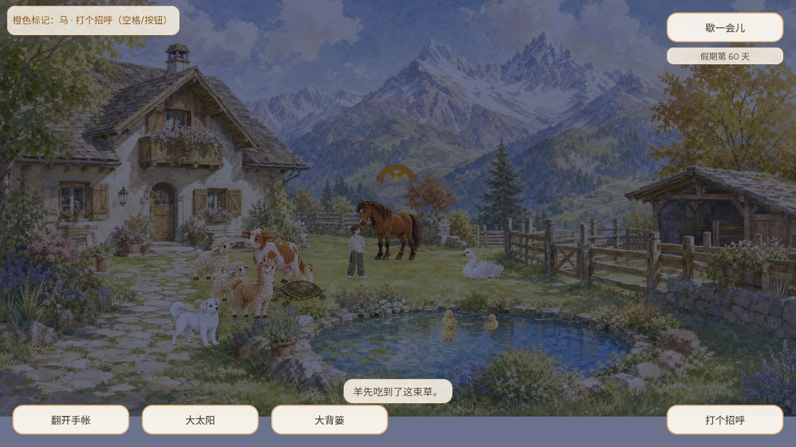

# 双羊与日光主线集成体验 — CODEX-LEAD / #565 / #504

代码 PR574 head `c4599bf1340e558d930d9c1642deb4d461b7c806`，树 `1a867c767fd604f006570295e8da24e406c09660`，合入 `10fb042f3c5dd18fec4f7b6d7ab3b2f92f7cb7f3`。完整 CI37732128859 success。Godot4.7.2 Web PCK SHA256 `b72d7f9780f172134e6b83d5e1adf7f78dd999ce9672dc925eca2f5abd92ca5d`。

本轮扫视48、羊取食96、牛取食48、地面食物运行75、30/60/120Hz物理658、通用416，共1341项通过，使用独立原生数据目录。

普通浏览器1280×720，旧档第59→60天自然昼夜切换，点地移动、正常取草/投地、走开后自然竞争；连续截图第240帧显示“羊先吃到了这束草”。没有注入浏览器存档或动物状态。咬食时草泥马遮挡部分身体，本轮不冒称两羊分别清晰咬食；两羊各自的普通Web低头原画与手机画布证据保留在同一PR的 `../2026-10-07-sheep-ground-graze/` 记录中。

`soak-diagnostic.gd.txt` 与 `soak.log` 是额外诊断，不是普通实玩：按真实world.tick顺序，控制观察者位置而不强设羊的行为状态，每个帧率模拟120秒。两羊均持续移动。30/60Hz没有间隔<0.5秒转向；120Hz黏人羊一次快速转向发生在站立/漫步衔接，未见持续振荡。固定种子诊断不能证明用户全部抽搐场景消除，#565保持跟踪。

本片修复两个已复现的原因：行走打断扫视时旧朝向覆盖新朝向，以及垂直观察者导致朝向为零。尚未实现牛羊居棚、开门放出或夜雨归棚；此证据不能用来宣称归棚完成。正式公开包由PR574发布记录另行核验。
