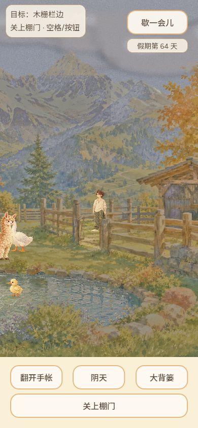

# #565 棚门可操作切片

Agent-ID: CODEX-LEAD。2026-10-08，本地 `codex/lead-yard-shelter-565`，基线 `0f3202d86be10d8adb4dfce58aa4b53998a5d179`。

## 玩家行为与边界

点击木门会自动走近，再提交开关状态；只有持久化确认后，门扇和可走区域一起变化。开门后点击棚内地面会经门洞走入，关门后不穿围栏。人或动物占据门槛时拒绝关门；在棚内关门仍可再次打开。提交期间暂停现场移动，未知结果保持原操作，不反向连点另起事务。旧存档默认关门，开关状态重开恢复。照片单独保存当时的门状态和天气混合，不让旧照片跟着当前门变化。

本片尚不改变牛羊住处，没有交付夜归、雨天避雨、卧姿或睡眠。近郊仍由 ASSISTANT 的 #586 独立推进，未修改其探索文件。

## 实现

- 新 `yard_gate_ground.gd` 将原草坪、门外接近区域、窄门洞和棚内分别建模，开放时合并；关门后按脚所在侧保留所在区域。没有启用旧 `pen_and_lawn()`。
- `yard_gate.gd` 消费 SaveStore 的真实确认/拒绝回执。未知回执由既有全局存档故障流程处理，门的在途编号保持，不能提前宣称开关成功。
- `yard_gate_view.gd` 仅在门洞使用 clean plate，其余栏杆/门扇是原晴阴底图上木条多边形采样，依脚底深度遮挡。保留原画，不整体换掉院子；门是即时开关，没有冒充新绘制的连续开合动画。
- 图片 `assets/holiday/environment/yard_gate_clean.png` 原样来自内置 imagegen 的 v2 候选，1672×941，3,188,316字节。仅采样门洞局部，不把候选整图当对齐背景。输入为现有 `yard_sunny.png`，生成提示如下。

> Precise-object-edit for game asset. Output must be 1920x1080, same framing as this image. Edit ONLY the X-braced gate between the two posts in the right-hand pen, centered around original image pixel (1360,700). Remove that gate leaf entirely, paint only the few pixels of grass and earth that were hidden behind it. Keep BOTH posts completely unchanged in their exact original locations (left near1325, right near1408) and every fence rail outside this small gap unchanged. This is a gate-leaf-removed clean plate, no new gate elsewhere, no moved posts, no larger entrance. Preserve the original image outside this small object exactly including color, sunlight, fine watercolor texture, all buildings mountains and pond. No additional objects, text, people or animals; no global repaint or resizing.

## 验证记录

最终相关原生检查合计4,112项通过（棚门41、照片存档47、照片渲染节点2471及下列回归）。

- 原生隔离存档：棚门协议/路径/真实 tick 行走、阻挡关门、关闭棚内后再开、JSON照片兼容和真实重载；控制回执检查拒绝/未知结果。控制回执不冒充磁盘故障实测。
- 相关回归：物理移动658项、场景热点92项、真实视口输入65项、探索300项、静观4项、共享天气运行时18项、通用416项通过；日志随此目录保存。探索首次因稀疏检出缺少既有候选锚点JSON失败，补取原文件后300/300通过，未改探索代码。
- 原生1280×720晴天/阴天和390×844跟随视口受控渲染已查看，`tools/capture_yard_gate.gd`可复跑；控制摆位不是普通输入实玩。
- 普通Web：沿用原测试存档62天进入，点击门自动走近开门、点击棚内地面穿门进入；刷新从普通入口重进63天，门保持打开，再次点击棚内成功进入；64天在棚内关门，点外侧被阻止，再用按钮打开。未改浏览器存储、未注入位置或调用游戏内部方法。

本目录不构成已发布声明。PR、CI及公开构建的精确SHA/哈希在关联PR补充后才能宣布上线。
