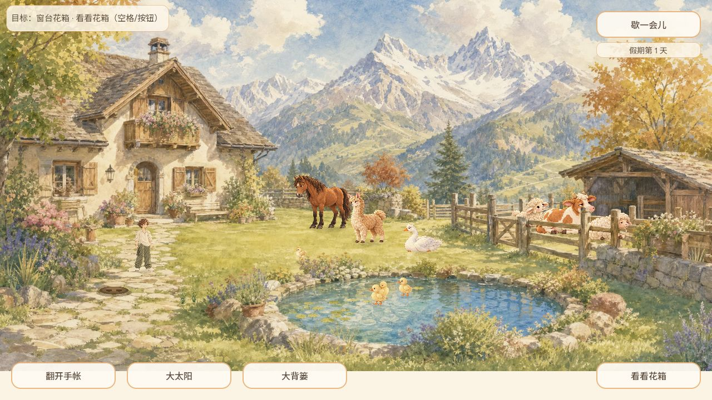

# #565 牛羊居棚与夜归

Agent-ID: CODEX-LEAD；接续已公开验证的PR600，基线3d0dd9f103a2d00387f4c6c3bec99970824e7ce1。

## 行为与实现边界

生产小院中，关门开始时牛和两只羊住在棚内，分别使用保留原角色身份的卧姿。白天开门后依次沿真实门洞走出，回原草坪主场地活动，仍可被草吸引。门口有人或其他身体阻挡就等候并重新寻路，不瞬移穿越。夜间使用共享时辰（20:00–05:00）依次返回棚内固定休息位置；为满足自动回家，关着的门先走现有持久化事务打开，确认后才通行。回棚队列未完成时暂不能关门，文字说明原因；都回家后可关门。没有自动扣草或离线惩罚。

院门与时间沿用现有保存。动物每一步坐标仍不另建存档：重新进入时，已保存的夜间或关门状态恢复棚内主场地，白天开门恢复原草坪主场地。日夜行走中的精确位置不宣称持久化。雨天、马/羊驼避雨、房门入睡、闭眼眨眼序列尚未交付。

实现集中在yard_shelter控制器。进出门期间沿YardBodies实际碰撞路径，复用Actor已锚定步态；在棚内停止时使用独立卧姿，不挤压站姿。夜归/等门时不接受地面投食目标，食物账本没有变更，白天在外恢复原投食规则。旧仅构造World的无库存测试场景保持原布局；真实Main挂载库存时才启动居民控制器，本片集成测试使用Main和隔离真实存档。

## 资源出处

牛及两只羊均由内置image_gen使用仓库各自cast_v2原角色制作；完整提示见[provenance.json](provenance.json)，不覆盖原站姿。1254×1254 RGBA原样保留，alpha>16边界像素均为0。正式源图在assets/holiday/characters/shelter/，脚底与朝向元数据见scripts/game/shelter_art.gd。受控构图验证与普通输入证据分开记录。

## 验证

居棚集成回归包含初始卧姿、真实行走出门、夜间持久打开、返回位置、夜归关门保护、暂停、照片JSON兼容以及保存重载。旧棚门测试需先让牛羊完全离开门口再验证人物穿门，不能再将牛的位置作为空地，也不能在羊尚占门槛时假定可关门；禁穿栏与门口占位保护保留。

普通Web在隔离本地端口8768从初始入口进入，牛羊已住在棚内；点击门自动走近开门，让开门口后继续观察出棚。后续体验、CI、公开版本与精确SHA在本PR补充，未通过前不宣称正式发布。

### 本轮本地结果（2026-10-08）

Godot 4.7.2 Windows 隔离存档：居棚34、棚门41、地面食物账本22/运行时75、羊吃草96、牛吃草48、身体碰撞658、场景热点92、真实窗口输入65、照片渲染2471/落盘47、提示适配5213/宽度10384、通用416全部通过；逐套日志见native目录。居棚照片验证三只动物的真实卧姿纹理经JSON往返保留，不只验证记录非空。没有把加速模拟当普通浏览器体验。

旧界面测试将草坪牛作为HUD目标的隐含条件改为明确摆位；快速推进后先等待真实存档队列完成，再检查花箱世界反馈。旧门测试先等牛羊实际离开草坪门口再让人物进入，保留碰撞保护。

普通Web 1280×720：初始关门牛羊居棚，实际点门开门，看到第一只羊走出，人物让开通道；随后夜间看到三只动物回棚卧下，关门，次日仍居棚。没有逐帧观察普通Web中三只动物完整往返，因此全路径断言来自上述原生集成回归。刷新入口后继续进入仍为第2天，闭门居棚延续；证据web-next-day-closed.jpeg。

手机普通输入补验：390×844由初始位置沿地图走到棚区；568×320点门后人物自动走近并打开，界面切换“关上棚门”。回390×844实际点底部按钮关门，再直接点可见门叶打开，分别得到“棚门关好了/棚门打开了”反馈；web-390-close-action.jpeg、web-390-open-action.jpeg、web-568-open.jpeg。早先远距离点门未触发的尝试如实保留，不作为成功证据；重新定位可见门叶后闭环成立。控制台warning/error均为空。已恢复默认视口，测试页暂停留作后续交接。

### 合入前修订：60fps栏杆拐角复现

普通Web追加观察发现牛卡在东侧床位与棚门之间。原0.1秒步长测试漏检；60fps同等时长复现牛/第二只羊不出棚及后续门状态4项失败，保留pre-fix-60fps-failure.txt。只缩小路径点容差仍不够：通用网格平滑路径在凹栏杆拐角的5像素采样之间会抄近路。居棚控制器改为先朝门内(924,466)行走，再出门，并将路径点容差从3降至0.05，不改共享碰撞器、不传送。最终居棚34项使用60fps通过，棚门41、身体658、真实食物75、照片2471重新通过；重新Web导出成功。旧CI只适用于旧SHA，不作为本修订通过依据。

相同修订另以120fps、等长上限完整运行，34项通过（yard_shelter-120fps.txt）。CI主套件固定60fps。

修订版普通Web在新隔离端口8769从第1天入口进入，点门让人物走近打开，然后点击屋前让开通道；实际看到牛和两只羊均走到草坪、棚内为空（web-v2-all-out.jpeg），此前卡住的牛已通过。该页无warning/error；初次进场点击工具曾超时，但随后截图确认已进入游戏，不将工具超时误记为游戏通过/失败。
