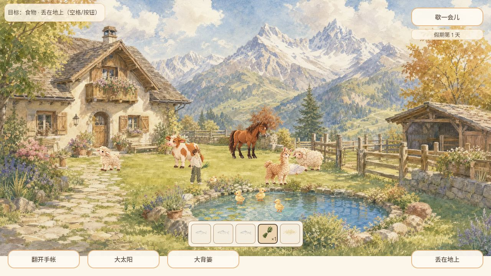
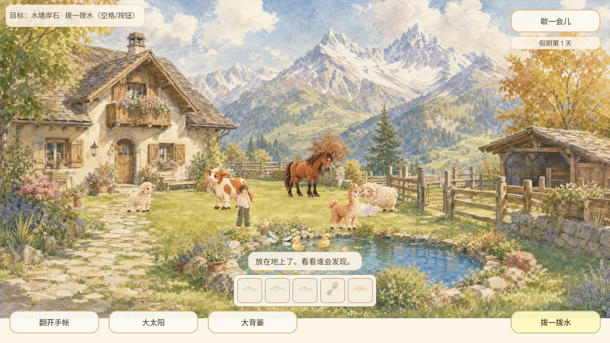
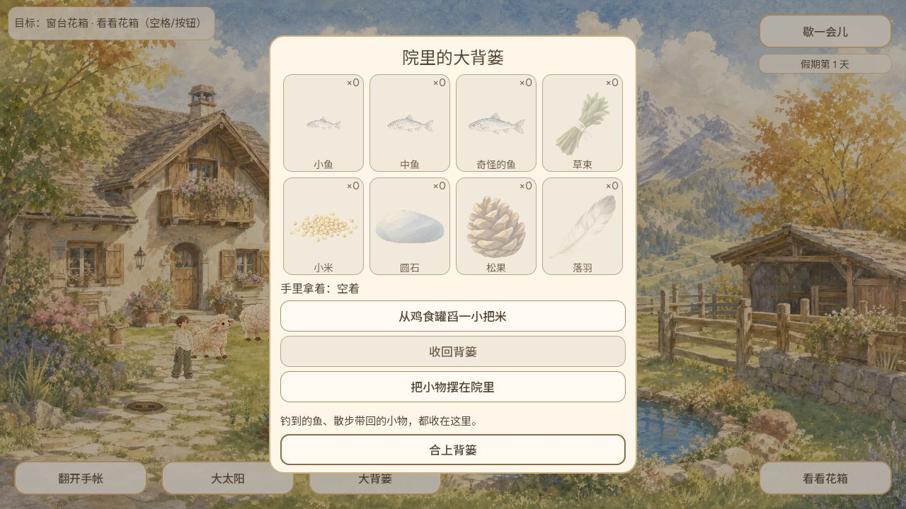

# 奶牛吃地面草束：普通网页补测

CODEX-LEAD，2026-10-09约09:06–09:10北京时间。复用本地马眨眼Web候选 `http://127.0.0.1:8776/`，源码树与PR626最终头74f19e9f08c84a69b6ddb99caf9f8bd883d0a185一致，1280×720，IAB鼠标操作。第1天隔离档，无注入物品、时钟、位置或存档。候选PCK SHA256 d99b9729b0a7c11a2893c3db2c9ebb0aadc89a3cb6a3c8a203f401badd8fbdaa。

从暂停继续，点击围栏入口，开门状态显示「关上棚门」，牛羊出棚。点击草丛后人物走近取得草束；01记录手持与快捷栏×1。点击羊附近草地移动，再按「丢在地上」，02显示脚边草束和「放在地上了。看看谁会发现」。随后普通页面观察到奶牛靠近，并出现「奶牛慢慢吃掉了这束草」，草束消失、手空、快捷栏回零。

03保存稍晚于吃掉提示，提示已消失，不能把它当作低头咬食或提示瞬间的图片证据；提示文字来自当时工具返回的完整普通页面截图。没有完整捕获低头、咀嚼的逐帧动作，也没有证明两只羊都完成同样过程。

暂停后刷新重新进入同一第1天档：围栏仍开、动物在院里；打开背篓，04显示草束×0、手里空着，未见已吃掉的草束重新出现。核验的是一次正常吃草及刷新恢复，不外推异常存储、长时队列或手机实机。结束合上背篓并暂停。

