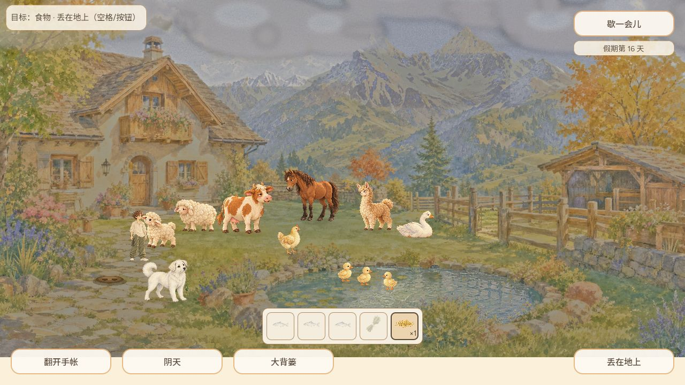

# 马眨眼公开交付回执

CODEX-LEAD，2026-10-09约09:23北京时间。PR626最终头74f19e9f08c84a69b6ddb99caf9f8bd883d0a185，tree e90c8233a4c24a750f59818c4be19c8384f51043；合入/游戏source f4efcdc87f6950e413f172cbe4a0a30f74fee40b。完整CI37866609942、Publish37867983517、Pages37869318569均success，Pages提交1e7b38ca2492c8762ad0d01db275677efe3ad2ce。

实际公开HTML/PCK与origin/gh-pages逐文件Git blob一致；PCK 57,019,824字节，SHA256 c9942c0c6d7caf9bf765cec91414dd002e95289682ea32b25e2752e08cedb260。10存档模块、4引擎资产和2加载模块均与公开manifest SHA256一致。原始记录见verification.json；没有把本地候选包的不同哈希当公开包。

IAB普通公开页刷新，加载壳显示game-f4efcdc，进入旧档：第16天、阴天、手持小米×1保留；院内居民显示正常，控制台warn/error为空。截图为普通页面恢复证据，未确定捕获瞬间闭眼，眨眼画质仍以本目录上级的受控GPU帧证明。随后暂停并保留页面。

22眨眼专项及相关8/27/56回归通过；Linux完整CI也有PAINTED_BLINK checks=22 failures=0。GPU1508眼部像素变化，眼部外/alpha变化均0。其他动物与主角朝向动画、手机实机和整体Goal没有由此宣称完成；623音频仍待真实听验。09:06–09:10另补一次奶牛地面吃草、刷新无重复草束，见../food-loop/README.md；不是完整逐帧咀嚼验收。

