# #565 入屋睡眠验证

Owner CODEX-LEAD。PR621最终候选`a3c03b27fab70e44e27fc09b188d2893817cb84d`，tree `06b239a135d50c97e57307f859e870127aa1977b`；本地同树提交`e640a8563e`。实现基于main `1b02f46b69b7046ed000386f6990c7eb5fc3e983`。完整CI 37829427901通过；PR621已合入 `ccee83ab62b00ae6b8a8f6dd10891e039bfe7e02`。Publish37831543831、Pages37833289013成功，公开包及旧存档已核验。

## 已覆盖

- Native `house_sleep_suite` 53项：夜间判定、一次跨日、植物/天气、库存和其他字段保留、真实门廊行走、牵绳/钓鱼互斥、连点、确认存档后才显示早晨、旧自动保存不倒退、失败回执及UI重试、照片灯光兼容、睡眠开花照片补拍、持有小米时家门优先。120Hz同53项通过；120Hz源码与日志归档以便重现。
- 相关回归：快捷栏138、挂载71、大动物27、牛羊34、棚门41、照片保存47、照片渲染2471、天气199、天气运行18、过渡75、保存协调86、通用416。
- Windows原生GPU受控实绘：夜窗、开门床铺、睡眠熄灯、次晨返回。工具主动设置夜间和门口位置，因此仅作为美术配准/阶段证据，不冒充普通游玩。
- 普通Web 1280×720：自然Day1夜间点门到Day2，刷新仍Day2。390×844响应式视口：自然Day2→3，刷新仍Day3；这是桌面浏览器模拟尺寸，并非实体手机。
- 最终Web：自然Day3入屋后Esc暂停，人隐去、灯熄灭、界面仍Day3；间隔约一分钟画面/日期不推进。过场中刷新，恢复已落盘Day4早晨及续算后的阴天，不重复跨日。
- 最终Web：手持小米、快捷投放已武装。夜间点门后、仍站在门廊且窗灯亮时暂停并刷新，重开仍Day4夜间/小米×1；再次正常入屋到Day5，小米×1保留。控制台warn/error为空。

## 实测发现并修复

1. 窗灯被全局夜色压暗：改为夜色之后绘制，照片复用相同窗格。
2. 睡眠跨日让植物开花却漏掉首次开花照片：角色回院后拍摄真实开花场景，中断重开也可补齐，已有解锁不重复。
3. 已武装的快捷投放把家门点击当成投放：Main投放入口保留家门交互，真实库存和指针入口加入回归。

曾因runner拼错regional_weather套件文件名中断，改为实际world_weather入口后完成。早期42/47项候选日志不充当最终53项完成凭据。两次旧CI因后续提交自动取消，不计为通过。受控失败回执不冒充拔网线或真实磁盘损坏。

## 截图

受控GPU：

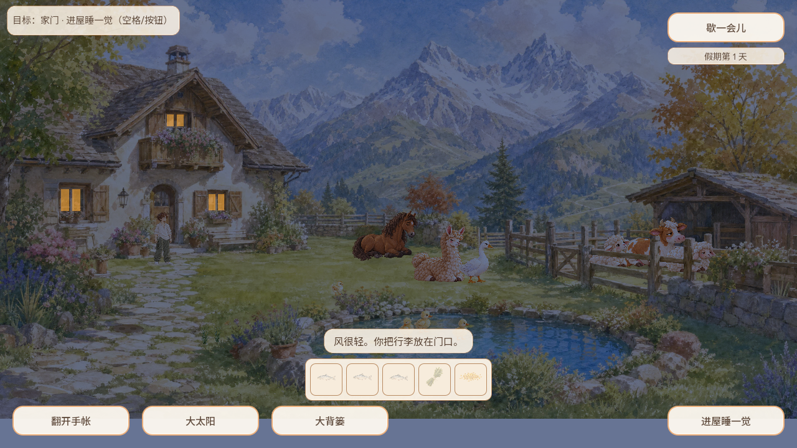
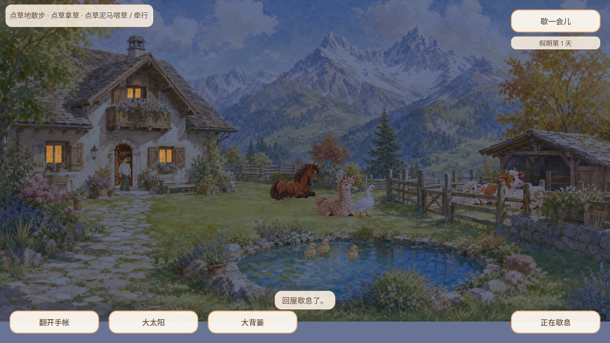
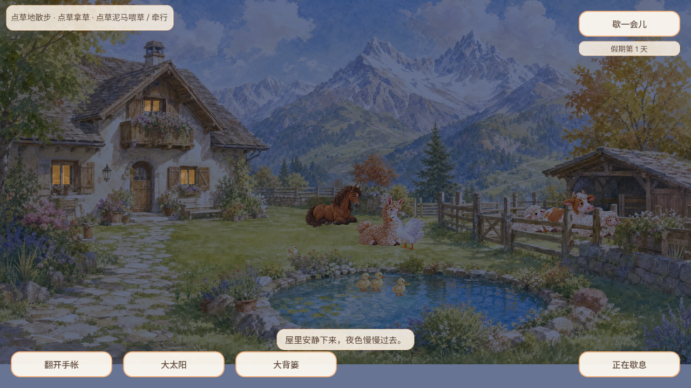
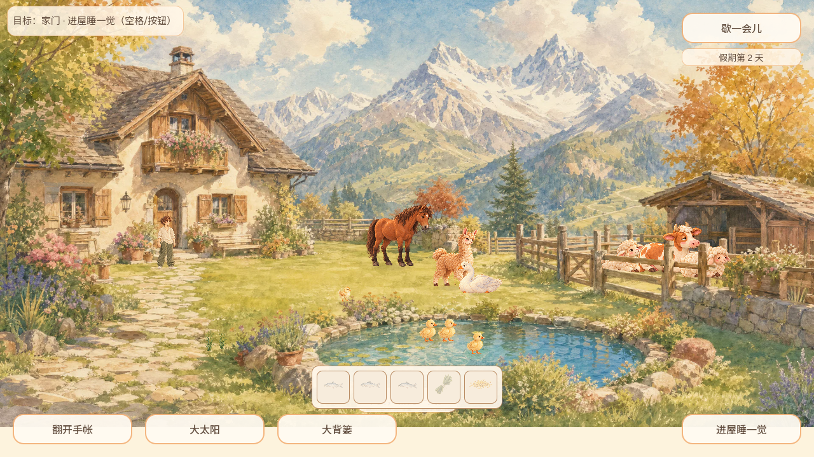

普通浏览器：

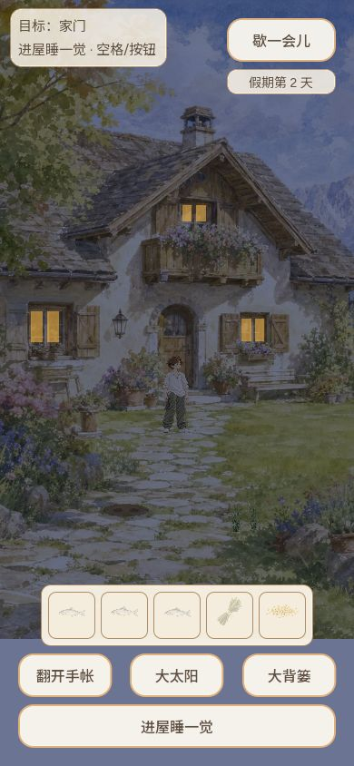
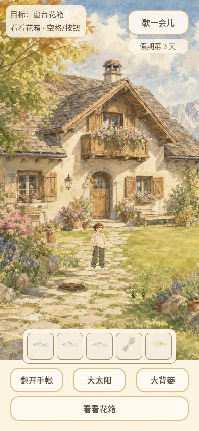
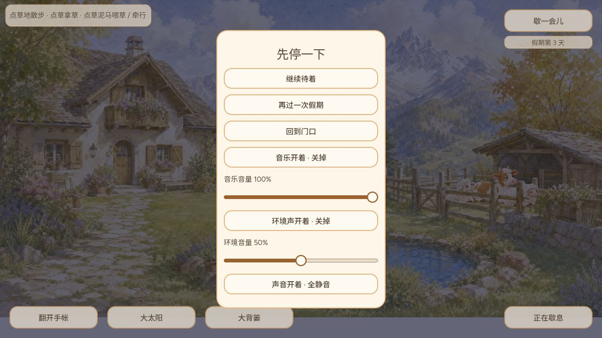
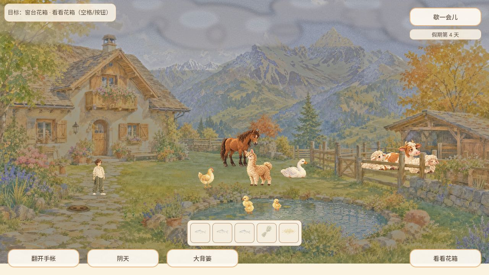
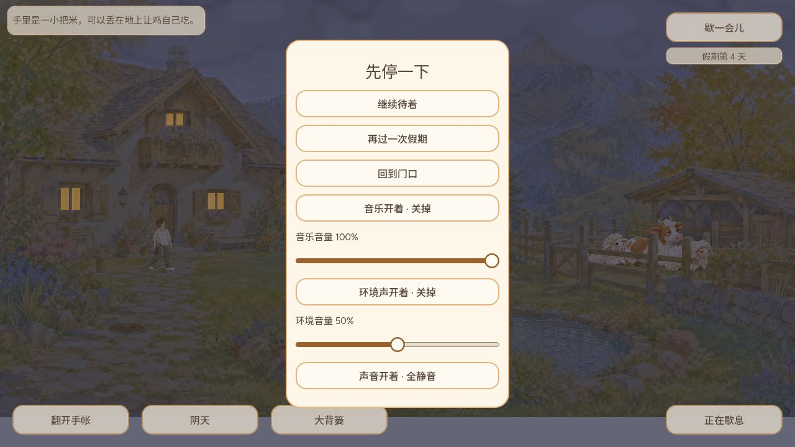
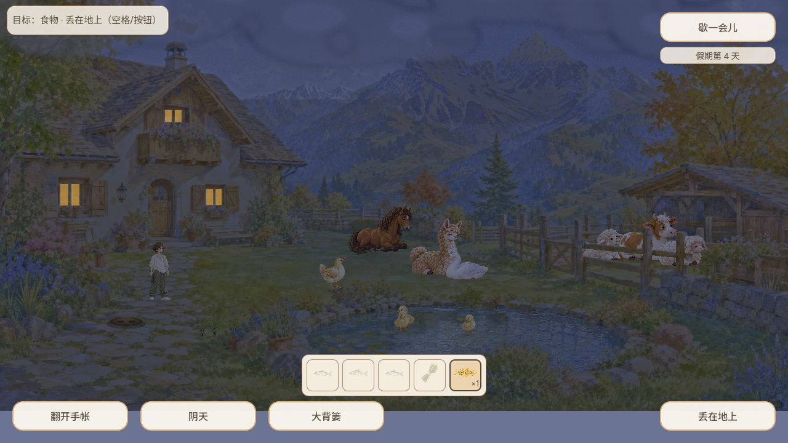
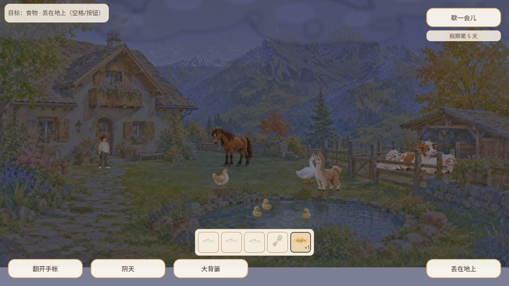

## 限制

呼噜声、夜间音乐、蛙虫蛇音景、星月专用原画仍未交付/真实听验；不关闭整个#565。纹理来源、完整提示、原始SHA256见art-provenance.md。原始门洞资源保留字节，未替换整幅小院背景。

## 正式公开核验（2026-10-09 03:39 CST 起）

- 游戏源 `ccee83ab62b00ae6b8a8f6dd10891e039bfe7e02`，构建 `game-ccee83a`；Pages提交 `3fbe4eebb8805713230d175e8728b733048b3ce8`。
- [PR CI](https://github.com/narutojzm1-dot/youjia/actions/runs/37829427901)、[Publish](https://github.com/narutojzm1-dot/youjia/actions/runs/37831543831)、[Pages](https://github.com/narutojzm1-dot/youjia/actions/runs/37833289013) 均成功。CI日志明确包含 `house_sleep_suite checks=53 failures=0`。
- PCK实际下载55,196,096字节；SHA256 `1aced6e6928120c2a77db9abebd602b81543a251455a2aa73376b06e364ca261`，Git blob `c677399bff6927db4c746e17193d4778ede83bd5` 与gh-pages原件一致。
- HTML SHA256 `35f8a5f04851ee3e3821fa5fe021c8fc1db338498fd08fc3f231cdc6845e86b9`，Git blob `280390a4c9ce676679d2c348c97211043d072ce5`；十个存档模块、四个引擎资源、两个加载模块逐一下载并匹配manifest哈希。[原始清单](public/game-release.json)、[实际验证结果](public/verification.json)、[工作流标识](public/workflows.json)。
- 同一公开浏览器旧profile，不清档：升级前Day15雨夜；新版恢复Day15/小米×1/beibei及其他动物进展，暖窗可见；点击家门入睡到Day16，续算为阴天，小米仍×1。再次刷新重开仍Day16/小米×1，动物进展保留，未重复跨日；公开控制台warn/error为空。

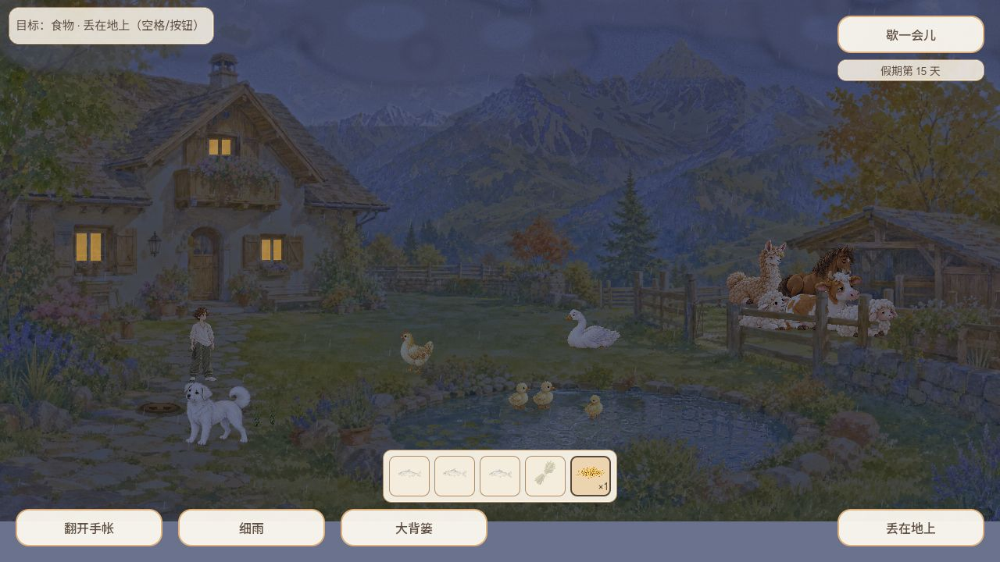
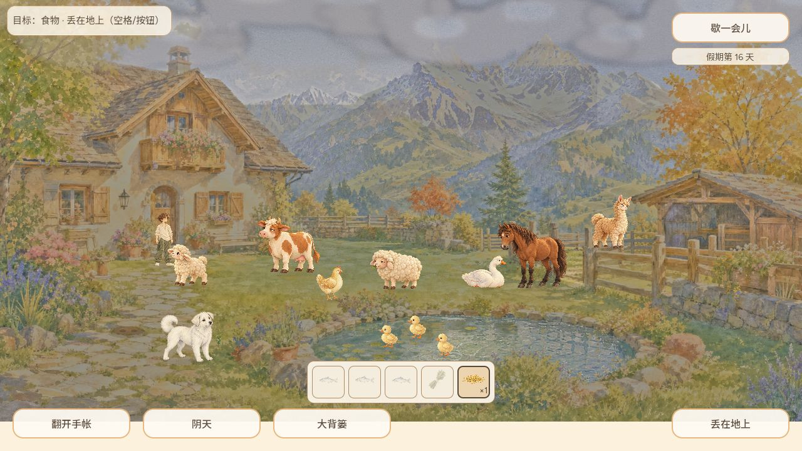
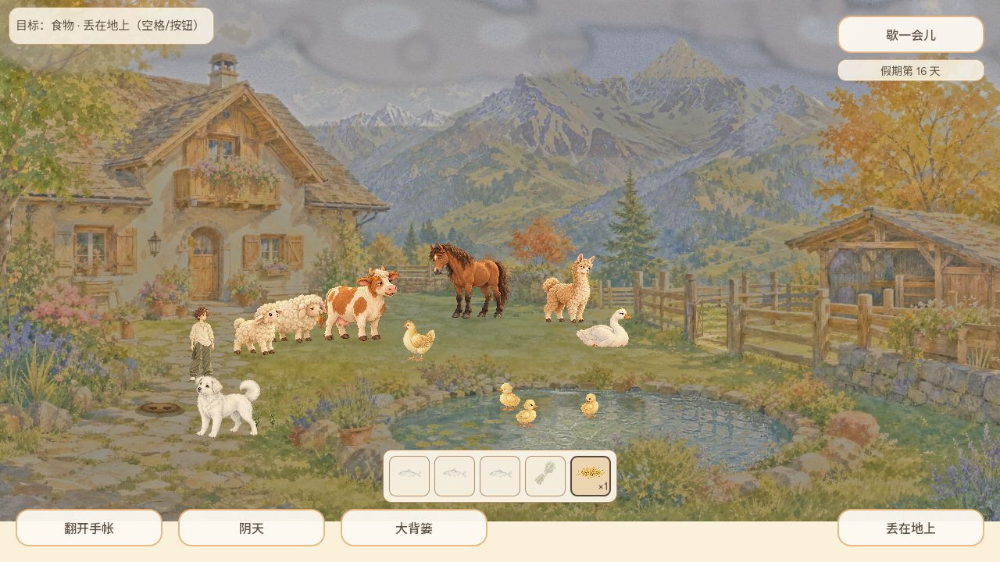

本轮不是10月8日23:00日节点的重复执行；原日结/邮件保持，不额外发日推。整体Goal与#565未完成项保持开放。
