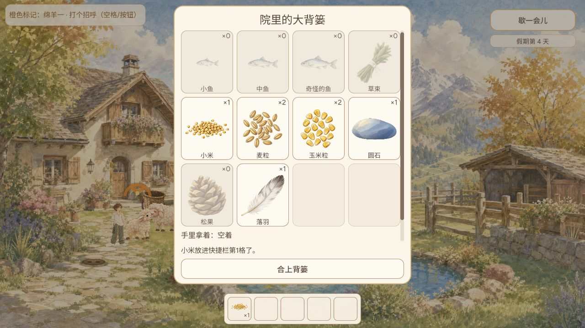
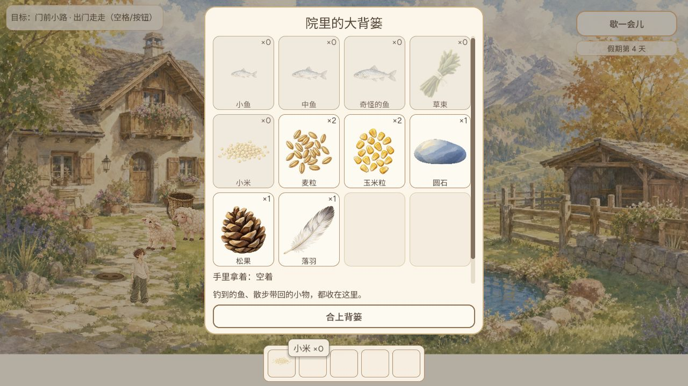

# GAME-QA 2026-10-10 23:22 冒烟

结论：**核心冒烟限定通过，新增功能覆盖不足，不放行全量发布。** 17项适用原生专项17987检查通过，实际旧档恢复、快捷栏拖入/取用/投放及附近松果入库通过。种收、照料成长、夜间睡觉、阳台与长待机等普通玩家完整流程尚未完成。本轮没有新增确证产品BUG，不以环境故障启动简单修复。

## 新增功能与缺口

受测线上0.2.0（第2版内部测试）game-e9e7292，完整SHA `e9e72920446705415c9a41da7380ab48fe75664e`。从最后受测070ae5a跨多日累计比较，全部原始[提交主题](evidence/commit-subjects.log)、[路径清单](evidence/changed-files.log)、[逐项矩阵](evidence/coverage.json)归档。GitHub compare原件比较到main候选f787f9d，返回296提交和300文件上限，不能把其中全部变更当已受测线上，也不能把300文件当完整清单；实际受测范围以本地070ae5a→e9e7292的提交主题和无rename路径清单为准。

| 功能 | 需求/PR | 实际结果 | 自动证据 | 结果与缺口 |
|---|---|---|---|---|
| 玩家自配五格快捷栏 | #597/#698 | 08拖入未扣库存；12手持；13投放小鸡低头啄米；16米1→0 | hotbar_player_slots136 | 正常闭环限定通过；Web快捷栏偏好持久化源码明确尚缺共享保存，未宣称重开保留 |
| 手持投放意图与武装样式 | REQ075/076 | 正常投放通过，取消/全部物件与移动端未测 | 由快捷槽专项覆盖部分 | 部分覆盖 |
| 物理背篓/麦粒玉米/种植 | #637 | 实体背篓可见；新版库存麦粒2玉米2，未种收 | physical_basket22 / yard_crops90 | 自动通过，实际种收完整流程未测；下轮优先 |
| 小鸡成长照料面板/原子喂食 | #636 | 实际地面投米，小鸡低头靠近；成长面板及信用累计未验 | chick_care73 | 部分覆盖，下轮实际面板 |
| 入屋睡觉/夜窗 | #565/#640 | 18图下午睡觉提示天还亮着；夜间完整睡眠未验 | house_sleep154 | 白天边界通过，完整闭环未测 |
| 室外坐下躺卧与起身 | #639/#634 | 未等自然动作完整周期 | resident_idle_rest61 | 自动通过；下轮自然待机 |
| 阳台清晨 | #641/#638 | 未达偶发条件 | balcony_morning3867 | 自动通过；实际未测 |
| 共享12小时时钟 | #638 | 院内上午→下午，附近下午1:31→2:06，回院下午2:35，顺序推进 | regional_clock92 | 限定通过；长期边界未实际 |
| 夜空/黄金晨光/照片冻结光照 | #640 | 日景和时钟可见，夜天空与照片回放未实际 | regional_night_sky3759 | 自动通过；下轮完整光照 |
| 动物呼吸/闭眼/局部眨眼 | #645/#565 | 无完整周期视觉证据 | resting_eyelids37 / painted_rest_breath7264 | 自动通过；不当实际视觉验收 |
| 背篓内摆放、收回与拒绝保存 | #594/#598 | 未实际摆放当前新流程 | yard_basket_drop_place42 / yard_decor_rejection19 | 自动通过；旧微调已移除不沿用旧通过 |
| 旅行背篓容量保护 | #642 | 普通松果0→1入库通过；未达到容量边界 | exploration_trip_capacity48 | 正常路径通过；容量边界仅自动 |
| HUD被面板遮挡时淡出 | #692/#687 | 07/16背篓布局可见；未全分辨率扫屏 | hud_under_menu2257 | 限定视觉/自动通过 |
| 背篓hug高度、短横屏单行与提示避让 | #595/REQ相关UI | 当前1280×720，未实际横竖屏切换 | 未跑无重复补齐项 | 未测：本轮冒烟优先核心闭环，下轮尺寸/英语专项 |
| 纸面滚动条/焦点/禁用色/工具提示 | care-panels/REQ UI | 滚动条可见；键盘及全状态未验 | 未专项 | 部分可见，输入未测 |
| 天气纸签与照片到达淡入 | REQ077/070 | 未开相册；相关天气字段改变触发定向自动，不重复旧题词#40 | photo_diary_weather42 | 自动通过；题词错配未专项 |
| 小物接触影/位置纸签/落定圈 | REQ066/068/069 | 未实际摆小物 | 未专项 | 未测，下轮摆放闭环一并覆盖 |
| 附近点击反馈/拾取名称淡出 | REQ063/073 | 15图篮子松果，16松果1；按压瞬态与淡出时长未验 | 未专项 | 核心拾取通过，动效未测 |
| 蜗牛苜蓿淡出/鱼圈调色/落点圈 | REQ072/071/074 | 未触发完整效果 | 未专项 | 未测，下轮动效与钓鱼 |
| 0.2.0加载页与下载计数 | #634/loading-shell | 01/02进度21%→58%，03中止，04重试，05标题，06院子 | 本轮未跑shell测试 | 重试恢复通过，首次异常原因未确认 |
| 花坛/花朵昆虫/桥图/雾/8方向角色/小落羽候选 | #642/#643/#644/#646/#635 | 候选概念图不冒充已接入玩法 | 静态提交清单 | 候选单列，完整资源调用链未做 |
| 保存兼容 | 070ae5a→e9e7292 | 第4天米1石1羽1恢复；完成后米0松1石1羽1 | save_recovery24 | 限定旧档通过；本轮修改后再次重载未验 |

下轮优先：真实种植→收获→喂食、照料面板成长、夜间睡觉/阳台、快捷栏重开保存差异；然后窄横屏与全部新增视觉动效。容量上限与保存故障只有原生覆盖。候选资源单列。没有‘全部新功能通过’结论。

## 时间、环境、来源

心跳北京时间23:22:28.980送达，并非8/12/16准点完成；首次证据UTC 2026-10-10T15:26:26.702Z，收尾2026-10-10T23:45:24.336154+08:00。10月9日没有本聊天已执行报告，不补造成功记录。本人独立测试，无子代理修复任务。

Windows/IAB浏览器2新tab1，1280×720自然视口。旧浏览器列表为空；Chrome策略加载失败，IAB可用。沿用IAB原存档，未重置或注入。公开加载壳明确显示e9e7292，再由本地Git对象解析完整SHA。main已是f787f9d3cbc8b15ac2cae853de355e1f06ba3bc0，未刷新候选、不算线上受测。第二次API查询Release/tag均为空（remote-checks.json）。

安全fetch完成了对象获取；后续API/连接器发生连接错误、部分promisor读取DNS失败。checkout包装器超时，但日志已显示切换到e9e7292；随后rev-parse/真实diff/源码文件和隔离Godot导入验证一致，才运行专项。没有用旧源码冒充当前版本。引擎改写5个已知import存patch后恢复，tracked diff空，UID保留。

已读QA说明、最新可得AGENTS/CONTRIBUTING/qa-reporting和历史台账；当前角色分工由Cursor UI、Grok修bug，QA简单修复仍依用户双子代理新授权。只提交QA文档PR待审，不自审不合入。此次心跳主体乱码；两个既有自动任务已恢复完整中文并保留排期与10月8日授权，未来运行成功与ACTIVE状态分开。

## 实际游玩与边界

1. 01/02图下载21%到58%；后续60%观察后03图报signal is aborted without reason。没有证据确定产品根因，归加载/网络环境异常观察。点击公开重试，04图41%，05标题、06院子，失败恢复成功。
2. 07图第4天旧米1、圆石1、落羽1恢复；新麦粒2玉米2只记录所见，不声称由本轮种植产生。
3. 空快捷槽打开背篓；将小米拖到第1槽，08提示配置成功且库存仍1。关闭后布局与提示变化产生截图时序差，09/10不是成功取用证据；按最新位置单击后12显示食物投放目标，13点地后小鸡低头靠近米堆，16米0、手空。没有用连续误点推断产品BUG。
4. 点击院门小路进入附近，14有下午1:31时钟；点松果后15篮子显示松果，回院16松果1，圆石1落羽1仍保留。共享时钟顺序推进；不是同刻精确同步或容量极限验收。
5. 17走近屋门出现进屋睡一觉；白天下午点击，18提示天还亮着，再在院子待一会，日数未跳。夜间睡眠闭环未执行。结束点击歇一会儿暂停，未清档，未再次假期。

## 自动测试

主批12专项10471检查，补充5专项7516检查，共17专项17987，另import通过。每项exit0、完成契约检查通过，Windows APPDATA/XDG每套隔离且profile-probe验证；日志/runner/verified wrapper归档。

主批：hotbar136、crops90、chick73、trip48、physical basket22、idle61、balcony3867、clock92、night sky3759、HUD2257、drop place42、save recovery24。补充因新增天气纸签/入屋/保存拒绝/休息资源变更而选：photo weather42、house154、decor rejection19、eyelids37、breath7264。没有重复未变更鱼专项或旧相册题词专项。自动断言不是实际玩家体验，不算设备覆盖。

## BUG、环境与关卡

台账保留原编号、历史证据与最后专项版本。未新增重复issue。快捷栏Web配置持久化在当前提交说明中明确是共享保存缺口（#597），本轮未做重开配置验证，不误称已通过或新发现。旧相册#40不专项重复，新天气纸签自动回归不等于题词已修复。

初次加载中止、GitHub连接/DNS/工具超时分别记录为环境或待判定观察，重试后已恢复部分能力。实际启动/主要入口/最短闭环/旧档恢复限定通过；种植成长、睡眠阳台、所有新增动效、音频真实听验、完整游戏、长期性能和全分辨率未覆盖。不足以判定全量发布通过。
