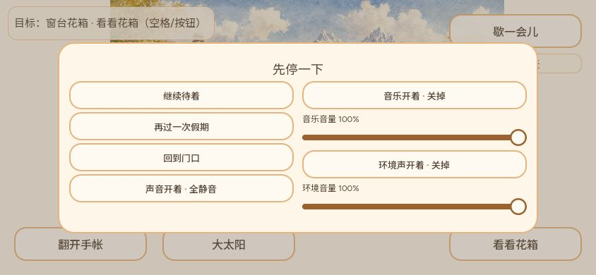

# 2026-10-06 日版本

主持人：CODEX-LEAD（本地，兼制作人）。计划节点：北京时间 23:00，Asia/Shanghai。

**状态：日版本已发布并完成本范围核验。** 北京时间 23:00 登记节点，23:08 完成公开文件与普通入口冒烟；文档归档及邮件结果另行记录。本文冻结游戏源码为 `245382d57da5c90aa59819a867ea9834d32a0266`，PR #501 合入。报告的文档提交不冒充游戏源码，不因文档 SHA 改变重复发布。

试玩：[悠长的假期](https://narutojzm1-dot.github.io/youjia/)。上一日冻结源为 `06da74694e256b4a92def2e0d9c4adad1aad0ef1`；今日集中审查覆盖它之后的已合运行时增量，并核对当前开放 PR、QA 与资源候选。

## 本日玩家变化

| 范围 | 实际交付 | 主要 PR |
| --- | --- | --- |
| 近郊往返 | 院门点按返院、短展示缩放/中文标签/安全区、清底与拾物视觉；松果和落羽已接入地面、拾起展示与提篮，白羽补地面对比 | #429、#467、#475、#484、#495（保留 #375 原提交） |
| 可靠接续 | 启动防重入；探索清理消费、重试上限与未知扩展保全，避免 INVALID 后用普通写入覆盖未理解的数据 | #427、#432、#438、#445 |
| 天气与相机 | 同构图阴天与可中断渐变，旧照片资源路径保留；静观与鹅马接管边界修复；云带限制在院子画幅内 | #465、#468、#478、#486、#500 |
| 输入与界面 | 触控确认取消不再操作后方滑条；滑条、提示、按钮和照片纸片统一；标题断行、矮屏暂停、保存提示、目标提示及照片题词适配 | #433、#439、#451、#454、#460、#464、#476、#488、#496、#501 |
| 验证与发布 | Godot 套件必须出现登记完成行且完整日志无错误；PR 组合验证与 Web 导出；CI 排除文档体积，发布仍保留历史包及存档模块 | #450、#452、#458、#462 |

动物、钓鱼、种花、环境偶遇与照片沿用已确认玩法。今日一些 PR 是补验或集成，不能全部计作新功能。布置、经济系统和新的大世界区域没有借日版本擅自加入。

## Leader 集中审查

按照用户 2026-10-06 最新授权，由 Leader 审查当天整体，不再逐 PR 等待外部或子代理签字。原有退回结论、测试和体验要求没有取消。

- **共享状态：**审读 `ExplorationHost` 的 cleanup 请求冻结、operation ownership、有限重试和 INVALID 拒绝覆盖，以及 Main 的真实持久化确认接续。旧照片版本/资源不覆盖，无新存档 schema。更广跨浏览器、断电和故障组合未由此次检查补齐。
- **探索：**审读院门命中、resize 中断、短展示生命周期与静音 fallback；资源接入不改物品标识和库存事务。圆石仍为占位画法，未将资源候选或提篮 UI 当成布置玩法。
- **画面与照片：**审读天气权重与暂停/减少动态行为、有效相机边界和接管连续性、云带整数像素分区及 PhotoMoment v1 分区回放。旧阴天图路径和字节保留。照片 UI、相册、小纸片变化没有替代历史照片错配修复。
- **输入与布局：**审读 Main 弹层手势消费、滑条组合、五项 Grok 最终改动和生产 UI 层；保留原作者提交。专门复验确认取消后两音量仍为 100 并可继续游戏。键盘焦点 #459 仍待实际修复/复验。
- **工程：**审读严格日志/完成标记门禁、PR 工作流与发布 sparse checkout；两条流程仍导出 Web，不以 exit 0 或截图代替完整回归。当天新增运行资源路径、导出资源检查及来源记录已核对；无新音频候选混入本版。

本次未发现阻断这些已验证切片发布的新问题。这是有范围的集中审查，不是宣称全游戏、全平台或所有历史 issue 已验收。

## 测试与体验证据

- #495：松果/落羽真实渲染与普通 Web 松果拾取→回院→重开；落羽普通随机遭遇未在本轮取得新样本。[档案](../playtests/2026-10-06-find155-local/README.md)。
- #496：输入/滑条组合原生 986 检查；公开 1280×720 普通鼠标入院→暂停→离开确认→取消，两音量 100，继续后场景运行。首次公共下载停滞后点重试成功，记录失败尝试，不冒充真机触摸复验。
- #500：旧代码红样与最终绿样保留；天气 75、照片 1,349、相机背景 44,734、相机接管 202、输入 63，共 46,423 检查通过，导入/Web 导出成功。1646×894 原生受控阴天前后对照证明云层越界消除；普通 Web 仅观察到天气过程，未拍得稳定阴天长观测。[档案](../playtests/2026-10-06-cloud400/README.md)。
- #501：Windows Godot 4.7.2 十专项共 14,986 检查通过，导入/Web 导出成功；普通 Web 390×844 标题/院子与 844×390 暂停/确认取消/继续通过。保存待确认纸片及英文照片通过生产 UI 层受控原生捕获，不能算自然保存失败或自然照片事件。[档案](../playtests/2026-10-06-grok-ui-integration/README.md)。
- 独立 GAME-QA：[PR #479](https://github.com/narutojzm1-dot/youjia/pull/479) 的圆石缺字限定复测及 45,956 原生检查；[PR #494](https://github.com/narutojzm1-dot/youjia/pull/494) 的中午冒烟与 1,388 检查；[PR #497](https://github.com/narutojzm1-dot/youjia/pull/497) 的下午冒烟、742 检查与真实关页恢复。版本分别保留，后两轮实际公开 `game-3e06802`，**不能套用为本节点 `game-245382d` 的 QA 全量通过**。[PR #491](https://github.com/narutojzm1-dot/youjia/pull/491) 是旧构建原录像的落羽中文字形补证，同样不算新版本回归。这些历史证据 PR 尚待收纳，未修改其原作者分支。

不把不同 SHA 的检查数量累加成一次同版完整测试。真实触摸/DPR、长期性能、音频真人听验、普通 Web 鱼自然过期及完整故障恢复矩阵仍未覆盖。

## 发布核验

最终游戏源：`245382d57da5c90aa59819a867ea9834d32a0266`。PR #501 head：`ca9e6eefed89863f78ab9b16b9b3925b8745692d`，tree：`a3b52b46d8e6450973a3224bfe0b206ed6d352a6`，本地同树提交：`dcba1a7f80258441a692af06bcd70784fbe2bb58`。

- [PR 完整检查 37481222237](https://github.com/narutojzm1-dot/youjia/actions/runs/37481222237)：success。
- [最终源发布 37482689449](https://github.com/narutojzm1-dot/youjia/actions/runs/37482689449)：success；本次沿用合入触发，不另 dispatch。
- [Pages 37484106875](https://github.com/narutojzm1-dot/youjia/actions/runs/37484106875)：success；gh-pages `d5878c00921665c8f75c6a305614a06040286ba1`。
- 公开 `game-245382d`，manifest 发布时间 `2026-10-06T15:02:56Z`；实际下载 PCK **27,707,752 bytes**，SHA256 **`5cbe3871996c4e7de34dd67348f411fcdec10100ec113ae1ec43d6ddad649cd7`**，Git blob **`577555f9fb6857f02b26ee8a482b23f66d2d334c`**，与 gh-pages 原件一致。HTML 入口与十个版本化存档模块全部匹配；核验结果于 `2026-10-06T15:08:52Z` 确认完成。[实际文件核验](2026-10-06-evidence/public-final.json)、[公开 manifest](2026-10-06-evidence/game-release.json)。
- 同一公开页 DOM `data-build=game-245382d`；390×844 标题→入院→暂停→旋转 844×390→离开确认→取消，两个音量仍为 100%，继续后正常显示院子。使用普通鼠标输入和视口覆盖，不是真机触屏。浏览器保留 14:10 的旧版本网络错误，本次 15:04 之后未见新增 warn/error，不把历史日志抹掉。[操作与日志](2026-10-06-evidence/browser-smoke.json)。本次入口加载成功，未把旧版重试记录套用为新版本失败。

第一父链历史快照有 shallow 边界，范围说明见[证据说明](2026-10-06-evidence/README.md)；整体代码审查依赖实际前后文件差异，未把不完整提交标题当成完整审查。旧阴天资源和 PhotoDiary 文件 blob 未改变，`web/save` 源模块无变更，见[兼容性核对](2026-10-06-evidence/compatibility-audit.json)。

已验证上一可用源 `6557240172b504a61b9d66710383e891106cc21c`（#500）：CI 37478258754、发布 37479810585、Pages 37480904346 success；`game-6557240` 的 PCK 27,700,072 bytes，SHA256 `6a6f0af7d0c3f9fb55a97c0079de63700940d1ad58862dfe3531ef86cb157b2e`，blob `4f873ee6fbe3e72233b13bb005793dd589c53046`，与 gh-pages `484c7a0eb585229b0d06373cca424764a1ef21e5` 原件、HTML 和十模块一致。此结果不替代最终源核验。

## 未完成与下一交付

| 范围 | Owner / 下一步 | 真实限制 |
| --- | --- | --- |
| 近郊圆石正式资源、动物姿态及获得短音 | Leader 接续原候选并保留提交；圆石优先做边缘/接地收尾与三场景验证 | #285 风格已冻结，仅必要返修；#359/#317/#300/#339 未完成适用听验，不接入新声 |
| 携回物件在小院使用 | Leader，#154；正式布置规则确认后接共享状态和实际交互 | 用户已收到有限位置+小幅调整、暂留提篮、自由布置三方案，未有选择，不擅自定经济/成长规则 |
| 输入/存档/P1缺陷 | Assistant、Cursor Cloud 辅助，Leader 解除真实共享依赖 | #459 焦点；#382 真机复测；#231 普通 Web 自然过期；#150/#305 广泛故障与跨设备矩阵 |
| #400 与历史相册 | Leader + QA 复验；#500 已修确定的云层越界切片 | 用户原 2444×1502 路径及旋转/返院组合仍未完整复现，父单不关闭；历史照片题词错配未当成新照片回归或已修复 |
| 独立界面与测试 | Grok 继续界面制作/修改，QA 继续独立测试 | 五项 Grok 原提交已纳入 #501；不要求恢复 PM、Producer 或旧云端 Leader |

腾讯接入 #198 继续按用户原决定延期到核心可玩后，不索取权限或把它列为本轮开发阻塞。Native Goal 保持 active；两小时 heartbeat 读取同一目标与在途工作，下一轮接续真实未完成项，避免重复发布和重复检查。

## 日推去重

成稿时尚未发送。发送前再次核对 #146 与 Gmail 已发记录；成功后在 #146 记录节点、构建、实际时间及 API 结果，不公开私人邮箱，不宣称已读。文档晚于发布，不为包含自身 SHA 循环发版。
